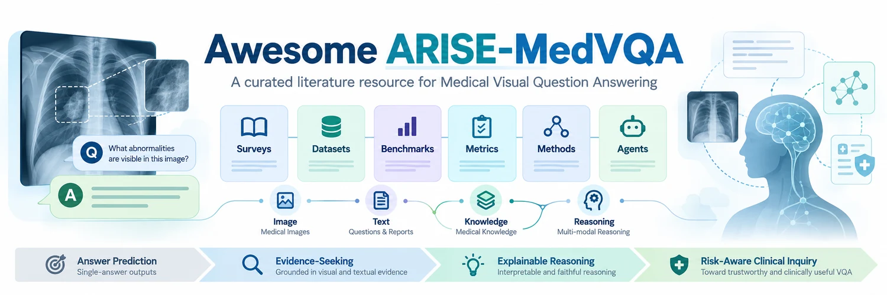

  

  
  
  
  
  

  <b>A curated academic resource hub for ARISE-MedVQA</b> 
  From Passive Answering to Active Inquiry · Evidence-Driven Reasoning · Medical Visual Question Answering

# Awesome ARISE-MedVQA

ARISE-MedVQA is a curated literature resource repository for Medical Visual Question Answering (Med-VQA), covering surveys, research directions, datasets, benchmarks, evaluation metrics, representative methods, and multimodal medical agent studies. The repository is not a single model implementation. Instead, it provides a structured and continuously updated entry point for researchers to understand the evolution, core resources, evaluation frameworks, and emerging trends of Med-VQA. Centered on the shift from passive answer prediction to active, evidence-seeking, risk-aware clinical inquiry, ARISE-MedVQA organizes key papers, datasets, benchmarks, evaluation protocols, and technical methods to support literature review, dataset selection, method comparison, experimental design, survey writing, and future research on interactive and clinically grounded medical AI.

## Intended Audience
This project is suitable for the following research and teaching scenarios:
- Researchers working on Medical Visual Question Answering, medical multimodal large models, and medical AI agents;
- Graduate students who need a quick and structured overview of Med-VQA datasets, methods, benchmarks, and research trends;
- Developers working on medical image question answering, report generation, interactive diagnostic support, or knowledge-enhanced medical reasoning;
- Authors preparing Med-VQA surveys, research proposals, grant applications, thesis topics, or benchmark studies;
- Teams interested in building medical multimodal datasets, evaluation frameworks, or active diagnostic interaction systems.

**We will continue to update and refine this repository to keep it aligned with the latest progress in Med-VQA and related medical multimodal AI research.**

# Survey
[1] **Task-Specific Models vs. Large Vision-Language Models in Medical Visual Question Answering: A Survey**  Huahu Xu, Qishen Chen, Wenxuan He, Xingyuan Chen, [**Honghao Gao***](https://scholar.google.com/citations?user=PiiIpJIAAAAJ)   *Expert Systems with Applications*, 2026, 132008.   [[DOI](https://doi.org/10.1016/j.eswa.2026.132008)] [[Publisher](https://www.sciencedirect.com/science/article/pii/S095741742600123X)]

[2] **From Visual Question Answering to Intelligent AI Agents in Ophthalmology**   Xiaolan Chen, Ruoyu Chen, Pusheng Xu, Xiaojie Wan, Weiyi Zhang, Bingjie Yan, Xianwen Shang, Mingguang He, Danli Shi  *British Journal of Ophthalmology*, 2026.   [[DOI](https://doi.org/10.1136/bjo-2024-326097)] [[Publisher](https://bjo.bmj.com/content/110/1/1)]

[3] **Generative Models in Medical Visual Question Answering: A Survey**   Wenjie Dong, Shuhao Shen, Yuqiang Han, Tao Tan, Jian Wu, Hongxia Xu   *Applied Sciences*, **15**(6), 2983, 2025.   [[DOI](https://doi.org/10.3390/app15062983)] [[Publisher](https://www.mdpi.com/2076-3417/15/6/2983)]

[4] **Visual Question Answering in Robotic Surgery: A Comprehensive Review**  Di Ding, Tianliang Yao, Rong Luo, Xusen Sun   *IEEE Access*, **13**, 1–18, 2025.   [[DOI](https://doi.org/10.1109/ACCESS.2024.3525145)] [[Publisher](https://ieeexplore.ieee.org/document/10807961)]

[5] **Vision-Language Models for Medical Report Generation and Visual Question Answering: A Review**   Iryna Hartsock, Ghulam Rasool   *Frontiers in Artificial Intelligence*, **7**, 1430984, 2024.   [[DOI](https://doi.org/10.3389/frai.2024.1430984)] [[Publisher](https://www.frontiersin.org/journals/artificial-intelligence/articles/10.3389/frai.2024.1430984/full)] [[arXiv](https://arxiv.org/abs/2403.02469)]

[6] **Developing ChatGPT for Biology and Medicine: A Complete Review of Biomedical Question Answering**  Qing Li, Lei Li, Yu Li   *Biophysics Reports*, **10**(3), 2024.   [[DOI](https://doi.org/10.52601/bpr.2024.240004)] [[Publisher](https://www.biophysics-reports.org/en/article/doi/10.52601/bpr.2024.240004)]

[7] **Survey of Multimodal Medical Question Answering**   Hilmi Demirhan, Wlodek W. Zadrozny   *BioMedInformatics*, **4**(1), 56–78, 2024.   [[DOI](https://doi.org/10.3390/biomedinformatics4010004)] [[Publisher](https://www.mdpi.com/2673-7426/4/1/4)]

[8] **Medical Visual Question Answering: A Survey**   Zhihong Lin, Donghao Zhang, Qingyi Tao, Danli Shi, Gholamreza Haffari, Qi Wu, Mingguang He, Zongyuan Ge   *Artificial Intelligence in Medicine*, **153**, 102611, 2024.   [[DOI](https://doi.org/10.1016/j.artmed.2023.102611)] [[Publisher](https://www.sciencedirect.com/science/article/pii/S0933365723002498)] [[arXiv](https://arxiv.org/abs/2111.10056)]

[9] **A Comprehensive Interpretation for Medical VQA: Datasets, Techniques, and Challenges**   Sheerin Sitara Noor Mohamed, Kavitha Srinivasan   *Journal of Intelligent & Fuzzy Systems*, **44**(6), 10527–10545, 2023.   [[DOI](https://doi.org/10.3233/JIFS-222569)] [[Publisher](https://content.iospress.com/articles/journal-of-intelligent-and-fuzzy-systems/ifs222569)]

[10] **A Critical Analysis of Benchmarks, Techniques, and Models in Medical Visual Question Answering**   Suheer Ali Al-Hadhrami, Mohamed El Bachir Menai, Saad Al-Ahmadi, Ahmad Alnafessah   *IEEE Access*, **11**, 136840–136858, 2023.   [[DOI](https://doi.org/10.1109/ACCESS.2023.3335216)] [[Publisher](https://ieeexplore.ieee.org/document/10323452)]

[11] **Visual Question Answering in the Medical Domain Based on Deep Learning Approaches: A Comprehensive Study**   Aisha Al-Sadi, Mahmoud Al-Ayyoub, Yaser Jararweh, Fumie Costen   *Pattern Recognition Letters*, **152**, 118–128, 2021.   [[DOI](https://doi.org/10.1016/j.patrec.2021.07.002)] [[Publisher](https://www.sciencedirect.com/science/article/pii/S0167865521002657)]

# Datasets (Open Access)

## 1.1 Early Medical Visual Question Answering Datasets

[1] **VQA-RAD, A Dataset of Clinically Generated Visual Questions and Answers About Radiology Images**  Jason J. Lau, Soumya Gayen, Asma Ben Abacha, **[Dina Demner-Fushman\*](https://scholar.google.com/citations?user=ashaP54AAAAJ)**  *Scientific Data*, **5**, 180251, **2018**.  [[DOI](https://doi.org/10.1038/sdata.2018.251)] [[Publisher](https://www.nature.com/articles/sdata2018251)] [[PubMed](https://pubmed.ncbi.nlm.nih.gov/30457565/)] [[Dataset](https://doi.org/10.17605/OSF.IO/89KPS)] 

[2] **VQA-Med 2019, VQA-Med: Overview of the Medical Visual Question Answering Task at ImageCLEF 2019**  Asma Ben Abacha, Sadid A. Hasan, Vivek V. Datla, Joey Liu, Dina Demner-Fushman, Henning Müller  *Working Notes of CLEF 2019*, CEUR Workshop Proceedings 2380, **2019**.  [[Publisher](https://ceur-ws.org/Vol-2380/)] [[PDF](https://ceur-ws.org/Vol-2380/paper_272.pdf)] [[Dataset](https://zenodo.org/records/10499039)] [[Code/Data](https://github.com/abachaa/VQA-Med-2019)]

[3] **VQA-Med 2020, Overview of the VQA-Med Task at ImageCLEF 2020: Visual Question Answering and Generation in the Medical Domain**  Asma Ben Abacha, Vivek V. Datla, Sadid A. Hasan, Dina Demner-Fushman, Henning Müller  *Working Notes of CLEF 2020*, CEUR Workshop Proceedings 2696, **2020**.  [[Publisher](https://ceur-ws.org/Vol-2696/)] [[PDF](https://ceur-ws.org/Vol-2696/paper_106.pdf)] [[Code/Dataset](https://github.com/abachaa/VQA-Med-2020)]

[4] **SLAKE: A Semantically-Labeled Knowledge-Enhanced Dataset for Medical Visual Question Answering**  Bo Liu, Li-Ming Zhan, Li Xu, Lin Ma, Yan Yang, [**Xiao-Ming Wu\***](https://scholar.google.com/citations?user=3KbaUFkAAAAJ&hl=en)  *2021 IEEE 18th International Symposium on Biomedical Imaging (ISBI)*, 1650–1654, **2021**.  [[DOI](https://doi.org/10.1109/ISBI48211.2021.9434010)] [[Publisher](https://ieeexplore.ieee.org/document/9434010)] [[arXiv](https://arxiv.org/abs/2102.09542)] [[Dataset](https://www.med-vqa.com/slake/)] 

[5] **PathVQA, Towards Visual Question Answering on Pathology Images**  Xuehai He, Zhuo Cai, Wenlan Wei, Yichen Zhang, Luntian Mou, Eric Xing, **[Pengtao Xie\*](https://scholar.google.com/citations?user=cnncomYAAAAJ)**  *Proceedings of the 59th Annual Meeting of the Association for Computational Linguistics and the 11th International Joint Conference on Natural Language Processing (ACL-IJCNLP), Volume 2: Short Papers*, 708–718, **2021**.  [[DOI](https://doi.org/10.18653/v1/2021.acl-short.90)] [[Publisher](https://aclanthology.org/2021.acl-short.90/)] [[PDF](https://aclanthology.org/2021.acl-short.90.pdf)] [[Code/Dataset](https://github.com/UCSD-AI4H/PathVQA)]

[6] **OVQA: A Clinically Generated Visual Question Answering Dataset**  Yefan Huang, [**Xiaoli Wang***](https://scholar.google.com/citations?user=gXjyRxsAAAAJ&hl=en), Feiyan Liu, Guofeng Huang  *Proceedings of the 45th International ACM SIGIR Conference on Research and Development in Information Retrieval (SIGIR)*, 2924–2938, **2022**.  [[DOI](https://doi.org/10.1145/3477495.3531724)] [[Publisher](https://dl.acm.org/doi/10.1145/3477495.3531724)] [[arXiv](https://arxiv.org/abs/2211.06862)] [[~~Dataset~~](http://47.94.174.82)]

[7] **P-VQA, Medical Knowledge-Based Network for Patient-Oriented Visual Question Answering** Jian Huang, Yihao Chen, Yong Li, [**Zhenguo Yang***](https://yzw.gdut.edu.cn/info/1082/2458.htm), Xuehao Gong, Fu Lee Wang, Xiaohong Xu, Wenyin Liu  *Information Processing & Management*, 60(2), 103241, **2023**.  [[DOI](https://doi.org/10.1016/j.ipm.2022.103241)] [[Publisher](https://www.sciencedirect.com/science/article/pii/S0306457322003429)] [[Code](https://github.com/cs-jerhuang/P-VQA)] [[Dataset: Code 249a](https://pan.baidu.com/s/1WALE9hNVpOIPiBxnQy7QCg)]

## 1.2 Large-Scale General Medical VQA Datasets

[8] **PMC-OA, PMC-CLIP: Contrastive Language-Image Pre-training Using Biomedical Documents** Weixiong Lin, Ziheng Zhao, Xiaoman Zhang, Chaoyi Wu, Ya Zhang, Yanfeng Wang, [**Weidi Xie\***](https://scholar.google.com/citations?user=Vtrqj4gAAAAJ)  *Medical Image Computing and Computer Assisted Intervention – MICCAI 2023*, LNCS 14227, 525–536, **2023**.  [[DOI](https://doi.org/10.1007/978-3-031-43993-3_51)] [[Publisher](https://link.springer.com/chapter/10.1007/978-3-031-43993-3_51)] [[arXiv](https://arxiv.org/abs/2303.07240)] [[Code](https://github.com/WeixiongLin/PMC-CLIP)] [[Dataset-Huggingface](https://huggingface.co/datasets/axiong/pmc_oa)] [[Dataset-Baidu-key: 3iqf](https://pan.baidu.com/s/1mD51oOYbIOqDJSeiPNaCCg)]

[9] **PMC-VQA, Development of a Large-Scale Medical Visual Question-Answering Dataset** Xiaoman Zhang, Chaoyi Wu, Ziheng Zhao, Weixiong Lin, Ya Zhang, **Yanfeng Wang\***, [**Weidi Xie\***](https://scholar.google.com/citations?user=Vtrqj4gAAAAJ)  *Communications Medicine*, 4, 277, **2024**.  [[DOI](https://doi.org/10.1038/s43856-024-00709-2)] [[Publisher](https://www.nature.com/articles/s43856-024-00709-2)] [[PubMed](https://pubmed.ncbi.nlm.nih.gov/39709495)] [[Code](https://github.com/xiaoman-zhang/PMC-VQA)] [[Dataset](https://huggingface.co/datasets/xmcmic/PMC-VQA)]

[10] **PubMedVision, Towards Injecting Medical Visual Knowledge into Multimodal LLMs at Scale**  Junying Chen, Chi Gui, Ruyi Ouyang, Anningzhe Gao, Shunian Chen, Guiming Hardy Chen, Xidong Wang, Zhenyang Cai, Ke Ji, Guangjun Yu, Xiang Wan, [**Benyou Wang\***](https://scholar.google.com/citations?user=Jk4vJU8AAAAJ)  *Proceedings of the 2024 Conference on Empirical Methods in Natural Language Processing (EMNLP)*, 7346–7370, **2024**.  [[DOI](https://doi.org/10.18653/v1/2024.emnlp-main.418)] [[Publisher](https://aclanthology.org/2024.emnlp-main.418)] [[PDF](https://aclanthology.org/2024.emnlp-main.418.pdf)] [[Code](https://github.com/FreedomIntelligence/HuatuoGPT-Vision)] [[Dataset](https://huggingface.co/datasets/FreedomIntelligence/PubMedVision)]

[12]  **M3D: Advancing 3D Medical Image Analysis with Multi-Modal Large Language Models**  Fan Bai, Yuxin Du, Tiejun Huang, Max Q.-H. Meng, [**Bo Zhao***](https://scholar.google.com/citations?user=R3_AR5EAAAAJ&hl=zh-CN)  *arXiv preprint*, arXiv:2404.00578, **2024**.  [[arXiv](https://arxiv.org/abs/2404.00578)] [[Code](https://github.com/BAAI-DCAI/M3D)] [[Dataset](https://huggingface.co/datasets/GoodBaiBai88/M3D-VQA)] [[M3D-VQA](https://huggingface.co/datasets/GoodBaiBai88/M3D-VQA)]

[13] **3D-RAD: A Comprehensive 3D Radiology Med-VQA Dataset with Multi-Temporal Analysis and Diverse Diagnostic Tasks**  Xiaotang Gai, Jiaxiang Liu, Yichen Li, Zijie Meng, Jian Wu, [**Zuozhu Liu\***](https://scholar.google.com/citations?user=h602wLIAAAAJ&hl=en)  *Advances in Neural Information Processing Systems (NeurIPS)*, 38, Datasets and Benchmarks Track, **2025**.  [[DOI](https://doi.org/10.52202/085713-5656)] [[Publisher](https://proceedings.neurips.cc/paper_files/paper/2025/hash/f8250afec8305ed4a6b27ae405507442-Abstract-Datasets_and_Benchmarks_Track.html)] [[arXiv](https://arxiv.org/abs/2506.11147)] [[Code](https://github.com/Tang-xiaoxiao/3D-RAD)] [[Dataset](https://huggingface.co/datasets/Tang-xiaoxiao/3D-RAD)]

[14] **RadImageNet-VQA: A Large-Scale CT and MRI Dataset for Radiologic Visual Question Answering**  Léo Butsanets, Charles Corbière, Julien Khlaut, Pierre Manceron, Corentin Dancette  *Proceedings of the 9th International Conference on Medical Imaging with Deep Learning (MIDL)*, PMLR 315, 3036–3068, **2026**.  [[Publisher](https://proceedings.mlr.press/v315/butsanets26a.html)] [[arXiv](https://arxiv.org/abs/2512.17396)] [[Dataset](https://huggingface.co/datasets/raidium/RadImageNet-VQA)]

[15] **MedMax: Mixed-Modal Instruction Tuning for Training Biomedical Assistants**  Hritik Bansal, Daniel Israel, [**Siyan Zhao***](https://siyan-zhao.github.io/), Shufan Li, Tung Nguyen, Aditya Grover  *Advances in Neural Information Processing Systems (NeurIPS)*, 38, Datasets and Benchmarks Track, **2025**.  [[DOI](https://doi.org/10.52202/085713-3588)] [[Publisher](https://proceedings.neurips.cc/paper_files/paper/2025/hash/9a6f7d845cf12385524f0f27ab26f57e-Abstract-Datasets_and_Benchmarks_Track.html)] [[arXiv](https://arxiv.org/abs/2412.12661)] [[Code](https://github.com/Hritikbansal/medmax)] [[Dataset](https://huggingface.co/datasets/mint-medmax/medmax_data)] [[Project](https://mint-medmax.github.io/)]

## 1.3 Chest X-ray VQA and Report-Driven Question Answering Datasets

[16] **EHRXQA: A Multi-Modal Question Answering Dataset for Electronic Health Records with Chest X-ray Images**  Seongsu Bae, Daeun Kyung, Jaehee Ryu, Eunbyeol Cho, Gyubok Lee, Sunjun Kweon, Jungwoo Oh, Lei Ji, Eric I. Chang, Tackeun Kim, [**Edward Choi***](https://scholar.google.com/citations?user=GUlGIPkAAAAJ&hl=en)  *Advances in Neural Information Processing Systems (NeurIPS)*, 36, Datasets and Benchmarks Track, 3867–3880, **2023**.  [[DOI](https://doi.org/10.52202/075280-0170)] [[Publisher](https://proceedings.neurips.cc/paper_files/paper/2023/hash/0c007ebef1d11fd48da6ce4f54687db6-Abstract-Datasets_and_Benchmarks.html)] [[arXiv](https://arxiv.org/abs/2310.18652)] [[Code/Dataset](https://github.com/baeseongsu/ehrxqa)]

[17] **Medical-Diff-VQA，Expert Knowledge-Aware Image Difference Graph Representation Learning for Difference-Aware Medical Visual Question Answering**   Xinyue Hu, Lin Gu, Qiyuan An, Mengliang Zhang, Liangchen Liu, Kazuma Kobayashi, Tatsuya Harada, Ronald M. Summers, [**Yingying Zhu***](https://scholar.google.com/citations?user=PMjtni8AAAAJ&hl=en)  *Proceedings of the 29th ACM SIGKDD Conference on Knowledge Discovery and Data Mining (KDD)*, 4156–4165, **2023**. [[DOI](https://doi.org/10.1145/3580305.3599819)] [[Publisher](https://dl.acm.org/doi/10.1145/3580305.3599819)] [[arXiv](https://arxiv.org/abs/2307.11986)] [[Code/Dataset](https://github.com/Holipori/MIMIC-Diff-VQA)]

[18] **Medical-CXR-VQA, Interpretable Medical Image Visual Question Answering via Multi-Modal Relationship Graph Learning**  Xinyue Hu, Lin Gu, Kazuma Kobayashi, Liangchen Liu, Mengliang Zhang, Tatsuya Harada, Ronald M. Summers, [**Yingying Zhu***](https://scholar.google.com/citations?user=PMjtni8AAAAJ&hl=en)  *Medical Image Analysis*, 97, 103279, **2024**.  [[DOI](https://doi.org/10.1016/j.media.2024.103279)] [[Publisher](https://www.sciencedirect.com/science/article/pii/S1361841524002044)] [[PubMed](https://pubmed.ncbi.nlm.nih.gov/39079429/)] [[Code/Dataset](https://github.com/Holipori/Medical-CXR-VQA)]

[19] **RaDialog: Large Vision-Language Models for X-Ray Reporting and Dialog-Driven Assistance**  Chantal Pellegrini, Ege Özsoy, Benjamin Busam, Benedikt Wiestler, Nassir Navab, Matthias Keicher  *Proceedings of Machine Learning Research (PMLR)*, 301, 1294–1312, **2026**.  [[Publisher](https://proceedings.mlr.press/v301/pellegrini26a.html)] [[PDF](https://proceedings.mlr.press/v301/pellegrini26a/pellegrini26a.pdf)] [[arXiv](https://arxiv.org/abs/2311.18681)] [[Code](https://github.com/ChantalMP/RaDialog)] [[Dataset](https://physionet.org/content/radialog-instruct-dataset/1.1.0/)]

[20] **VinDr-CXR-VQA: A Visual Question Answering Dataset for Explainable Chest X-Ray Analysis with Multi-Task Learning**  Hai-Dang Nguyen, Ha-Hieu Pham, Hao T. Nguyen, **[Huy-Hieu Pham\*](https://scholar.google.com/citations?user=mXcFcNkAAAAJ)**  *arXiv preprint*, arXiv:2511.00504, 2025.  [[arXiv](https://arxiv.org/abs/2511.00504)] [[Dataset](https://huggingface.co/datasets/Dangindev/VinDR-CXR-VQA)]

[21] **ReXVQA: A Large-scale Visual Question Answering Benchmark for Generalist Chest X-ray Understanding**  Ankit Pal, Jung-Oh Lee, Xiaoman Zhang, Malaikannan Sankarasubbu, Seunghyeon Roh, Won Jung Kim, Meesun Lee, Pranav Rajpurkar  *Pacific Symposium on Biocomputing*, **31**, 251–264, 2026.  [[DOI](https://doi.org/10.1142/9789819824755_0018)] [[PubMed](https://pubmed.ncbi.nlm.nih.gov/41758146/)] [[arXiv](https://arxiv.org/abs/2506.04353)] [[Dataset](https://huggingface.co/datasets/rajpurkarlab/ReXVQA)]

[22] **GEMeX: A Large-Scale, Groundable, and Explainable Medical VQA Benchmark for Chest X-ray Diagnosis**  Bo Liu, Ke Zou, Li-Ming Zhan, Zexin Lu, Xiaoyu Dong, Yidi Chen, Chengqiang Xie, Jiannong Cao, [**Xiao-Ming Wu\***](https://scholar.google.com/citations?user=3KbaUFkAAAAJ&hl=en), **[Huazhu Fu\*](https://scholar.google.com/citations?user=jCvUBYMAAAAJ)**  *Proceedings of the IEEE/CVF International Conference on Computer Vision (ICCV)*, 21310–21320, 2025.  [[DOI](https://doi.org/10.1109/ICCV51701.2025.01979)] [[Publisher](https://openaccess.thecvf.com/content/ICCV2025/html/Liu_GEMeX_A_Large-Scale_Groundable_and_Explainable_Medical_VQA_Benchmark_for_ICCV_2025_paper.html)] [[arXiv](https://arxiv.org/abs/2411.16778)] [[Code](https://github.com/Awenbocc/GEMeX-Project)] [[Project](https://www.med-vqa.com/GEMeX/)]

[23] **GEMeX-RMCoT: An Enhanced Med-VQA Dataset for Region-Aware Multimodal Chain-of-Thought Reasoning**  Bo Liu, Xiangyu Zhao, Along He, Yidi Chen, **[Huazhu Fu\*](https://scholar.google.com/citations?user=jCvUBYMAAAAJ)** , Xiao-Ming Wu  *Proceedings of the 33rd ACM International Conference on Multimedia (ACM MM)*, 13213–13220, 2025.  [[DOI](https://doi.org/10.1145/3746027.3758277)] [[Publisher](https://dl.acm.org/doi/10.1145/3746027.3758277)] [[arXiv](https://arxiv.org/abs/2506.17939)] [[Dataset](https://www.med-vqa.com/GEMeX/)]

[24] **CXR-QBA: A Structured, Tagged, and Localized Visual Question Answering Dataset with Full Sentence Answers and Scene Graphs for Chest X-ray Images**   Philip Müller, Friederike Jungmann, Georgios Kaissis, Daniel Rueckert   *International Conference on Learning Representations (ICLR)*, **2026**.   [[Publisher](https://proceedings.iclr.cc/paper_files/paper/2026/hash/6de71272e0be559af3f76b884e94794b-Abstract-Conference.html)] [[OpenReview](https://openreview.net/forum?id=LrmyW9JLYq)] [[Poster](https://iclr.cc/virtual/2026/poster/10009998)] [[Code](https://github.com/philip-mueller/mimic-ext-cxr-qba)] [[Dataset](https://physionet.org/content/mimic-ext-cxr-qba/1.0.1/)]

[26] **DAMON-VQA, DAMON: Difference-Aware Medical Visual Question Answering via Multimodal Large Language Model**  Zefan Zhang, Yanhui Li, Ruihong Zhao, [**Tian Bai***](https://ccst.jlu.edu.cn/info/1367/20115.htm)  *IEEE Journal of Biomedical and Health Informatics*, **30**(8), 6336–6345, 2026.  [[DOI](https://doi.org/10.1109/JBHI.2026.3663420)] [[PubMed](https://pubmed.ncbi.nlm.nih.gov/41666056/)] [[Code](https://github.com/zefanZhang-cn/DAMON)]

[26-1] **MIMIC-CXR-VQA: A Large-Scale LLM-Annotated Dataset and Comparative Benchmark for Medical Visual Question Answering**   Mohamed Aas-Alas, Miquel Obrador-Reina, Luis-Jesus Marhuenda, Alberto Albiol, Roberto Paredes, Francisco Albiol   *Proceedings of the IEEE/CVF Conference on Computer Vision and Pattern Recognition Workshops (CVPRW 2026)*, 6563–6572, 2026.   [[Publisher](https://openaccess.thecvf.com/content/CVPR2026W/CV4Clinic2026/html/Aas-Alas_MIMIC-CXR-VQA_A_Large-Scale_LLM-Annotated_Dataset_and_Comparative_Benchmark_for_Medical_CVPRW_2026_paper.html)] [[PDF](https://openaccess.thecvf.com/content/CVPR2026W/CV4Clinic2026/papers/Aas-Alas_MIMIC-CXR-VQA_A_Large-Scale_LLM-Annotated_Dataset_and_Comparative_Benchmark_for_Medical_CVPRW_2026_paper.pdf)] [[Code](https://github.com/LightVED-prhlt/MIMIC-CXR-VQA-Dataset_Creation)]

## 1.4 Specialty-Specific VQA Datasets

### 1.4.1 Ophthalmology VQA

[27] **DME-VQA: Consistency-Preserving Visual Question Answering in Medical Imaging**   [**Sergio Tascon-Morales***](https://scholar.google.com/citations?hl=de&user=eYFOmsEAAAAJ), Pablo Márquez-Neila, Raphael Sznitman   *Medical Image Computing and Computer Assisted Intervention – MICCAI 2022*, LNCS 13438, 386–395, **2022**.   [[DOI](https://doi.org/10.1007/978-3-031-16452-1_37)] [[Publisher](https://link.springer.com/chapter/10.1007/978-3-031-16452-1_37)] [[Code](https://github.com/sergiotasconmorales/consistency_vqa)] [[Dataset](https://zenodo.org/record/6784358)]

[28] **OphthalVQA: Unveiling the Clinical Incapabilities: A Benchmarking Study of GPT-4V(ision) for Ophthalmic Multimodal Image Analysis**   Pusheng Xu, Xiaolan Chen, Ziwei Zhao, Danli Shi   *British Journal of Ophthalmology*, **108**(10), 1384–1389, **2024**.   [[DOI](https://doi.org/10.1136/bjo-2023-325054)] [[Publisher](https://bjo.bmj.com/content/108/10/1384)] [[PubMed](https://pubmed.ncbi.nlm.nih.gov/38789133/)] [[Dataset](https://figshare.com/s/3e8ad50db900e82d3b47)]

[29] **OphthalWeChat: Benchmarking Large Multimodal Models for Ophthalmic Visual Question Answering with OphthalWeChat**   Pusheng Xu, Xia Gong, Xiaolan Chen, Weiyi Zhang, Jiancheng Yang, Bingjie Yan, Meng Yuan, Yalin Zheng, Mingguang He, [**Danli Shi***](https://scholar.google.com/citations?user=QyF6ivQAAAAJ&hl=zh-CN)   *Advances in Ophthalmology Practice and Research*, 6(1), 33–41, **2026**.   [[DOI](https://doi.org/10.1016/j.aopr.2025.10.006)] [[Publisher](https://www.sciencedirect.com/science/article/pii/S2667376225000538)] [[Dataset](https://figshare.com/s/e55ec97c0e142c94735c)]

### 1.4.2 Pathology and Whole Slide Image VQA

[30] **WSI-VQA: Interpreting Whole Slide Images by Generative Visual Question Answering**  [**Pingyi Chen***](https://scholar.google.com/citations?user=CTGCfsgAAAAJ&hl=zh-CN), Chenglu Zhu, Sunyi Zheng, Honglin Li, [**Lin Yang***](https://scholar.google.com/citations?user=fskm0zEAAAAJ&hl=en)   *Computer Vision – ECCV 2024 Workshops*, 401–417, **2024**.  [[Publisher](https://www.ecva.net/papers/eccv_2024/papers_ECCV/html/5355_ECCV_2024_paper.php)] [[arXiv](https://arxiv.org/abs/2407.05603)] [[Code](https://github.com/cpystan/WSI-VQA)] [[Train Set](https://drive.google.com/file/d/1l8XUgDKgzDCZzneLG7PZFbUmL9NP7GhF/view?usp=drive_link) |[Val Set](https://drive.google.com/file/d/1Z6ueneNWgOSfP940HoBCPYAwn2riYkss/view?usp=drive_link) |[Test Set](https://drive.google.com/file/d/1eSQaZ-hKRUDCerGKkPW8VtfOQPgFOMD7/view?usp=drive_link) ]

[31] **Quilt-LLaVA: Visual Instruction Tuning by Extracting Localized Narratives from Open-Source Histopathology Videos**  **Mehmet Saygin Seyfioglu***, Wisdom O. Ikezogwo, Fatemeh Ghezloo, Ranjay Krishna, Linda Shapiro  *Proceedings of the IEEE/CVF Conference on Computer Vision and Pattern Recognition (CVPR)*, 13183–13192, **2024**.  [[DOI](https://doi.org/10.1109/CVPR52733.2024.01252)] [[Publisher](https://openaccess.thecvf.com/content/CVPR2024/html/Seyfioglu_Quilt-LLaVA_Visual_Instruction_Tuning_by_Extracting_Localized_Narratives_from_Open-Source_CVPR_2024_paper.html)] [[arXiv](https://arxiv.org/abs/2312.04746)] [[Code](https://github.com/aldraus/quilt-llava)] [[Project](https://quilt-llava.github.io/)] 

### 1.4.3 Gastrointestinal Endoscopy and Digestive-Tract VQA

[32] **MEDVQA-GI: Overview of ImageCLEFmedical 2023: Medical Visual Question Answering for Gastrointestinal Tract**   [**Steven Hicks***](https://scholar.google.com/citations?user=2fVVFSwAAAAJ&hl=en), Andrea Storås, Pål Halvorsen, Vajira Thambawita, Michael A. Riegler   *CLEF 2023 Working Notes*, **CEUR Workshop Proceedings 3497,** **2023**.   [[Publisher](https://ceur-ws.org/Vol-3497/)] [[PDF](https://ceur-ws.org/Vol-3497/paper-107.pdf)] [[Challenge](https://www.imageclef.org/2023/medical/vqa)]

[33] **Kvasir-VQA: A Text-Image Pair GI Tract Dataset**   Sushant Gautam, Andrea Storås, Cise Midoglu, Steven A. Hicks, Vajira Thambawita, Pål Halvorsen, **Michael A. Riegler***   *Proceedings of the First International Workshop on Vision-Language Models for Biomedical Applications (VLM4Bio '24)*, 3–12, **2024**.   [[DOI](https://doi.org/10.1145/3689096.3689458)] [[Publisher](https://dl.acm.org/doi/10.1145/3689096.3689458)] [[Dataset](https://datasets.simula.no/kvasir-vqa/)] [[Code](https://github.com/simula/Kvasir-VQA)] [[Huggingface](https://huggingface.co/datasets/SimulaMet-HOST/Kvasir-VQA)]

[34] **Kvasir-VQA-x1: A Multimodal Dataset for Medical Reasoning and Robust MedVQA in Gastrointestinal Endoscopy**   Sushant Gautam, Michael A. Riegler, Pål Halvorsen   *Data Engineering in Medical Imaging (DEMI 2025), MICCAI Workshop*, LNCS 16053, 53–63, **2025**.   [[DOI](https://doi.org/10.1007/978-3-032-08009-7_6)] [[Publisher](https://link.springer.com/chapter/10.1007/978-3-032-08009-7_6)] [[arXiv](https://arxiv.org/abs/2506.09958)] [[Code](https://github.com/simula/Kvasir-VQA-x1)] [[Dataset](https://datasets.simula.no/kvasir-vqa-x1/)] [[HuggingFace](https://huggingface.co/datasets/SimulaMet/Kvasir-VQA-x1)]

[35] **Frontiers in Intelligent Colonoscopy**   Ge-Peng Ji, Jingyi Liu, Peng Xu, Nick Barnes, Fahad Shahbaz Khan, Salman Khan, [**Deng-Ping Fan*** ]()  *Machine Intelligence Research*, 23, 70–114, **2026**.   [[DOI](https://doi.org/10.1007/s11633-025-1597-6)] [[Publisher](https://link.springer.com/article/10.1007/s11633-025-1597-6)] [[Code/Project](https://github.com/ai4colonoscopy/IntelliScope)] [[arXiv](https://arxiv.org/abs/2410.17241)] [[HuggingFace](https://huggingface.co/papers/2410.17241)]

### 1.4.4 Surgical and Robotic Surgery VQA

[36] **Surgical-VQA: Visual Question Answering in Surgical Scenes Using Transformer**   *Lalithkumar Seenivasan, Mobarakol Islam, Adithya K. Krishna, [**Hongliang Ren***](https://scholar.google.com/citations?user=rcF7N44AAAAJ&hl=en)  *Medical Image Computing and Computer Assisted Intervention – MICCAI 2022*, LNCS 13435, 33–43, **2022**.   [[DOI](https://doi.org/10.1007/978-3-031-16449-1_4)] [[Publisher](https://link.springer.com/chapter/10.1007/978-3-031-16449-1_4)] [[arXiv](https://arxiv.org/abs/2206.11053)] [[Code](https://github.com/lalithjets/Surgical_VQA)] [[Cholec80-VQA](https://drive.google.com/drive/folders/1QAqCEi_tMY9n3b37on0w6vr03cHom2ls?usp=sharing)] [[EndoVis-18-VQA](https://drive.google.com/drive/folders/1hu_yK27Xz2_lvjjZ97-WF2MK_JO14MWI?usp=sharing)]

[37] **PitVQA: Image-Grounded Text Embedding LLM for Visual Question Answering in Pituitary Surgery**   Runlong He, Mengya Xu, Adrito Das, Danyal Z. Khan, Sophia Bano, Hani J. Marcus, Danail Stoyanov, Matthew J. Clarkson, [**Mobarakol Islam***](https://scholar.google.com/citations?user=QUwym50AAAAJ&hl=en)   *Medical Image Computing and Computer Assisted Intervention – MICCAI 2024*, LNCS 15007, 488–498, **2024**.   [[DOI](https://doi.org/10.1007/978-3-031-72089-5_46)] [[Publisher](https://link.springer.com/chapter/10.1007/978-3-031-72089-5_46)] [[arXiv](https://arxiv.org/abs/2405.13949)] [[Code/Dataset](https://github.com/mobarakol/PitVQA)]

[38] **PitVQA++: Vector Matrix-Low-Rank Adaptation for Open-Ended Visual Question Answering in Pituitary Surgery**   Runlong He, Danyal Z. Khan, Evangelos B. Mazomenos, Hani J. Marcus, Danail Stoyanov, Matthew J. Clarkson, [**Mobarak I. Hoque\***](https://scholar.google.com/citations?user=QUwym50AAAAJ)   *IEEE Transactions on Medical Imaging*, **45(7)**, 3626–3636, **2026**.   [[DOI](https://doi.org/10.1109/TMI.2026.3681175)] [[PubMed](https://pubmed.ncbi.nlm.nih.gov/41941823/)] [[arXiv](https://arxiv.org/abs/2502.14149)] [[Code/Dataset](https://github.com/HRL-Mike/PitVQA-Plus)]

[39] **SSG-VQA: Advancing Surgical VQA with Scene Graph Knowledge**   [**Kun Yuan***](https://scholar.google.com/citations?user=zId4EqoAAAAJ&hl=zh-CN), Manasi Kattel, Joël L. Lavanchy, Nassir Navab, Vinkle Srivastav, Nicolas Padoy   *International Journal of Computer Assisted Radiology and Surgery*, 19, 1409–1417, **2024**.   [[DOI](https://doi.org/10.1007/s11548-024-03141-y)] [[Publisher](https://link.springer.com/article/10.1007/s11548-024-03141-y)] [[PubMed](https://pubmed.ncbi.nlm.nih.gov/38780829/)] [[Code/Dataset](https://github.com/CAMMA-public/SSG-VQA)]

[40] **EndoChat: Grounded Multimodal Large Language Model for Endoscopic Surgery**   Guankun Wang, Long Bai, Junyi Wang, Kun Yuan, Zhen Li, Tianxu Jiang, Xiting He, Jinlin Wu, Zhen Chen, Zhen Lei, Hongbin Liu, Jiazheng Wang, Fan Zhang, Nicolas Padoy, Nassir Navab, [**Hongliang Ren***]()   *Medical Image Analysis*, 107, 103789, **2026**.   [[DOI](https://doi.org/10.1016/j.media.2025.103789)] [[Publisher](https://www.sciencedirect.com/science/article/pii/S1361841525003354)] [[PubMed](https://pubmed.ncbi.nlm.nih.gov/40929920/)] [[arXiv](https://arxiv.org/abs/2501.11347)] [[Code/Dataset](https://github.com/gkw0010/EndoChat)]

[41] **Surgical-VQLA++: Adversarial Contrastive Learning for Calibrated Robust Visual Question-Localized Answering in Robotic Surgery**   Long Bai, Guankun Wang, Mobarakol Islam, Lalithkumar Seenivasan, An Wang, [**Hongliang Ren***](https://scholar.google.com/citations?user=rcF7N44AAAAJ&hl=en)    *Information Fusion*, 113, 102602, **2025**.   [[DOI](https://doi.org/10.1016/j.inffus.2024.102602)] [[Publisher](https://www.sciencedirect.com/science/article/pii/S1566253524003804)] [[Code/Dataset](https://github.com/longbai1006/Surgical-VQLAPlus)] [[EndoVis17/18-VQLA-Extended](https://drive.google.com/file/d/1-FXOdhD3uw55ATDgI1wPEe-txyuCiP2E/view?usp=drive_link)]

[42] **EndoBench: A Comprehensive Evaluation of Multi-Modal Large Language Models for Endoscopy Analysis**  Shengyuan Liu, Boyun Zheng, Wenting Chen, Zhihao Peng, Zhenfei Yin, Jing Shao, Jiancong Hu, [**Yixuan Yuan***](https://scholar.google.com/citations?user=Aho5Jv8AAAAJ&hl=en)   *Advances in Neural Information Processing Systems (NeurIPS 2025)*, 38, Datasets and Benchmarks Track, **2025**.   [[DOI](https://doi.org/10.52202/085713-0076)] [[Publisher](https://proceedings.neurips.cc/)] [[arXiv](https://arxiv.org/abs/2505.23601)] [[Code](https://github.com/CUHK-AIM-Group/EndoBench)] [[Hugging Face](https://huggingface.co/datasets/Saint-lsy/EndoBench)]

### 1.4.5 Dermatology, Wound Care, and Mammography VQA

[43] **DermaVQA: A Multilingual Visual Question Answering Dataset for Dermatology**   Wen-wai Yim, Yujuan Fu, Zhaoyi Sun, Asma Ben Abacha, Meliha Yetisgen, Fei Xia *Medical Image Computing and Computer Assisted Intervention – MICCAI 2024*, LNCS 15005, 209–219, **2024**.   [[DOI](https://doi.org/10.1007/978-3-031-72086-4_20)] [[Publisher](https://link.springer.com/chapter/10.1007/978-3-031-72086-4_20)] [[Code](https://github.com/velvinnn/DermaVQA)] [[Dataset](https://osf.io/72rp3/)]

[44] **WoundcareVQA: A Multilingual Visual Question Answering Benchmark Dataset for Wound Care**   Wen-wai Yim, Asma Ben Abacha, Robert Doerning, Chia-Yu Chen, Jiaying Xu, Anita Subbarao, Zixuan Yu, Fei Xia, M. Kennedy Hall, Meliha Yetisgen   *Journal of Biomedical Informatics*, 170, 104888, **2025**.   [[DOI](https://doi.org/10.1016/j.jbi.2025.104888)] [[Publisher](https://www.sciencedirect.com/science/article/pii/S1532046425001170)] [[PubMed](https://pubmed.ncbi.nlm.nih.gov/40886812/)] [[Dataset](https://osf.io/xsj5u/)]

[45] **MammoVQA: A Benchmark for Breast Cancer Screening and Diagnosis in Mammogram Visual Question Answering**   Jiayi Zhu, Fuxiang Huang, Qiong Luo, Hao Chen   *Nature Communications*, 16, 11683, **2025**.   [[DOI](https://doi.org/10.1038/s41467-025-66507-z)] [[Publisher](https://www.nature.com/articles/s41467-025-66507-z)] [[PubMed](https://pubmed.ncbi.nlm.nih.gov/41309622/)] [[Code/Dataset](https://github.com/PiggyJerry/MammoVQA)]

[46] **DermaVQA-DAS: Dermatology Assessment Schema (DAS) & Datasets for Closed-Ended Question Answering & Segmentation in Patient-Generated Dermatology Images**   [**Wen-wai Yim***](https://www.microsoft.com/en-us/research/people/yimwenwai/publications/?lang=zh-cn), Yujuan Fu, Asma Ben Abacha, Meliha Yetisgen, Noel Codella, Roberto Andres Novoa, Josep Malvehy   *arXiv preprint*, arXiv:2512.24340, **2025**.   [[arXiv](https://arxiv.org/abs/2512.24340)]  [[Dataset](https://osf.io/72rp3[)]

## 1.5 Localized, Explainable, and Reasoning-Enhanced VQA Datasets

[new] **HEAL-MedVQA, Localizing Before Answering: A Benchmark for Grounded Medical Visual Question Answering**    Dung Nguyen, Minh Khoi Ho, Huy Ta, Thanh Tam Nguyen, Qi Chen, Kumar Rav, Quy Duong Dang, Satwik Ramchandre, Son Lam Phung, Zhibin Liao, Minh-Son To, Johan Verjans, Phi Le Nguyen, Vu Minh Hieu Phan    *Proceedings of the Thirty-Fourth International Joint Conference on Artificial Intelligence (IJCAI-25)*, Main Track, 7670–7678, **2025**.    [[DOI](https://doi.org/10.24963/ijcai.2025/853)] [[IJCAI Paper](https://www.ijcai.org/proceedings/2025/853)] [[arXiv](https://arxiv.org/abs/2505.00744)] [[Code](https://github.com/tuandung2812alt3/Localize-before-Answering)] [[Project](https://loba-ijcai25.github.io)] [[Dataset](https://huggingface.co/datasets/tuandung2812/Heal-MedVQA)] [[HuggingFace-VinDr-CXR](https://huggingface.co/datasets/MM-Hallu/HEAL-MedVQA)]

[49] **Surgical-VQLA: Transformer with Gated Vision-Language Embedding for Visual Question Localized-Answering in Robotic Surgery**   Long Bai, Mobarakol Islam, Lalithkumar Seenivasan, [**Hongliang Ren***](https://scholar.google.com/citations?user=rcF7N44AAAAJ&hl=en)   *2023 IEEE International Conference on Robotics and Automation (ICRA)*, 6859–6865, **2023**.   [[DOI](https://doi.org/10.1109/ICRA48891.2023.10160403)] [[Publisher](https://ieeexplore.ieee.org/document/10160403)] [[arXiv](https://arxiv.org/abs/2303.14448)] [[Code](https://github.com/longbai1006/Surgical-VQLA)] [[EndoVis-17-VQLA](https://drive.google.com/file/d/1PQ-SDxwiNXs5nmV7PuBgBUlfaRRQaQAU/view?usp=sharing)] [[EndoVis-18-VQA](https://drive.google.com/file/d/1m7CSNY9PcUoCAUO_DoppDCi_l2L2RiFN/view?usp=sharing)]

[50] **MedThink: A Rationale-Guided Framework for Explaining Medical Visual Question Answering**   Xiaotang Gai, Chenyi Zhou, Jiaxiang Liu, Yang Feng, Jian Wu, [**Zuozhu Liu\*** ](https://scholar.google.com/citations?user=h602wLIAAAAJ&hl=en)  *Findings of the Association for Computational Linguistics: NAACL 2025*, 7453–7465, **2025**.   [[DOI](https://doi.org/10.18653/v1/2025.findings-naacl.415)] [[Publisher](https://aclanthology.org/2025.findings-naacl.415/)] [[PDF](https://aclanthology.org/2025.findings-naacl.415.pdf)] [[Code](https://github.com/Tang-xiaoxiao/Medthink)] [[Dataset](https://github.com/Tang-xiaoxiao/Medthink/tree/main/Medthink_Dataset)]

[51] **VQA-RAD-SCoT, Med-SER: Enhancing Reasoning Interpretability in Medical Visual Question Answering via Structured Chain-of-Thought**   Jinhao Qiao, Sihan Li, Jiang Liu, Heng Yu, Yi Xiao, Hongshan Yu, [**Yan Zheng***](https://eeit.hnu.edu.cn/info/1314/4584.htm)   *2025 IEEE International Conference on Bioinformatics and Biomedicine (BIBM)*, 4036–4040, **2025**.   [[DOI](https://doi.org/10.1109/BIBM66473.2025.11356359)] [[Publisher](https://ieeexplore.ieee.org/document/11356359)] [[Code/Dataset](https://github.com/qiaodongxing/Med-SCoT)]

[52] **MeCoVQA: Towards a Multimodal Large Language Model with Pixel-Level Insight for Biomedicine**   Xiaoshuang Huang, Lingdong Shen, Jia Liu, Fangxin Shang, Hongxiang Li, Haifeng Huang, [**Yehui Yang***](https://scholar.google.com.hk/citations?user=mD0yUUMAAAAJ)   *Proceedings of the AAAI Conference on Artificial Intelligence*, 39(4), 3779–3787, **2025**.   [[DOI](https://doi.org/10.1609/AAAI.V39I4.32394)] [[Publisher](https://ojs.aaai.org/index.php/AAAI/article/view/32394)] [[Code](https://github.com/shawnhuang497/medplib)] [[Dataset](https://drive.google.com/file/d/1zIZJ5OBmV3OPc41H_Iaz9mdEh7wHmHqv/view?usp=drive_link)]  [[SA-Med2D-20M](https://huggingface.co/datasets/OpenGVLab/SA-Med2D-20M)]

[53] **C-SLAKE: Consistency Conditioned Memory Augmented Dynamic Diagnosis Model for Medical Visual Question Answering**   [**Ting Yu***](https://scholar.google.com/citations?user=01_-U40AAAAJ&hl=en), Binhui Ge, Shuhui Wang, Yan Yang, Qingming Huang, Jun Yu   *IEEE Journal of Biomedical and Health Informatics*, 29(2), 1357–1370, **2025**.   [[DOI](https://doi.org/10.1109/JBHI.2024.3492141)] [[Publisher](https://ieeexplore.ieee.org/document/10746333)] [[PubMed](https://pubmed.ncbi.nlm.nih.gov/41364559/)] [[Code](https://github.com/OpenMICG/CoCoMeD)] [[DME](https://zenodo.org/record/6784358)] [[C-SLAKE](https://github.com/OpenMICG/CSLAKE)]

## 1.6 Medical Education, Examination, Multi-Source Data, and Interactive Question Answering Resources

[54] **MMMED: A Multilingual Multimodal Medical Examination Dataset for Visual Question Answering in Healthcare**   Giuseppe Riccio, Antonio Romano, Mariano Barone, Gian Marco Orlando, Diego Russo, [**Marco Postiglione***](https://scholar.google.com/citations?user=_wU3MxUAAAAJ&hl=it), [**Valerio La Gatta***](https://scholar.google.com/citations?user=n1AQBRYAAAAJ&hl=en), and Vincenzo Moscato.  *2025 IEEE 38th International Symposium on Computer-Based Medical Systems (CBMS)*, **2025**.   [[DOI](https://doi.org/10.1109/CBMS65348.2025.00093)] [[Publisher](https://ieeexplore.ieee.org/document/11058719)] [[Dataset](https://huggingface.co/datasets/praiselab-picuslab/MMMED)] [[Code](https://github.com/PRAISELab-PicusLab/MMMED)]

[55] **MEDSQ: Towards Personalized Medical Education via Multi-Form Interaction Guidance**   Yong Ouyang, Wenjin Gao, Huanwen Wang, Lingyu Chen, **Jing Wang***, Yawen Zeng   *Expert Systems with Applications*, 267, 126138, **2025**.   [[DOI](https://doi.org/10.1016/j.eswa.2024.126138)] [[Publisher](https://www.sciencedirect.com/science/article/pii/S0957417424030057)] [[Code/Dataset](https://github.com/JaneGovan/MEDSQ)]

[56] **MedFrameQA: A Multi-Image Medical VQA Benchmark for Clinical Reasoning**   Suhao Yu, Haojin Wang, Juncheng Wu, Cihang Xie, Yuyin Zhou   *arXiv preprint arXiv:2505.16964*, **2025**.   [[arXiv](https://arxiv.org/abs/2505.16964)] [[Project](https://ucsc-vlaa.github.io/MedFrameQA/)] [[Code](https://github.com/haojinw0027/MedFrameQA)] [[Dataset](https://huggingface.co/datasets/SuhaoYu1020/MedFrameQA)]

[57] **MedDQA: Integration of Multi-Source Medical Data for Medical Diagnosis Question Answering**   Qi Peng , Yi Cai ,  Jiankun Liu, Quan Zou, Xing Chen, Zheng Zhong, Zefeng Wang, [**Jiayuan Xie***](https://scholar.google.com/citations?user=yZOXh24AAAAJ&hl=zh-CN) , and Qing Li  *IEEE Transactions on Medical Imaging*, 44(3), 1373–1385, **2025**.   [[DOI](https://doi.org/10.1109/TMI.2024.3496862)] [[Publisher](https://ieeexplore.ieee.org/document/10748057)] [[Code](https://github.com/pqpq17/MMA)] [[Dataset](https://drive.google.com/file/d/1zHmIb7Ej3lb3z6KO_pT9IfX0YBZJapFF/view?usp=sharing)]

[58] **SilVar-Med: A Speech-Driven Visual Language Model for Explainable Abnormality Detection in Medical Imaging**   **Tan-Hanh Pham***, Trong-Duong Bui, Minh Luu Quang, Tan-Huong Pham, Chris Ngo, Truong-Son Hy   *Proceedings of the IEEE/CVF Conference on Computer Vision and Pattern Recognition Workshops (CVPRW)*, 2984–2994, **2025**.   [[DOI](https://doi.org/10.1109/CVPRW67362.2025.00281)] [[Publisher](https://openaccess.thecvf.com/content/CVPR2025W/MAR/html/Pham_SilVar-Med_A_Speech-Driven_Visual_Language_Model_for_Explainable_Abnormality_Detection_CVPRW_2025_paper.html)] [[arXiv](https://arxiv.org/abs/2504.10642)] [[Code](https://github.com/hanhpt23/silvarmed)] [[Dataset](https://huggingface.co/datasets/Hanhpt23/Silvar-Med)]

# 1.7 Benchmark (Pending)

[1] **MultiMedBench: A Scenario-Aware Benchmark for Evaluating Knowledge Editing in Medical VQA**  Shengtao Wen*, Haodong Chen*, Yadong Wang, Zhongying Pan, [**Xiang Chen***](https://scholar.google.com/citations?user=pXivdn8AAAAJ), Yu Tian, Bo Qian, Dong Liang, Sheng-Jun Huang  *Proceedings of the AAAI Conference on Artificial Intelligence (AAAI)*, **40(40)**, 33872–33880, 2026. [AAAI-2026](https://ojs.aaai.org/index.php/AAAI/article/download/40679/44640) | [DOI](https://doi.org/10.1609/aaai.v40i40.40679) | [Publisher](https://ojs.aaai.org/index.php/AAAI/article/view/40679) | [PDF](https://ojs.aaai.org/index.php/AAAI/article/download/40679/44640) | [Code](https://github.com/NUAA-MMMI/MedBench) | [arXiv](https://arxiv.org/abs/2508.07022)

[2] **OmniPathoVQA: Benchmarking Pathology Vision–Language Models with Encyclopedia-Scale Knowledge**   Kaitao Chen, Linda Wei, Shaohao Rui, Yifan Yuan, Xialing Zhang, Zunguo Du, Ping He, **Yu Wang\***, **Mianxin Liu\***, **[Mu Zhou\*](https://scholar.google.com/citations?user=wYvr48gAAAAJ)**, **Yirong Chen\***   *Medical Image Analysis*, **113**, 104196, **2026**.   [DOI](https://doi.org/10.1016/j.media.2026.104196) | [Publisher](https://www.sciencedirect.com/science/article/pii/S1361841526002653) | [PubMed](https://pubmed.ncbi.nlm.nih.gov/42431152)

[3] **OmniMedVQA: A New Large-Scale Comprehensive Evaluation Benchmark for Medical LVLM**   Yutao Hu, Tianbin Li, Quanfeng Lu, **Wenqi Shao\***, Junjun He, Yu Qiao, **Ping Luo\***   *Proceedings of the IEEE/CVF Conference on Computer Vision and Pattern Recognition (CVPR)*, 22170–22183, **2024**.   [DOI](https://doi.org/10.1109/CVPR52733.2024.02093) | [Publisher](https://openaccess.thecvf.com/content/CVPR2024/html/Hu_OmniMedVQA_A_New_Large-Scale_Comprehensive_Evaluation_Benchmark_for_Medical_LVLM_CVPR_2024_paper.html) | [arXiv](https://arxiv.org/abs/2402.09181) | [Code/Dataset](https://github.com/OpenGVLab/Multi-Modality-Arena) | [CPVR-2024](https://openaccess.thecvf.com/content/CVPR2024/html/Hu_OmniMedVQA_A_New_Large-Scale_Comprehensive_Evaluation_Benchmark_for_Medical_LVLM_CVPR_2024_paper.html)

[4] **Proto-CAP: Prototype Memory Fusion and Curriculum-Adaptive Loss for Pediatric Myopia Visual Question Answering**   Xu Yan, Yanlin Wu, Zixun Wang, Jingtao Yu, Ruihua Wei, **[Tao Li\*](https://scholar.google.com/citations?user=FWamm4sAAAAJ)**   *Medical Image Computing and Computer Assisted Intervention – MICCAI 2026*, **LNCS 16878**, 450–459, **2027**.   [[DOI](https://doi.org/10.1007/978-3-032-38059-3_43)]  [[Publisher](https://link.springer.com/chapter/10.1007/978-3-032-38059-3_43)]  [[MICCAI-2026](https://papers.miccai.org/miccai-2026/0825-Paper3429.html)]  [[Code/Dataset](https://github.com/PixelOptic-Dev/Proto-CAP)]

[5] **Med-CMR: A Fine-Grained Benchmark Integrating Visual Evidence and Clinical Logic for Medical Complex Multimodal Reasoning**   Haozhen Gong, Xiaozhong Ji, Yuansen Liu, Wenbin Wu, Xiaoxiao Yan, Jingjing Liu, Kai Wu, Jiazhen Pan, Bailiang Jian, Jiangning Zhang, **Xiaobin Hu***, Hongwei Bran Li   *Proceedings of the IEEE/CVF Conference on Computer Vision and Pattern Recognition (CVPR)*, 41224–41234, **2026**.   [[Publisher](https://openaccess.thecvf.com/content/CVPR2026/html/Gong_Med-CMR_A_Fine-Grained_Benchmark_Integrating_Visual_Evidence_and_Clinical_Logic_CVPR_2026_paper.html)]  [[PDF](https://openaccess.thecvf.com/content/CVPR2026/papers/Gong_Med-CMR_A_Fine-Grained_Benchmark_Integrating_Visual_Evidence_and_Clinical_Logic_CVPR_2026_paper.pdf)]  [[arXiv](https://arxiv.org/abs/2512.00818)]  [[Code](https://github.com/LsmnBmnc/Med-CMR)] [[Dataset](https://huggingface.co/datasets/aaassddaadf/Med-CMR)] [[CVPR-2026](https://openaccess.thecvf.com/content/CVPR2026/html/Gong_Med-CMR_A_Fine-Grained_Benchmark_Integrating_Visual_Evidence_and_Clinical_Logic_CVPR_2026_paper.html)]

# Methods (Selected)

## 1.1 Feature Fusion and Attention-based Medical VQA

[1] **MedFuseNet: An attention-based multimodal deep learning model for visual question answering in the medical domain**  Dhruv Sharma, **Sanjay Purushotham\***, **Chandan K. Reddy\***  *Scientific Reports*, **11**, 19826, **2021**. [[DOI](https://doi.org/10.1038/s41598-021-98390-1)]  [[PubMed](https://pubmed.ncbi.nlm.nih.gov/34615894/)]

[2] **Hierarchical deep multi-modal network for medical visual question answering**  Deepak Gupta, Swati Suman, Asif Ekbal  *Expert Systems with Applications*, **164**, 113993, **2021**. [[DOI](https://doi.org/10.1016/j.eswa.2020.113993)] [[Publisher](https://www.sciencedirect.com/science/article/pii/S0957417420307697)]

[3] **Medical visual question answering via corresponding feature fusion combined with semantic attention**  Han Zhu, Xiaohai He, Meiling Wang, Mozhi Zhang, Linbo Qing  *Mathematical Biosciences and Engineering*, **19(10)**, 10192–10212, **2022**. [DOI](https://doi.org/10.3934/mbe.2022478) [PubMed](https://pubmed.ncbi.nlm.nih.gov/36031991/)

[4] **Type-Aware Medical Visual Question Answering**  Anda Zhang, Wei Tao, Ziyan Li, Haofen Wang, Wenqiang Zhang  *ICASSP 2022 – 2022 IEEE International Conference on Acoustics, Speech and Signal Processing*, 4838–4842, **2022**. [DOI](https://doi.org/10.1109/ICASSP43922.2022.9747087) [Publisher](https://www.proceedings.com/content/065/065074webtoc.pdf)

[5] **Medical visual question answering based on question-type reasoning and semantic space constraint**  Meiling Wang, Xiaohai He, Luping Liu, Linbo Qing, Honggang Chen, Yan Liu, Chao Ren  *Artificial Intelligence in Medicine*, **131**, 102346, **2022**. [DOI](https://doi.org/10.1016/j.artmed.2022.102346) [PubMed](https://pubmed.ncbi.nlm.nih.gov/36100340/)

[6] **MHKD-MVQA: Multimodal Hierarchical Knowledge Distillation for Medical Visual Question Answering**  Jianfeng Wang, Shuokang Huang, Huifang Du, Yu Qin, Haofen Wang, Wenqiang Zhang  *2022 IEEE International Conference on Bioinformatics and Biomedicine (BIBM)*, 567–574, **2022**. [DOI](https://doi.org/10.1109/BIBM55620.2022.9995473) [DBLP](https://dblp.uni-trier.de/rec/conf/bibm/WangHDQWZ22.html)

[7] **M2FNet: Multi-granularity Feature Fusion Network for Medical Visual Question Answering**  He Wang, Haiwei Pan, Kejia Zhang, Shuning He, Chunling Chen  *PRICAI 2022: Trends in Artificial Intelligence*, **LNAI 13630**, 141–154, **2022**. [DOI](https://doi.org/10.1007/978-3-031-20865-2_11) [Springer](https://link.springer.com/book/10.1007/978-3-031-20865-2)

[8] **AMAM: An Attention-based Multimodal Alignment Model for Medical Visual Question Answering**  Haiwei Pan, Shuning He, Kejia Zhang, Bo Qu, Chunling Chen, Kun Shi  *Knowledge-Based Systems*, **255**, 109763, **2022**. [DOI](https://doi.org/10.1016/j.knosys.2022.109763) [Publisher](https://www.sciencedirect.com/science/article/pii/S0950705122008929)

[9] **BPI-MVQA: a bi-branch model for medical visual question answering**  Shengyan Liu, Xuejie Zhang, Xiaobing Zhou, Jian Yang  *BMC Medical Imaging*, **22**, 79, **2022**. [DOI](https://doi.org/10.1186/s12880-022-00800-x) [PubMed](https://pubmed.ncbi.nlm.nih.gov/35488285/)

[10] **A Transformer-based Medical Visual Question Answering Model**  Lei Liu, Xiangdong Su, Hui Guo, Daobin Zhu  *2022 26th International Conference on Pattern Recognition (ICPR)*, 1712–1718, **2022**. [DOI](https://doi.org/10.1109/ICPR56361.2022.9956469) [Proceedings](https://www.proceedings.com/content/066/066472webtoc.pdf)

[11] **How Well Apply Multimodal Mixup and Simple MLPs Backbone to Medical Visual Question Answering?**  Lei Liu, Xiangdong Su  *2022 IEEE International Conference on Bioinformatics and Biomedicine (BIBM)*, 2648–2655, **2022**. [DOI](https://doi.org/10.1109/BIBM55620.2022.9995347)。[ResearchGate](https://www.researchgate.net/publication/366832548_How_Well_Apply_Multimodal_Mixup_and_Simple_MLPs_Backbone_to_Medical_Visual_Question_Answering)

[12] **A Bi-level representation learning model for medical visual question answering**  Yong Li, Shaopei Long, Zhenguo Yang, Heng Weng, Kun Zeng, Zhenhua Huang, Fu Lee Wang, Tianyong Hao  *Journal of Biomedical Informatics*, **134**, 104183, **2022**. [DOI](https://doi.org/10.1016/j.jbi.2022.104183) [PubMed](https://pubmed.ncbi.nlm.nih.gov/36038063/)

[13] **Caption-Aware Medical VQA via Semantic Focusing and Progressive Cross-Modality Comprehension**  Fuze Cong, Shibiao Xu, Li Guo, Yinbing Tian  *Proceedings of the 30th ACM International Conference on Multimedia (MM ’22)*, 3569–3577, **2022**. [DOI](https://doi.org/10.1145/3503161.3548122) [Researchr](https://researchr.org/publication/CongXGT22/bibtex)

[14] **Question-guided feature pyramid network for medical visual question answering**  Yonglin Yu, Haifeng Li, Hanrong Shi, Lin Li, Jun Xiao  *Expert Systems with Applications*, **214**, 119148, **2023**. [DOI](https://doi.org/10.1016/j.eswa.2022.119148) [Publisher](https://www.sciencedirect.com/science/article/pii/S0957417422021662)

[15] **FGCVQA: Fine-Grained Cross-Attention for Medical VQA**  Ziheng Wu, Xinyao Shu, Shiyang Yan, Zhenyu Lu  *2023 IEEE International Conference on Image Processing (ICIP)*, 975–979, **2023**. [DOI](https://doi.org/10.1109/ICIP49359.2023.10222540) [Code](https://github.com/wwzziheng/FGCVQA) [URC | IEEE Universal Resource Center](https://resourcecenter.ieee.org/conferences/icip-2023/spsicip23vid0725)

[16] **Asymmetric cross-modal attention network with multimodal augmented mixup for medical visual question answering**  Yong Li, Qihao Yang, Fu Lee Wang, Lap-Kei Lee, Yingying Qu, Tianyong Hao  *Artificial Intelligence in Medicine*, **144**, 102667, **2023**. [DOI](https://doi.org/10.1016/j.artmed.2023.102667) [PubMed](https://pubmed.ncbi.nlm.nih.gov/37783542/) [Publisher](https://www.sciencedirect.com/science/article/abs/pii/S0933365723001811)

[17] **Medical visual question answering with symmetric interaction attention and cross-modal gating**  Zhi Chen, Beiji Zou, Yulan Dai, Chengzhang Zhu, Guilan Kong, Wensheng Zhang  *Biomedical Signal Processing and Control*, **85**, 105049, **2023**. [[DOI](https://doi.org/10.1016/j.bspc.2023.105049)] [[Publisher](https://www.sciencedirect.com/science/article/pii/S1746809423004822)]

[18] **VB-MVQA: Pre-trained multilevel fuse network based on vision-conditioned reasoning and bilinear attentions for medical image visual question answering**  Linqin Cai, Haodu Fang, Zhiqing Li  *The Journal of Supercomputing*, **79**, 13696–13723, **2023**. [DOI](https://doi.org/10.1007/s11227-023-05195-2) [ResearchGate](https://www.researchgate.net/publication/369623058_Pre-trained_multilevel_fuse_network_based_on_vision-conditioned_reasoning_and_bilinear_attentions_for_medical_image_visual_question_answering)

[19] **Visual Question Answer System for Skeletal Image Using Radiology Images in the Healthcare Domain Based on Visual and Textual Feature Extraction Techniques**  Jinesh Melvin Y. I., Mukesh Shrimali, Sushopti Gawade  *Annals of Data Science*, **12(3)**, 969–990, **2025**. [DOI](https://doi.org/10.1007/s40745-024-00553-0) [IDEAS/RePEc](https://ideas.repec.org/a/spr/aodasc/v12y2025i3d10.1007_s40745-024-00553-0.html)

[20] **Multimodal fusion: advancing medical visual question-answering**  Anjali Mudgal, Udbhav Kush, Aditya Kumar, Amir Jafari  *Neural Computing and Applications*, **36(33)**, 20949–20962, **2024**. [DOI](https://doi.org/10.1007/s00521-024-10318-8) [ResearchGate](https://www.researchgate.net/publication/383265301_Multimodal_fusion_advancing_medical_visual_question-answering)

[21] **Deep Fuzzy Multiteacher Distillation Network for Medical Visual Question Answering**  Yishu Liu, Bingzhi Chen, Shuihua Wang, Guangming Lu, [**Zheng Zhang\***](https://cszhengzhang.cn/FulPub)  *IEEE Transactions on Fuzzy Systems*, **32(10)**, 5413–5427, 2024.  [DOI](https://doi.org/10.1109/TFUZZ.2024.3402086) [Zheng Zhang Homepage](https://cszhengzhang.cn/)

[22] **Leveraging Convolutional Models as Backbone for Medical Visual Question Answering**  Lei Liu, Xiangdong Su, Guanglai Gao  *2024 IEEE International Conference on Bioinformatics and Biomedicine (BIBM)*, 2177–2182, 2024.  [DOI](https://doi.org/10.1109/BIBM62325.2024.10821918) [ResearchGate](https://www.researchgate.net/publication/387923975_Leveraging_Convolutional_Models_as_Backbone_for_Medical_Visual_Question_Answering)

[23] **Optimizing Transformer and MLP with Hidden States Perturbation for Medical Visual Question Answering**  Lei Liu, Xiangdong Su, Guanglai Gao  *2024 IEEE International Conference on Bioinformatics and Biomedicine (BIBM)*, 5515–5522, 2024.  [DOI](https://doi.org/10.1109/BIBM62325.2024.10821987) [ResearchGate](https://www.researchgate.net/publication/387916863_Optimizing_Transformer_and_MLP_with_Hidden_States_Perturbation_for_Medical_Visual_Question_Answering)

[24] **Multi-modal multi-head self-attention for medical VQA**  Vasudha Joshi, Pabitra Mitra, Supratik Bose  *Multimedia Tools and Applications*, **83(14)**, 42585–42608, 2024.  [DOI](https://doi.org/10.1007/s11042-023-17162-3) [Publisher](https://link.springer.com/article/10.1007/s11042-023-17162-3) [ResearchGate](https://www.researchgate.net/publication/374585955_Multi-modal_multi-head_self-attention_for_medical_VQA)

[25] **A Dual-Attention Learning Network With Word and Sentence Embedding for Medical Visual Question Answering**  Xiaofei Huang, Hongfang Gong  *IEEE Transactions on Medical Imaging*, **43(2)**, 832–845, 2024.  [DOI](https://doi.org/10.1109/TMI.2023.3322868) [PubMed](https://pubmed.ncbi.nlm.nih.gov/37812550/) [arXiv](https://arxiv.org/abs/2210.00220) 

[26] **Transforming Medical Imaging: A VQA Model for Microscopic Blood Cell Classification**  Izzah Fatima, Jamal Hussain Shah, Rabia Saleem, Samia Riaz, Muhammad Rafiq, **Fahad Ahmed Khokhar\***  *IEEE Access*, **12**, 168547–168556, 2024.  [DOI](https://doi.org/10.1109/ACCESS.2024.3496655) [ResearchGate](https://www.researchgate.net/publication/385769408_Transforming_Medical_Imaging_A_VQA_Model_for_Microscopic_Blood_Cell_Classification)

[27] **MMQL: Multi-Question Learning for Medical Visual Question Answering**  **Qishen Chen\***, Minjie Bian, Huahu Xu  *Medical Image Computing and Computer Assisted Intervention – MICCAI 2024*, **LNCS 15005**, 480–489, 2024.  [DOI](https://doi.org/10.1007/978-3-031-72086-4_45) [MICCAI-2024](https://papers.miccai.org/miccai-2024/525-Paper1159.html) [Code](https://github.com/shanziSZ/MMQL) [PDF](https://papers.miccai.org/miccai-2024/paper/1159_paper.pdf)

[28] **Overcoming Data Limitations and Cross-Modal Interaction Challenges in Medical Visual Question Answering**  Y. Bi, X. Wang, Q. Wang, J. Yang  *2024 International Joint Conference on Neural Networks (IJCNN)*, 1–8, 2024.  [DOI](https://doi.org/10.1109/IJCNN60899.2024.10651345)

[29] **Efficient Bilinear Attention-based Fusion for Medical Visual Question Answering**  [**Zhilin Zhang***](https://scholar.google.com/citations?user=vWTBvyQAAAAJ), Jie Wang, Zhanghao Qin, Ruiqi Zhu, Xiaoliang Gong  *2025 International Joint Conference on Neural Networks (IJCNN)*, 1–7, 2025.  [DOI](https://doi.org/10.1109/IJCNN64981.2025.11228425) [arXiv](https://arxiv.org/abs/2410.21000) [DBLP](https://dblp.uni-trier.de/rec/conf/ijcnn/ZhangWQZG25.html)

[30] **Enhanced Medical Visual Question Answering Using Multi-Feature Fusion and Similarity-Based Answer Selection**  Fenghua Yu, Haiwei Pan, Kejia Zhang, Haoyu Sun  *2025 International Joint Conference on Neural Networks (IJCNN)*, 1–8, 2025.  [DOI](https://doi.org/10.1109/IJCNN64981.2025.11228331) [ResearchGate](https://www.researchgate.net/publication/397629566_Enhanced_Medical_Visual_Question_Answering_Using_Multi-Feature_Fusion_and_Similarity-Based_Answer_Selection)

[31] **A medical visual question-answering model based on multi-scale feature fusion and question Feature enhancement**  **Hong Xia\***, Yifan Zhang, Hui Jia, Yanping Chen, Jing Xu, Shiyong Li  *Multimedia Systems*, **31(4)**, 271, 2025.  [DOI](https://doi.org/10.1007/s00530-025-01848-9) [Publisher](https://link.springer.com/article/10.1007/s00530-025-01848-9) [ResearchGate](https://www.researchgate.net/publication/392196972_A_medical_visual_question-answering_model_based_on_multi-scale_feature_fusion_and_question_Feature_enhancement)

[32] **Visual question answering on blood smear images using convolutional block attention module powered object detection**  A. Lubna, Saidalavi Kalady, A. Lijiya  *The Visual Computer*, **41(1)**, 739–757, 2025.  [DOI](https://doi.org/10.1007/s00371-024-03359-6) [Publisher](https://link.springer.com/article/10.1007/s00371-024-03359-6) [ResearchGate](https://www.researchgate.net/publication/379694011_Visual_question_answering_on_blood_smear_images_using_convolutional_block_attention_module_powered_object_detection)

[33] **Meta-Learning with Attention Network for Medical Visual Question Answering**  Lanrui Liu, Hongye Pang, Linqin Cai, Daohong Liu, Renyun Mou  *2025 IEEE International Conference on Bioinformatics and Biomedicine (BIBM)*, 3838–3841, 2025.  [DOI](https://doi.org/10.1109/BIBM66473.2025.11356912) [ResearchGate](https://www.researchgate.net/publication/400699816_Meta-Learning_with_Attention_Network_for_Medical_Visual_Question_Answering)

[34] **Answer Semantics-enhanced Medical Visual Question Answering**  Yuliang Liang, Enneng Yang, Guibing Guo, Wei Cai, Linying Jiang, Jianzhe Zhao, Xingwei Wang  *Machine Intelligence Research*, **22(6)**, 1127–1137, 2025.  [DOI](https://doi.org/10.1007/s11633-025-1564-2) [Publisher](https://www.mi-research.net/en/article/doi/10.1007/s11633-025-1564-2)

[35] **Inference enhanced model with answer refinement for medical visual question answering**  Yong Li, Zhenguo Yang, Lap-Kei Lee, Fu Lee Wang, **Yingying Qu\***, **Tianyong Hao\***  *Multimedia Systems*, **31(6)**, 422, 2025.  [DOI](https://doi.org/10.1007/s00530-025-01997-x) [Publisher](https://link.springer.com/article/10.1007/s00530-025-01997-x) [ResearchGate](https://www.researchgate.net/publication/396403791_Inference_enhanced_model_with_answer_refinement_for_medical_visual_question_answering)

[36] **VG-CALF: A vision-guided cross-attention and late-fusion network for radiology images in Medical Visual Question Answering**  Aiman Lameesa, Chaklam Silpasuwanchai, **Md. Sakib Bin Alam\***  *Neurocomputing*, **613**, 128730, 2025.  [DOI](https://doi.org/10.1016/j.neucom.2024.128730) [Publisher](https://www.sciencedirect.com/science/article/pii/S0925231224015017) [Dspace](https://dspace.aiub.edu/jspui/bitstream/123456789/2601/1/VG-CALF A vision-guided cross-attention and late-fusion network for radiology images in Medical Visual Question Answering.pdf)

[37] **Answer Distillation Network With Bi-Text-Image Attention for Medical Visual Question Answering**  Hongfang Gong, **Li Li\***  *IEEE Access*, **13**, 16455–16465, 2025.  [DOI](https://doi.org/10.1109/ACCESS.2025.3532308) [ResearchGate](https://www.researchgate.net/publication/388251403_Answer_Distillation_Network_With_Bi-Text-Image_Attention_for_Medical_Visual_Question_Answering)

[38] **Contextual Feature-Based Medical Visual Question Answering Aided by Learnable Matrix**  Cheng Gong, Haiwei Pan, **Haiyan Lan\***, Kejia Zhang, Shuning He, Xiteng Jia  *Pattern Recognition and Computer Vision – PRCV 2024*, **LNCS 15034**, 3–16, 2025.  [DOI](https://doi.org/10.1007/978-981-97-8505-6_1) [Publisher](https://link.springer.com/chapter/10.1007/978-981-97-8505-6_1)

[39] **A Language-Guided Progressive Fusion Network with semantic density alignment for Medical Visual Question Answering**  Shuxian Du, Shuang Liang, Yu Gu  *Journal of Biomedical Informatics*, **165**, 104811, 2025.  [DOI](https://doi.org/10.1016/j.jbi.2025.104811) [Publisher](https://www.sciencedirect.com/science/article/pii/S1532046425000401) [PubMed](https://pubmed.ncbi.nlm.nih.gov/40113190/)

[40] **Body Part-Aware Cross-Modal Feature Interaction Learning for Medical Vision Question Answering**  Shuting Dai, Hao Cong, Lijun Liu, Xiaobing Yang, Wei Peng, Li Liu  *Advanced Intelligent Computing Technology and Applications – ICIC 2025*, **LNCS 15846**, 14–23, 2025.  [DOI](https://doi.org/10.1007/978-981-96-9794-6_2) [Publisher](https://link.springer.com/chapter/10.1007/978-981-96-9794-6_2) [DBLP](https://dblp.uni-trier.de/rec/conf/icic/DaiCLYPL25.html)

[41] **Visual question answering for medical diagnosis**  **Nawel Ben Chaabane\***, Mohamed Bal-Ghaoui  *Intelligent Systems with Applications*, **27**, 200545, 2025.  [DOI](https://doi.org/10.1016/j.iswa.2025.200545) [Publisher](https://www.sciencedirect.com/science/article/pii/S2667305325000717)

[42] **CMID: Towards Medical Visual Question Answering via Contrastive Mutual Information Decoding**  Zhihong Zhu, Yunyan Zhang, Fan Zhang, Bowen Xing, [**Xian Wu\***](https://scholar.google.com/citations?user=lslB5jkAAAAJ&hl=zh-CN)  *Proceedings of the AAAI Conference on Artificial Intelligence*, **40**(41), 35275–35283, 2026.  [[DOI](https://doi.org/10.1609/aaai.v40i41.40835)] [[Publisher](https://ojs.aaai.org/index.php/AAAI/article/view/40835)] [[PDF](https://ojs.aaai.org/index.php/AAAI/article/download/40835/44796)]

[42-1] **Dual-Level Confidence based Implicit Self-Refinement for Medical Visual Question Answering**  Meihong Pan, [**Yefeng Zheng***](https://scholar.google.com/citations?user=vAIECxgAAAAJ&amp;hl=zh-CN)  *Proceedings of the IEEE/CVF Conference on Computer Vision and Pattern Recognition (CVPR)*, 17215–17225, 2026.  [[Publisher](https://openaccess.thecvf.com/content/CVPR2026/html/Pan_Dual-Level_Confidence_based_Implicit_Self-Refinement_for_Medical_Visual_Question_Answering_CVPR_2026_paper.html)] [[Code](https://github.com/pmhDL/DuCoR)]

[42-3] **Dual-Guided Multi-Granularity Implicit Alignment Network for Medical Visual Question Answering**  Qiaoying Teng, Jun Chen, Deqi Yuan, Yi Liu, **Zhe Liu***  *2026 IEEE International Conference on Acoustics, Speech and Signal Processing (ICASSP)*, 2026.  [[DOI](https://doi.org/10.1109/ICASSP55912.2026.11461438)] [[Publisher](https://ieeexplore.ieee.org/document/11461438)] [[ICASSP-2026](https://www.cmsworkshops.com/ICASSP2026/view_paper.php?PaperNum=13035)]

[42-4] **MedEyes: Learning Dynamic Visual Focus for Medical Progressive Diagnosis**   Chunzheng Zhu, Yangfang Lin, Shen Chen, **[Yijun Wang\*](https://csee.hnu.edu.cn/people/wangyijun)**, **Jianxin Lin\***   *Proceedings of the AAAI Conference on Artificial Intelligence*, **40(16)**, 13916–13924, **2026**.   [[DOI](https://doi.org/10.1609/aaai.v40i16.38401)]  [[Publisher](https://ojs.aaai.org/index.php/AAAI/article/view/38401)]  [[arXiv](https://arxiv.org/abs/2511.22018)]  [[Code](https://github.com/zhcz328/MedEyes)] [[AAAI-2026](https://ojs.aaai.org/index.php/AAAI/article/view/38401)]

## 1.2 Vision-Language Pre-training and Cross-modal Representation Alignment

[42] **Contrastive Pre-training and Representation Distillation for Medical Visual Question Answering Based on Radiology Images**  Bo Liu, Li-Ming Zhan, Xiao-Ming Wu  *Medical Image Computing and Computer Assisted Intervention – MICCAI 2021*, **LNCS 12902**, 210–220, **2021**.  [DOI](https://doi.org/10.1007/978-3-030-87196-3_20) [MICCAI-2021](https://miccai2021.org/openaccess/paperlinks/2021/09/01/113-Paper1235.html) [Code/Data](https://github.com/awenbocc/cprd)

[43] **MMBERT: Multimodal BERT Pretraining for Improved Medical VQA**  Yash Khare, Viraj Bagal, Minesh Mathew, Adithi Devi, U. Deva Priyakumar, C. V. Jawahar  *2021 IEEE 18th International Symposium on Biomedical Imaging (ISBI)*, 1033–1036, **2021**.  [DOI](https://doi.org/10.1109/ISBI48211.2021.9434063) [arXiv](https://arxiv.org/abs/2104.01394) [Code](https://github.com/VirajBagal/MMBERT)。

[44] **Multi-Modal Masked Autoencoders for Medical Vision-and-Language Pre-Training**  Zhihong Chen, Yuhao Du, Jinpeng Hu, Yang Liu, Guanbin Li, Xiang Wan, Tsung-Hui Chang  *Medical Image Computing and Computer Assisted Intervention – MICCAI 2022*, **LNCS 13435**, 679–689, **2022**.  [DOI](https://doi.org/10.1007/978-3-031-16443-9_65) [MICCAI-2022](https://conferences.miccai.org/2022/papers/336-Paper1841.html) [arXiv](https://arxiv.org/abs/2209.07098) [Code](https://github.com/zhjohnchan/M3AE)

[45] **PLMVQA: Applying Pseudo Labels for Medical Visual Question Answering with Limited Data**  Zheng Yu, Yutong Xie, Yong Xia, Qi Wu  *Medical Image Computing and Computer Assisted Intervention – MICCAI 2023 Workshops: MTSAIL/LEAF/AI4Treat/MMMI/REMIA*, **LNCS 14394**, 357–367, **2023**.  [DOI](https://doi.org/10.1007/978-3-031-47425-5_32) [Publisher](https://link.springer.com/book/10.1007/978-3-031-47425-5)。

[46] **PMC-CLIP: Contrastive Language-Image Pre-training Using Biomedical Documents**  Weixiong Lin, Ziheng Zhao, Xiaoman Zhang, Chaoyi Wu, Ya Zhang, Yanfeng Wang, Weidi Xie  *Medical Image Computing and Computer Assisted Intervention – MICCAI 2023*, **LNCS 14227**, 525–536, **2023**.  [DOI](https://doi.org/10.1007/978-3-031-43993-3_51) [MICCAI-2023](https://conferences.miccai.org/2023/papers/502-Paper0820.html) [arXiv](https://arxiv.org/abs/2303.07240) [Code/Data](https://github.com/WeixiongLin/PMC-CLIP)

[47] **Self-Supervised Vision-Language Pretraining for Medial Visual Question Answering**  Pengfei Li, Gang Liu, Lin Tan, Jinying Liao, Shenjun Zhong  *2023 IEEE 20th International Symposium on Biomedical Imaging (ISBI)*, 1–5, **2023**.  [DOI](https://doi.org/10.1109/ISBI53787.2023.10230743) [Code](https://github.com/pengfeiliHEU/M2I2)。

[48] **Masked Vision and Language Pre-training with Unimodal and Multimodal Contrastive Losses for Medical Visual Question Answering**  Pengfei Li, Gang Liu, Jinlong He, Zixu Zhao, Shenjun Zhong  *Medical Image Computing and Computer Assisted Intervention – MICCAI 2023*, **LNCS 14220**, 374–383, **2023**.  [DOI](https://doi.org/10.1007/978-3-031-43907-0_36) [MICCAI-2023](https://conferences.miccai.org/2023/papers/401-Paper2138.html) [arXiv](https://arxiv.org/abs/2307.05314) [Code](https://github.com/pengfeiliHEU/MUMC)。

[49] **A Weak Supervision-based Robust Pretraining Method for Medical Visual Question Answering**  Shuning He, Haiwei Pan, Kejia Zhang, Cheng Gong, Zhe Li  *2023 IEEE International Conference on Bioinformatics and Biomedicine (BIBM)*, 1957–1960, **2023**.  [DOI](https://doi.org/10.1109/BIBM58861.2023.10385332)

[50] **PubMedCLIP: How Much Does CLIP Benefit Visual Question Answering in the Medical Domain?**  Sedigheh Eslami, Christoph Meinel, Gerard de Melo  *Findings of the Association for Computational Linguistics: EACL 2023*, 1181–1193, **2023**.  [DOI](https://doi.org/10.18653/v1/2023.findings-eacl.88) [ACL](https://aclanthology.org/2023.findings-eacl.88/) [Code](https://github.com/sarahESL/PubMedCLIP)。

[51] **Diffusion-based Visual Representation Learning for Medical Question Answering**  Dexin Bian, Xiaoru Wang, Meifang Li  *Proceedings of the 15th Asian Conference on Machine Learning (ACML 2023)*, **PMLR 222**, 169–184, **2024**.  [PMLR](https://proceedings.mlr.press/v222/bian24a.html)

[52] **Cross-Modal self-supervised vision language pre-training with multiple objectives for medical visual question answering**  Gang Liu, Jinlong He, Pengfei Li, Zixu Zhao, Shenjun Zhong  *Journal of Biomedical Informatics*, **160**, 104748, **2024**.  [DOI](https://doi.org/10.1016/j.jbi.2024.104748) [PubMed](https://pubmed.ncbi.nlm.nih.gov/39536998/)

[53] **Leveraging Coarse-to-Fine Grained Representations in Contrastive Learning for Differential Medical Visual Question Answering**  Xiao Liang, Yin Wang, **Di Wang\***, Zhicheng Jiao, Haodi Zhong, Mengyu Yang, Quan Wang  *Medical Image Computing and Computer Assisted Intervention – MICCAI 2024*, **LNCS 15005**, 415–425, **2024**.  [DOI](https://doi.org/10.1007/978-3-031-72086-4_39) [MICCAI-2024](https://papers.miccai.org/miccai-2024/456-Paper1957.html) [Code](https://github.com/big-white-rabbit/Coarse-to-Fine-Grained-Contrastive-Learning)

[54] **MISS: A Generative Pre-training and Fine-Tuning Approach for Med-VQA**  Jiawei Chen, Dingkang Yang, Yue Jiang, Yuxuan Lei, Lihua Zhang  *Artificial Neural Networks and Machine Learning – ICANN 2024*, **LNCS 15023**, 299–313, **2024**.  [DOI](https://doi.org/10.1007/978-3-031-72353-7_22) [Publisher](https://link.springer.com/book/10.1007/978-3-031-72353-7) [Code](https://github.com/TIMMY-CHAN/MISS)

[56] **MVCM: Enhancing Multi-View and Cross-Modality Alignment for Medical Visual Question Answering and Medical Image-Text Retrieval**  Yuanhao Zou, Zhaozheng Yin  *Proceedings of the IEEE/CVF Conference on Computer Vision and Pattern Recognition Workshops (CVPRW)*, 180–190, **2025**.  [DOI](https://doi.org/10.1109/CVPRW67362.2025.00023) [CVPR-2025-CVPRW](https://openaccess.thecvf.com/content/CVPR2025W/MULA2025/html/Zou_MVCM_Enhancing_Multi-View_and_Cross-Modality_Alignment_for_Medical_Visual_Question_CVPRW_2025_paper.html) [Code](https://github.com/AlexCo1d/MVCM)

[57] **MLP-Based Vision Language Pre-Training for Medical Visual Question Answering**  Zequn Zhang, Jinlong He, Pengfei Li  *2025 IEEE International Conference on Bioinformatics and Biomedicine (BIBM)*, 1951–1956, **2025**.  [DOI](https://doi.org/10.1109/BIBM66473.2025.11356107) [Publisher](https://ieeexplore.ieee.org/document/11356107)

[58] **UnICLAM: Contrastive Representation Learning with Adversarial Masking for Unified and Interpretable Medical Vision Question Answering**  Chenlu Zhan, Peng Peng, [**Hongwei Wang\***](https://scholar.google.com/citations?user=lFbTT5AAAAAJ&hl=en), Gaoang Wang, Yu Lin, **Tao Chen\***, Hongsen Wang  *Medical Image Analysis*, **101**, 103464, 2025.  [[DOI](https://doi.org/10.1016/j.media.2025.103464)] [[Publisher](https://www.sciencedirect.com/science/article/pii/S136184152500012X)] [[PubMed](https://pubmed.ncbi.nlm.nih.gov/39847954/)] [[arXiv](https://arxiv.org/abs/2212.10729)]

[59] **BaMCo: Balanced Multimodal Contrastive Learning for Knowledge-Driven Medical VQA**  [**Ziya Ata Yazıcı***](https://scholar.google.com/citations?user=D_i4ga8AAAAJ&hl=en), Hazım Kemal Ekenel  *Medical Image Computing and Computer Assisted Intervention – MICCAI 2025*, **LNCS 15966**, 77–87, 2025.  [[DOI](https://doi.org/10.1007/978-3-032-04981-0_8)] [[Publisher](https://link.springer.com/chapter/10.1007/978-3-032-04981-0_8)] [[MICCAI](https://papers.miccai.org/miccai-2025/0088-Paper3305.html)] [[Code](https://github.com/yaziciz/BaMCo)]

[60] **Medical Vision-Language Pre-training with Multimodal Variational Masked Autoencoder for Robust Medical VQA**  Dexuan Xu, Yanyuan Chen, [**Yu Huang\***](https://faculty.pku.edu.cn/hy/zh_CN/index.htm), Shihao E, Yiwei Lou, Yongzhi Cao, Hanpin Wang, Meikang Qiu  *Proceedings of the 33rd ACM International Conference on Multimedia (ACM MM)*, 3991–4000, 2025.  [[DOI](https://doi.org/10.1145/3746027.3755273)] [[Publisher](https://dl.acm.org/doi/10.1145/3746027.3755273)]

**[61] Unimodality-Supervised Contrastive Learning and Inference Enhancement Method for Medical Visual Question Answering**  Yunlong Tian, Zhaowei Qu, Zehua Zhang, Dongxin Zhou, Mujin Liu  *2025 International Joint Conference on Neural Networks (IJCNN)*, 1–7, **2025**.  [DOI](https://doi.org/10.1109/IJCNN64981.2025.11228617) [Publisher](https://ieeexplore.ieee.org/abstract/document/11228617)

[62] **Beyond Static Knowledge: Dynamic Context-Aware Cross-Modal Contrastive Learning for Medical Visual Question Answering** Rui Yang, [**Lijun Liu***](https://scholar.google.com/citations?user=bi_u1-sAAAAJ), Xupeng Feng, Wei Peng, Xiaobing Yang *IEEE Transactions on Medical Imaging*, **45**(3), 1075–1087, 2026. [[DOI](https://doi.org/10.1109/TMI.2025.3617289)] [[Publisher](https://ieeexplore.ieee.org/document/11192609)] [[PubMed](https://pubmed.ncbi.nlm.nih.gov/41052164/)] [[Code](https://github.com/cloneiq/CKRA-MedVQA)]

[63] **Redefining medical visual question answering using conditional generative diffusion models**  Bing Liu, **[Lijun Liu\*](https://scholar.google.com/citations?user=bi_u1-sAAAAJ)**, Xiaobing Yang, Wei Peng, Li Liu  *Biomedical Signal Processing and Control*, **111**, 108222, 2026.  [[DOI](https://doi.org/10.1016/j.bspc.2025.108222)] [[Publisher](https://www.sciencedirect.com/science/article/pii/S1746809425007335)] [[Code](https://github.com/cloneiq/DiffuVQA)]

[63-1] **MedFG-VQA: Low-Frequency Memory and Graph Attention for Lightweight Medical VQA**  Haowen Gu, Gensheng Pei, Zeren Sun, [**Mingwu Ren***](https://cs.njust.edu.cn/e4/01/c1730a189441/page.htm), Xiangbo Shu, Yazhou Yao, Fumin Shen  *Proceedings of the IEEE/CVF Conference on Computer Vision and Pattern Recognition (CVPR)*, 42755–42764, 2026.  [[Publisher](https://openaccess.thecvf.com/content/CVPR2026/html/Gu_MedFG-VQA_Low-Frequency_Memory_and_Graph_Attention_for_Lightweight_Medical_VQA_CVPR_2026_paper.html)] [[arXiv](https://arxiv.org/abs/2608.26848)] [[Code](https://github.com/NUST-Machine-Intelligence-Laboratory/MedFG)]

[63-2] **M3D-QAdapter: 3D Medical VQA with Lesion-Level Finding-Segmentation Alignment and Query-Driven Adaptive Token Reduction**  Hong Liu, Dong Wei, Hongze Zhu, Yinghao Zhang, Yefeng Zheng, [**Xian Wu\***](https://scholar.google.com/citations?user=lslB5jkAAAAJ), [**Liansheng Wang\*** ](https://xmu-lswang.github.io/) *Medical Image Computing and Computer Assisted Intervention – MICCAI 2026*, **LNCS 16879**, 360–370, 2026.  [[DOI](https://doi.org/10.1007/978-3-032-38062-3_34)] [[Publisher](https://link.springer.com/chapter/10.1007/978-3-032-38062-3_34)] [[MICCAI](https://papers.miccai.org/miccai-2026/0604-Paper1643.html)] [[Code](https://github.com/ccarliu/M3D-QAdapter)]

[63-3] **Entropy-Aware Multimodal Preference Optimization for Factuality Alignment in Medical Visual Question Answering**   Zhi Chen, Beiji Zou, [**Xiaoyan Kui***](https://faculty.csu.edu.cn/kuixiaoyan/zh_CN/index.htm), Wenqi Lu, Jinming Duan   *2026 IEEE International Conference on Acoustics, Speech and Signal Processing (ICASSP)*, **2026**.   [[DOI](https://doi.org/10.1109/ICASSP55912.2026.11460518)]  [[Publisher](https://ieeexplore.ieee.org/document/11460518/)]  [[Conference](https://www.cmsworkshops.com/ICASSP2026/view_paper.php?PaperNum=4970)] 

## 1.3 Knowledge-enhanced and Retrieval-augmented Medical VQA

[64] **RAMM: Retrieval-augmented Biomedical Visual Question Answering with Multi-modal Pre-training**   Zheng Yuan, Qiao Jin, Chuanqi Tan, Zhengyun Zhao, Hongyi Yuan, Fei Huang, Songfang Huang   *Proceedings of the 31st ACM International Conference on Multimedia (ACM Multimedia 2023)*, 547–556, **2023**.   [[DOI](https://doi.org/10.1145/3581783.3611830)  [[arXiv](https://arxiv.org/abs/2303.00534)]  [[Code](https://github.com/GanjinZero/RAMM)]

[65] **Medical knowledge-based network for Patient-oriented Visual Question Answering**   Jian Huang, Yihao Chen, Yong Li, Zhenguo Yang, Xuehao Gong, Fu Lee Wang, Xiaohong Xu, Wenyin Liu   *Information Processing & Management*, **60(2)**, 103241, **2023**.   [[DOI](https://doi.org/10.1016/j.ipm.2022.103241)]  [[Publisher](https://www.sciencedirect.com/science/article/pii/S0306457322003429)]  [[Code/Dataset](https://github.com/cs-jerhuang/P-VQA)]  

[66] **K-PathVQA: Knowledge-Aware Multimodal Representation for Pathology Visual Question Answering**   Usman Naseem, Matloob Khushi, Adam G. Dunn, Jinman Kim   *IEEE Journal of Biomedical and Health Informatics*, **28(4)**, 1886–1895, **2024**.   [[DOI](https://doi.org/10.1109/JBHI.2023.3294249)]  [[Publisher](https://ieeexplore.ieee.org/document/10177927/)]  [[PubMed](https://pubmed.ncbi.nlm.nih.gov/37432797/)]

[67] **Candidate-Heuristic In-Context Learning: A new framework for enhancing medical visual question answering with LLMs**   Xiao Liang, Di Wang, Haodi Zhong, Quan Wang, Ronghan Li, Rui Jia, Bo Wan   *Information Processing & Management*, **61(5)**, 103805, **2024**.   [[DOI](https://doi.org/10.1016/j.ipm.2024.103805)]  [[Publisher](https://www.sciencedirect.com/science/article/pii/S030645732400164X)]  [[Code/Dataset](https://github.com/ecoxial2007/CH-ICL)] 

[68] **MKGF: A multi-modal knowledge graph based RAG framework to enhance LVLMs for Medical visual question answering**   Yinan Wu, Yuming Lu, Yan Zhou, Yifan Ding, Jingping Liu, Tong Ruan   *Neurocomputing*, **635**, 129999, **2025**.   [[DOI](https://doi.org/10.1016/j.neucom.2025.129999)]  [[Publisher](https://www.sciencedirect.com/science/article/pii/S092523122500671X)]  [[Code/Data](https://github.com/ehnal/MKGF)]

[69] **MedKI: Knowledge Dual Injections for Medical Visual Question Answering**   Hongyi Ren, Weiran Chen, Chunping Liu, Yi Ji, Ying Li   *2025 IEEE International Conference on Image Processing (ICIP)*, 79–84, **2025**.   [[DOI](https://doi.org/10.1109/ICIP55913.2025.11084480)] 

[70] **Integration of Multi-Source Medical Data for Medical Diagnosis Question Answering**   Qi Peng, Yi Cai, Jiankun Liu, Quan Zou, Xing Chen, Zheng Zhong, Zefeng Wang, Jiayuan Xie, Qing Li   *IEEE Transactions on Medical Imaging*, **44(3)**, 1373–1385, **2025**.   [[DOI](https://doi.org/10.1109/TMI.2024.3496862)]  [[Publisher](https://ieeexplore.ieee.org/document/10752912/)]  [[PubMed](https://pubmed.ncbi.nlm.nih.gov/40030182/)]  [[Code/Dataset](https://github.com/pqpq17/MMA)]

[71] **Bridging the Semantic Gap in Medical Visual Question Answering With Prompt Learning**  Zilin Lu, Qingjie Zeng, Mengkang Lu, Geng Chen, **[Yong Xia\*](https://scholar.google.com/citations?user=Usw1jeMAAAAJ)**  *IEEE Transactions on Medical Imaging*, **44**(11), 4605–4616, 2025.  [[DOI](https://doi.org/10.1109/TMI.2025.3580561)] [[Publisher](https://ieeexplore.ieee.org/document/11039185)] [[PubMed](https://pubmed.ncbi.nlm.nih.gov/40526558/)]

[72] **Fine-grained knowledge fusion for retrieval-augmented medical visual question answering**  Xiao Liang, Di Wang, Bin Jing, Zhicheng Jiao, Ronghan Li, Ruyi Liu, Qiguang Miao, Quan Wang  *Information Fusion*, **120**, 103059, **2025**.  [DOI](https://doi.org/10.1016/j.inffus.2025.103059) [Publisher](https://www.sciencedirect.com/science/article/pii/S1566253525001320) [Code](https://github.com/ecoxial2007/FGRW_MedVQA)

[73] **MAP-GR: medical aware prompt and graph-guided reasoning for enhanced medical visual question answering**  Yuhai Yu, Xinghao Li, **Jiana Meng***, Xinyue Wang, Xinran Yan, Lin Lu  *Neurocomputing*, **672**, 132645, **2026**.  [DOI](https://doi.org/10.1016/j.neucom.2026.132645) [Publisher](https://www.sciencedirect.com/science/article/pii/S0925231226000421) 

[74] **Large-small model collaboration for medical visual question answering with task aware mixture of experts and relation knowledge distillation**  Qishen Chen, Wenxuan He, Xingyuan Chen, Chen Cheng, Minjie Bian, **[Huahu Xu*](https://scholar.google.com/citations?user=GYFm14EAAAAJ)**  *Image and Vision Computing*, **165**, 105820, **2026**.  [DOI](https://doi.org/10.1016/j.imavis.2025.105820) [Publisher](https://www.sciencedirect.com/science/article/pii/S0262885625004081) [Code](https://github.com/shanziSZ/CoMed-TR) 

[75] **KG-CMI: Knowledge Graph Enhanced Cross-Mamba Interaction for Medical Visual Question Answering**  Xianyao Zheng, Hong Yu, Hui Cui, Changming Sun, Xiangyu Li, Ran Su, Leyi Wei, Jia Zhou, Junbo Wang, **[Qiangguo Jin\*](https://scholar.google.com/citations?user=USoKG48AAAAJ)**  *IEEE Transactions on Industrial Informatics*, **22**(7), 6313–6324, 2026.  [[DOI](https://doi.org/10.1109/TII.2026.3676874)] [[Publisher](https://ieeexplore.ieee.org/document/11478768)] [[arXiv](https://arxiv.org/abs/2604.00601)] [[Code](https://github.com/BioMedIA-repo/KG-CMI)]

[75-1] **MR-RAG: Multimodal Relevance-Aware Retrieval-Augmented Generation for Medical Visual Question Answering**  Xuze Li, Haozhao Wang, Zhenyu Huang, Zhongxu Wang, Jinghua Zhang, [**Ruixuan Li***](https://scholar.google.com/citations?user=scAIu2MAAAAJ)  *Proceedings of the IEEE/CVF Conference on Computer Vision and Pattern Recognition (CVPR)*, 15010–15019, 2026.  [[CVPR-2026](https://openaccess.thecvf.com/content/CVPR2026/html/Li_MR-RAG_Multimodal_Relevance-Aware_Retrieval-Augmented_Generation_for_Medical_Visual_Question_Answering_CVPR_2026_paper.html)]

[75-2] **MEC: Medical Evidence Capsules for Retrieval-Augmented Generation in Medical Multimodal Question Answering**  Zhenghua Xu, Xinwei Dai, [**Bo Wang\***](https://scholar.google.com/citations?user=Z7_ciAIAAAAJ&hl=en), Tian Tian *Medical Image Computing and Computer Assisted Intervention – MICCAI 2026*, **LNCS 16878**, 303–312, 2026.  [[DOI](https://doi.org/10.1007/978-3-032-38059-3_29)] [[Publisher](https://link.springer.com/chapter/10.1007/978-3-032-38059-3_29)] [[MICCAI](https://papers.miccai.org/miccai-2026/0626-Paper2354.html)] [[Code](https://github.com/fruitbitlab/MEC)]

[75-3] **KGLMQA: Enhancing Medical Visual Question Answering with Knowledge Graphs and LLMs**  Wenhu Wang, **Huina Liu\***, **Changfa Wei\***  *PeerJ Computer Science*, **12**, e3679, 2026.  [[DOI](https://doi.org/10.7717/peerj-cs.3679)] [[Publisher](https://peerj.com/articles/cs-3679/)]

[75-4] **Augmenting Medical Visual Question Answering with Mixup, Label Smoothing, and Layer-Wise Relevance Propagation eXplainable Artificial Intelligence**  [**Sheerin Sitara Noor Mohamed\***](https://scholar.google.com/citations?hl=zh-CN&user=k3mM_s4AAAAJ), Kavitha Srinivasan  *PeerJ Computer Science*, **12**, e3407, 2026.  [[DOI](https://doi.org/10.7717/peerj-cs.3407)] [[Publisher](https://peerj.com/articles/cs-3407/)] [[Data](https://doi.org/10.5281/zenodo.15910714)]

[75-5] **EC-RAG: Evidence-Centric Retrieval-Augmented Generation for Medical Visual Question Answering**   Songming Li, [**Jun Long***](https://faculty.csu.edu.cn/longjun/zh_CN/index.htm)   *Proceedings of the 2026 International Conference on Multimedia Retrieval (ICMR ’26)*, 2760–2767, **2026**.   [DOI](https://doi.org/10.1145/3805622.3810670) |  [Publisher](https://dl.acm.org/doi/10.1145/3805622.3810670) | [ICMR-2026](https://icmr2026.org/technical-program.html)

[75.6] **MedKInstruct: A Multimodal Knowledge Graph Based Framework for Multi-Hop and Hard-Negative Instruction Data Synthesis in MedVQA**   Yinan Wu, Jihang Jin, Xuhao Bao, Weiyan Zhang, Hanjing Yan, Tong Ruan, ChunMing Wang   *Findings of the Association for Computational Linguistics: ACL 2026*, 27935–27947, **2026**.   [[DOI](https://doi.org/10.18653/v1/2026.findings-acl.1391)]  [[Publisher](https://aclanthology.org/2026.findings-acl.1391/)]  [[PDF](https://aclanthology.org/2026.findings-acl.1391.pdf)]  [[Code](https://github.com/Sonder-hang/MedKinstruct)]

## 1.4 Prompt Learning and Parameter-efficient Adaptation for Medical VQA

[75] **Prompt-Based Personalized Federated Learning for Medical Visual Question Answering**   He Zhu, Ren Togo, Takahiro Ogawa, Miki Haseyama   *ICASSP 2024 – 2024 IEEE International Conference on Acoustics, Speech and Signal Processing (ICASSP)*, 1821–1825, **2024**.   [[DOI](https://doi.org/10.1109/ICASSP48485.2024.10445933)] [[Publisher](https://ieeexplore.ieee.org/document/10445933)] [[arXiv](https://arxiv.org/abs/2402.09677)]

[76] **Targeted Visual Prompting for Medical Visual Question Answering**   Sergio Tascon-Morales, Pablo Márquez-Neila, Raphael Sznitman   *Applications of Medical Artificial Intelligence – Third International Workshop, AMAI 2024, Held in Conjunction with MICCAI 2024*, **LNCS 15384**, 64–73, **2025**.   [[DOI](https://doi.org/10.1007/978-3-031-82007-6_7)] [[Publisher](https://link.springer.com/chapter/10.1007/978-3-031-82007-6_7)] [[arXiv](https://arxiv.org/abs/2408.03043)] [[Code/Data](https://github.com/sergiotasconmorales/locvqallm)]

[77] **Parameter-Efficient Transfer Learning for Medical Visual Question Answering**   Jiaxiang Liu, Tianxiang Hu, Yan Zhang, Yang Feng, Jin Hao, Junhui Lv, [**Zuozhu Liu\*** ](https://scholar.google.com/citations?user=h602wLIAAAAJ&hl=en)   *IEEE Transactions on Emerging Topics in Computational Intelligence*, **8(4)**, 2816–2826, **2024**.   [[DOI](https://doi.org/10.1109/TETCI.2023.3311333)] [[Publihser](https://ieeexplore.ieee.org/document/10256025)] [[Code](https://github.com/JXLiu-AI/VQA-Adapter)]

[78] **LaPA: Latent Prompt Assist Model for Medical Visual Question Answering**   Tiancheng Gu, Kaicheng Yang, Dongnan Liu, Weidong Cai   *Proceedings of the IEEE/CVF Conference on Computer Vision and Pattern Recognition Workshops (CVPRW)*, 4971–4980, **2024**.    [[DOI](https://doi.org/10.1109/CVPRW63382.2024.00502)] [[CVF Open Access](https://openaccess.thecvf.com/content/CVPR2024W/DEF-AI-MIA/html/Gu_LaPA_Latent_Prompt_Assist_Model_For_Medical_Visual_Question_Answering_CVPRW_2024_paper.html)] [[arXiv](https://arxiv.org/abs/2404.13039)] [[Code](https://github.com/GaryGuTC/LaPA_model)] 

[79] **UniDCP: Unifying Multiple Medical Vision-Language Tasks via Dynamic Cross-Modal Learnable Prompts**   Chenlu Zhan, Yufei Zhang, Yu Lin, Gaoang Wang, Hongwei Wang   *IEEE Transactions on Multimedia*, **26**, 9736–9748, **2024**.   [[DOI](https://doi.org/10.1109/TMM.2024.3397191) [[Publihser](https://ieeexplore.ieee.org/document/10526408)] [[arXiv](https://arxiv.org/abs/2312.11171)]

[80] **Effective Medical Visual Question Answering Using Dynamic Prompting and Decoding Knowledge Editing**   ZhiJie Zhou, YeFan Huang, XiaoLi Wang, Xiaojie Hong   *Data Science and Engineering*, **10(4)**, 681–691, **2025**.   [[DOI](https://doi.org/10.1007/s41019-025-00291-0)] [[Publisher](https://link.springer.com/article/10.1007/s41019-025-00291-0)] 

[81] **Fine-grained Adaptive Visual Prompt for Generative Medical Visual Question Answering**  Ting Yu, Zixuan Tong, Jun Yu, **[Ke Zhang\*](https://scholar.google.com/citations?user=RMLMbeMAAAAJ)**  *Proceedings of the AAAI Conference on Artificial Intelligence*, **39**(9), 9662–9670, 2025.  [[DOI](https://doi.org/10.1609/aaai.v39i9.33047)] [[Publisher](https://ojs.aaai.org/index.php/AAAI/article/view/33047)] [[PDF](https://ojs.aaai.org/index.php/AAAI/article/download/33047/35202)] [[Code](https://github.com/OpenMICG/FAVP)]

[82] **Multi-Scale Visual Prompting for Robust Visual Question Answering in Medical Imaging**   Yang Ma, Dongang Wang, Peilin Liu, Michael Barnett, Dingxuan Zhou, Weidong Cai, Chenyu Wang   *2025 IEEE International Conference on Bioinformatics and Biomedicine (BIBM)*, 3921–3925, **2025**.   [[DOI](https://doi.org/10.1109/BIBM66473.2025.11356041)] [[Publisher](https://ieeexplore.ieee.org/document/11356041)]

[83] **Caption-augmented reasoning model with Hierarchical rank LoRA finetuing for medical visual question Answering**   Yong Li, Jianping Man, Yi Zhou, Likeng Liang  *Journal of Biomedical Informatics*, **172**, 104964, **2025**.   [[DOI](https://doi.org/10.1016/j.jbi.2025.104964)] [[Publisher](https://www.sciencedirect.com/science/article/pii/S1532046425001935)] [[PubMed](https://pubmed.ncbi.nlm.nih.gov/41308969)]

[84] **X-FLoRA: Cross-modal Federated Learning with Modality-expert LoRA for Medical VQA**   Min Hyuk Kim, Changheon Kim, **Seok Bong Yoo\***   *Proceedings of the 2025 Conference on Empirical Methods in Natural Language Processing (EMNLP 2025)*, 8379–8397, **2025**.   [[DOI](https://doi.org/10.18653/v1/2025.emnlp-main.422)] [[ACL](https://aclanthology.org/2025.emnlp-main.422)] [[PDF](https://aclanthology.org/2025.emnlp-main.422.pdf)] 

[85] **Optimizing multimodal models for medical visual question answering: A comparative study of LoRA and AdaLoRA on VQA-RAD and SLAKE-VQA**   Zahra Rezaei, Sara Safi Samghabadi, Yaser Mike Banad  *Computers in Biology and Medicine*, **200**, 111397, **2026**.   [[DOI](https://doi.org/10.1016/j.compbiomed.2025.111397)] [[Publisher](https://www.sciencedirect.com/science/article/pii/S0010482525017512)] [[PubMed](https://pubmed.ncbi.nlm.nih.gov/41391332)] [[Code](https://github.com/Datargets/MultiModals_VQA)]

[85-1] **MOTOR: Multimodal Optimal Transport via Grounded Retrieval in Medical Visual Question Answering**  Mai A. Shaaban, Tausifa Jan Saleem, Vijay Ram Kumar Papineni, Mohammad Yaqub  *Medical Image Computing and Computer Assisted Intervention – MICCAI 2025*, **LNCS 15965**, 459–469, 2025.  [[DOI](https://doi.org/10.1007/978-3-032-04978-0_44)] [[Publisher](https://link.springer.com/chapter/10.1007/978-3-032-04978-0_44)] [[MICCAI Open Access](https://papers.miccai.org/miccai-2025/0586-Paper2665.html)] [[arXiv](https://arxiv.org/abs/2506.22900)] [[Code](https://github.com/BioMedIA-MBZUAI/MOTOR)]

[85-2] **CARE: Confidence-Aware Reasoning for Reliable Medical VQA**   Yuetian Du, Yucheng Wang, Zhenyuan Chen, Luyuan Chen, Rongyu Zhang, Jinjian Zhang, Wei Zhou, Zhijie Xu, Ming Kong, Zhan Zhou, **Jie Liu\***, **[Qiang Zhu\*](https://scholar.google.com/citations?user=DmoOB2IAAAAJ)**   *Medical Image Computing and Computer Assisted Intervention – MICCAI 2026*, LNCS 16878, 66–75, **2027**.   [[DOI](https://doi.org/10.1007/978-3-032-38059-3_7)]  [[Publisher](https://link.springer.com/chapter/10.1007/978-3-032-38059-3_7)]  [[MICCAI-2026](https://papers.miccai.org/miccai-2026/0154-Paper6558.html)]  [[arXiv](https://arxiv.org/abs/2608.10964)]  [[Code](https://github.com/anotherbricki/CARE)]

## 1.5 Explainable Reasoning and Chain-of-Thought Medical VQA

[86] **MedCoT: Medical Chain of Thought via Hierarchical Expert**  Jiaxiang Liu, Yuan Wang, Jiawei Du, Joey Tianyi Zhou, [**Zuozhu Liu\*** ](https://scholar.google.com/citations?user=h602wLIAAAAJ&hl=en)  *Proceedings of the 2024 Conference on Empirical Methods in Natural Language Processing (EMNLP 2024)*, 17371–17389, **2024**.  [DOI](https://doi.org/10.18653/v1/2024.emnlp-main.962) [ACL](https://aclanthology.org/2024.emnlp-main.962/) [arXiv](https://arxiv.org/abs/2412.13736) [Code](https://github.com/JXLiu-AI/MedCoT) 

[87] **Tri-VQA: Triangular Reasoning Medical Visual Question Answering for Multi-Attribute Analysis**  Lin Fan, Xun Gong, Cenyang Zheng, Yafei Ou  *2024 IEEE International Conference on Bioinformatics and Biomedicine (BIBM)*, 1485–1488, **2024**.  [DOI](https://doi.org/10.1109/BIBM62325.2024.10822825) [arXiv](https://arxiv.org/abs/2406.15050) [Code](https://github.com/hahaha111111/Tri-VQA) [ResearchGate](https://www.researchgate.net/publication/387915764_Tri-VQA_Triangular_Reasoning_Medical_Visual_Question_Answering_for_Multi-Attribute_Analysis)

[88] **MedKCoT: A Knowledge-Guided Multi-Modal Chain-of-Thought Generation Framework for Medical Visual Question Answering**  Yinan Wu, Zhili Pu, Yuming Lu, Ruihui Hou, Jianjun Zeng, Yifan Ding, Jingping Liu, Tong Ruan  *2025 IEEE International Conference on Bioinformatics and Biomedicine (BIBM)*, 5954–5961, **2025**.  [DOI](https://doi.org/10.1109/BIBM66473.2025.11356053) [Code](https://github.com/EnjoyFailure/MedKCoT) [Publisher](https://ieeexplore.ieee.org/document/11356053)

[89] **Explainable medical visual question answering via chain of evidence**  Chen Qiu, Ke Huang, Zhiqiang Xie, Maofu Liu, Jinguang Gu, Xiaofen Zong  *Knowledge-Based Systems*, **324**, 113672, **2025**.  [DOI](https://doi.org/10.1016/j.knosys.2025.113672) [Publisher](https://www.sciencedirect.com/science/article/pii/S095070512500718X)

[90] **Med-SCoT: Structured chain-of-thought reasoning and evaluation for enhancing interpretability in medical visual question answering**  Jinhao Qiao, Sihan Li, Jiang Liu, Heng Yu, Yi Xiao, Hongshan Yu, Yan Zheng  *Computerized Medical Imaging and Graphics*, **126**, 102659, **2025**.  [DOI](https://doi.org/10.1016/j.compmedimag.2025.102659) [Publisher](https://www.sciencedirect.com/science/article/pii/S0895611125001685) [PubMed](https://pubmed.ncbi.nlm.nih.gov/41202542/) [Code/Data/Models](https://github.com/qiaodongxing/Med-SCoT) 

[91] **Med-SER: Enhancing Reasoning Interpretability in Medical Visual Question Answering via Structured Chain-of-Thought**  Jinhao Qiao, Sihan Li, Jiang Liu, Heng Yu, Yi Xiao, Hongshan Yu, Yan Zheng  *2025 IEEE International Conference on Bioinformatics and Biomedicine (BIBM)*, 4036–4040, **2025**.  [DOI](https://doi.org/10.1109/BIBM66473.2025.11356359) [Publisher](https://ieeexplore.ieee.org/document/11356359/)

[92] **Reflect Then Reason: Iterative Reflection with Soft Reasoning Feature Enhancement for Medical Visual Question Answering**  Haoyang Chen  *2025 IEEE International Conference on Bioinformatics and Biomedicine (BIBM)*, 2044–2050, **2025**.  [DOI](https://doi.org/10.1109/BIBM66473.2025.11356577) [Publisher](https://ieeexplore.ieee.org/document/11356359/)

## 1.6 Robust, Debiased, and Causally-grounded Medical VQA

[93] **Learning to Trim: End-to-End Causal Graph Pruning with Dynamic Anatomical Feature Banks for Medical VQA**  Zibo Xu, Qiang Li, [**Weizhi Nie\***](https://scholar.google.com/citations?user=aNwEZxkAAAAJ), Yuting Su  *Medical Image Computing and Computer Assisted Intervention – MICCAI 2026*, **LNCS 16878**, 260–270, 2027.  [[DOI](https://doi.org/10.1007/978-3-032-38059-3_25)] [[Publisher](https://link.springer.com/chapter/10.1007/978-3-032-38059-3_25)] [[MICCAI-2026](https://papers.miccai.org/miccai-2026/0574-Paper0307.html)] [[arXiv](https://arxiv.org/abs/2603.26028)]

[93] **Consistency-Preserving Visual Question Answering in Medical Imaging**  Sergio Tascon-Morales, Pablo Márquez-Neila, Raphael Sznitman  *Medical Image Computing and Computer Assisted Intervention – MICCAI 2022*, **LNCS 13438**, 386–395, **2022**.  [[DOI](https://doi.org/10.1007/978-3-031-16452-1_37)] [[Publisher](https://link.springer.com/chapter/10.1007/978-3-031-16452-1_37)] [[MICCAI](https://conferences.miccai.org/2022/papers/104-Paper0744.html)] [[arXiv](https://arxiv.org/abs/2206.13296)] [[Code/Data](https://github.com/sergiotasconmorales/consistency_vqa)]

[94] **VQAMix: Conditional Triplet Mixup for Medical Visual Question Answering**  Haifan Gong, Guanqi Chen, Mingzhi Mao, Zhen Li, Guanbin Li  *IEEE Transactions on Medical Imaging*, **41(11)**, 3332–3343, **2022**.  [[DOI](https://doi.org/10.1109/TMI.2022.3185008)] [[Publisher](https://ieeexplore.ieee.org/document/9802503)] [[PubMed](https://pubmed.ncbi.nlm.nih.gov/35727773/)] [[Code](https://github.com/haifangong/VQAMix)]

[95] **Anomaly Matters: An Anomaly-Oriented Model for Medical Visual Question Answering**  Fuze Cong, Shibiao Xu, Li Guo, Yinbing Tian  *IEEE Transactions on Medical Imaging*, **41(11)**, 3385–3397, **2022**.  [[DOI](https://doi.org/10.1109/TMI.2022.3185113)] [[PubMed](https://pubmed.ncbi.nlm.nih.gov/35767508/)]

[96] **Debiasing Medical Visual Question Answering via Counterfactual Training**  Chenlu Zhan, Peng Peng, Hanrong Zhang, Haiyue Sun, Chunnan Shang, Tao Chen, Hongsen Wang, Gaoang Wang, Hongwei Wang  *Medical Image Computing and Computer Assisted Intervention – MICCAI 2023*, **LNCS 14221**, 382–393, **2023**.  [[DOI](https://doi.org/10.1007/978-3-031-43895-0_36)] [[Publisher](https://link.springer.com/chapter/10.1007/978-3-031-43895-0_36)] [[MICCAI Open Access](https://conferences.miccai.org/2023/papers/169-Paper1588.html)] 

[97] **Cross-Modal Noise Information Elimination Network for Medical Visual Question Answering**  Wanjuan Yuan, **Chen Qiu\***  *2024 4th International Conference on Neural Networks, Information and Communication (NNICE)*, 813–819, **2024**.  [[DOI](https://doi.org/10.1109/NNICE61279.2024.10498179)] [ResearchGate](https://www.researchgate.net/publication/380013883_Cross-Modal_Noise_Information_Elimination_Network_for_Medical_Visual_Question_Answering)

[98] **A Causal Approach to Mitigate Modality Preference Bias in Medical Visual Question Answering**  Shuchang Ye, Usman Naseem, Mingyuan Meng, Dagan Feng, Jinman Kim  *Proceedings of the First International Workshop on Vision-Language Models for Biomedical Applications (VLM4Bio ’24)*, 13–17, **2024**.  [[DOI](https://doi.org/10.1145/3689096.3689459)] [[Publisher](https://researchers.mq.edu.au/en/publications/a-causal-approach-to-mitigate-modality-preference-bias-in-medical/)] [[arXiv](https://arxiv.org/abs/2505.16209)]

[99] **Enhancing Generalization in Medical Visual Question Answering Tasks via Gradient-Guided Model Perturbation**  Gang Liu, Hongyang Li, Zerui He, Shenjun Zhong  *ICASSP 2024 – 2024 IEEE International Conference on Acoustics, Speech and Signal Processing*, 2220–2224, **2024**.  [[DOI](https://doi.org/10.1109/ICASSP48485.2024.10446378)] [[ICASSP](https://cmsworkshops.com/ICASSP2024/view_paper.php?PaperNum=8914 )] [[arXiv](https://arxiv.org/abs/2403.02707)] [[Researchr](https://researchr.org/publication/icassp-2024)]

[100] **Counterfactual Causal-Effect Intervention for Interpretable Medical Visual Question Answering**  Linqin Cai, Haodu Fang, Nuoying Xu, Bo Ren  *IEEE Transactions on Medical Imaging*, **43(12)**, 4430–4441, **2024**.  [[DOI](https://doi.org/10.1109/TMI.2024.3425533)] [[PubMed](https://pubmed.ncbi.nlm.nih.gov/38980786/)] [PubMed](https://pubmed.ncbi.nlm.nih.gov/38980786/)

[101] **Constructing Negative Sample Pairs to Mitigate Language Priors in Medical Visual Question Answering**  Hao Cong, Lijun Liu, Xiaobing Yang, Wei Peng, Li Liu  *Proceedings of the 2024 5th International Conference on Intelligent Medicine and Health (ICIMH ’24)*, 121–127, **2025**.  [[DOI](https://doi.org/10.1145/3715931.3715951)] [[ACM](https://dl.acm.org/doi/proceedings/10.1145/3715931)]

[102] **Structure Causal Models and LLMs Integration in Medical Visual Question Answering**  Zibo Xu, Qiang Li, **[Weizhi Nie\*](https://scholar.google.com/citations?user=aNwEZxkAAAAJ)**, Weijie Wang, Anan Liu  *IEEE Transactions on Medical Imaging*, **44**(8), 3476–3489, 2025.  [[DOI](https://doi.org/10.1109/TMI.2025.3564320)] [[PubMed](https://pubmed.ncbi.nlm.nih.gov/40299735/)] [[arXiv](https://arxiv.org/abs/2505.02703)]

[103] **Eliminating Language Bias for Medical Visual Question Answering with Counterfactual Contrastive Training**  Xingyu Wan, Qiaoying Teng, **Jun Chen\***, Yonghan Lu, Deqi Yuan, **Zhe Liu\***  *Medical Image Computing and Computer Assisted Intervention – MICCAI 2025*, **LNCS 15965**, 194–204, **2025**.  [[DOI](https://doi.org/10.1007/978-3-032-04978-0_19)]  [[MICCAI](https://papers.miccai.org/miccai-2025/0283-Paper2827.html)]  [[Code](https://github.com/YX542/DeCoCT)]

[104] **Mitigating Language Bias in Medical VQA via Causally-Inspired Intervention**  Qiaoying Teng, Jun Chen, Xingyu Wan, Kai Han, Chongwen Lyu, Chongshang Zhong, Deqi Yuan, **Zhe Liu***  *2025 IEEE International Conference on Bioinformatics and Biomedicine (BIBM)*, 4107–4110, **2025**.  [[DOI](https://doi.org/10.1109/BIBM66473.2025.11356787)]  [[Publisher](https://ieeexplore.ieee.org/document/11356787)]

[105] **A Global Visual Information Intervention Model for Medical Visual Question Answering**  Peixi Peng, Wanshu Fan, Yue Shen, Xin Yang, Dongsheng Zhou  *Computers in Biology and Medicine*, **192, Part A**, 110195, **2025**.  [[DOI](https://doi.org/10.1016/j.compbiomed.2025.110195)]  [[Publisher](https://www.sciencedirect.com/science/article/pii/S0010482525005463)  [PubMed](https://pubmed.ncbi.nlm.nih.gov/40294480/)]

[106] **Vision-Amplified Semantic Entropy for Hallucination Detection in Medical Visual Question Answering**  Zehui Liao, Shishuai Hu, Ke Zou, Huazhu Fu, **Liangli Zhen\***, **Yong Xia\***  *Medical Image Computing and Computer Assisted Intervention – MICCAI 2025*, **LNCS 15964**, 669–679, **2025**.  [[DOI](https://doi.org/10.1007/978-3-032-04971-1_63)]  [MICCAI](https://papers.miccai.org/miccai-2025/1005-Paper0083.html)  [arXiv v1](https://arxiv.org/abs/2503.20504v1)  [Code](https://github.com/Merrical/VASE)

[107] **Knowing or Guessing? Robust Medical Visual Question Answering via Joint Consistency and Contrastive Learning**  Songtao Jiang, Yuxi Chen, Sibo Song, Yan Zhang, Yeying Jin, Yang Feng, Jian Wu, [**Zuozhu Liu\*** ](https://scholar.google.com/citations?user=h602wLIAAAAJ&hl=en)   *Medical Image Computing and Computer Assisted Intervention – MICCAI 2025*, **LNCS 15970**, 325–335, **2025**.  [DOI](https://doi.org/10.1007/978-3-032-05141-7_32)  [MICCAI](https://papers.miccai.org/miccai-2025/0471-Paper3893.html)  [arXiv](https://arxiv.org/abs/2508.18687)

[108] **DiN: Diffusion Model for Robust Medical VQA with Semantic Noisy Labels**  Erjian Guo, Zhen Zhao, Zicheng Wang, Tong Chen, Yunyi Liu, **Luping Zhou\***  *Proceedings of the IEEE/CVF Conference on Computer Vision and Pattern Recognition (CVPR)*, 14337–14346, **2025**.  [DOI](https://doi.org/10.1109/CVPR52734.2025.01337)  [CVPR-2025](https://openaccess.thecvf.com/content/CVPR2025/html/Guo_DiN_Diffusion_Model_for_Robust_Medical_VQA_with_Semantic_Noisy_CVPR_2025_paper.html)  [arXiv](https://arxiv.org/abs/2503.18536)  [Code](https://github.com/Erjian96/DiN)

[109] **Cycle-VQA: A Cycle-Consistent Framework for Robust Medical Visual Question Answering**  Lin Fan, Xun Gong, Cenyang Zheng, Xuli Tan, Jiao Li, Yafei Ou  *Pattern Recognition*, **165**, 111609, **2025**.  [DOI](https://doi.org/10.1016/j.patcog.2025.111609)  [Publisher](https://www.sciencedirect.com/science/article/pii/S0031320325002699)

[110] **Med-BiasX: Robust Medical Visual Question Answering with Language Biases**  Huanjia Zhu, **Yishu Liu\***, Chengju Zhou, Guangming Lu, **Bingzhi Chen\***  *Medical Image Computing and Computer Assisted Intervention – MICCAI 2025*, **LNCS 15973**, 369–378, **2025**.  [DOI](https://doi.org/10.1007/978-3-032-05185-1_36)  [MICCAI](https://papers.miccai.org/miccai-2025/0538-Paper5135.html)  [Code](https://github.com/bvyih3/Med-BiasX)

[111] **Anomaly-aware mutual promotion network for medical visual question answering**  Jiong Teng, Li Xi, Feihong Luo, Jing Zhang, Jing Wu  *Knowledge-Based Systems*, **340**, 115688, **2026**.  [DOI](https://doi.org/10.1016/j.knosys.2026.115688) | [Publisher](https://www.sciencedirect.com/science/article/pii/S0950705126004284) | [Code](https://github.com/jiongdemieshi/TMMPN)

[112] **CIMB-MVQA: Causal Intervention on Modality-specific Biases for Medical Visual Question Answering**  Bing Liu, [**Lijun Liu\***](https://scholar.google.com/citations?user=bi_u1-sAAAAJ), Jiaman Ding, Xiaobing Yang, Wei Peng, Li Liu  *Medical Image Analysis*, **107**(Pt B), 103850, 2026.  [[DOI](https://doi.org/10.1016/j.media.2025.103850)] [[Publisher](https://www.sciencedirect.com/science/article/pii/S1361841525003962)] [[PubMed](https://pubmed.ncbi.nlm.nih.gov/41172593/)] [[Code](https://github.com/cloneiq/CIMB-MVQA)]

[113] **Causal Gradient Intervention for Debiased and Evidence-Grounded Medical Visual Question Answering**  Bing Liu, Ziyuan Yang, [**Lijun Liu\***](https://scholar.google.com/citations?user=bi_u1-sAAAAJ), Jiaman Ding, Wei Peng  *Medical Image Analysis*, **114**, 104226, 2026.  [[DOI](https://doi.org/10.1016/j.media.2026.104226)] [[Publisher](https://www.sciencedirect.com/science/article/pii/S1361841526002951)] [[PubMed](https://pubmed.ncbi.nlm.nih.gov/42526079)] [[Code](https://github.com/cloneiq/DE-CaGI)]

[113-1] **Med-CAP: Counterfactual Evidence and Adaptive Prior Suppression for Robust Medical Visual Question Answering**  Zaiqiang Huang, Zhihong Zhu, Zixuan Huang, Yunyan Zhang, Hui Zhang, [**Xian Wu\*** ](https://scholar.google.com/citations?user=lslB5jkAAAAJ) *Medical Image Computing and Computer Assisted Intervention – MICCAI 2026*, **LNCS 16878**, 313–323, 2026.  [[DOI](https://doi.org/10.1007/978-3-032-38059-3_30)] [[Publisher](https://link.springer.com/chapter/10.1007/978-3-032-38059-3_30)] [[MICCAI](https://papers.miccai.org/miccai-2026/0628-Paper3867.html)] [[Code](https://github.com/ZaiqiangHuang/Med-CAP)]

[113-2] **VIHD: Visual Intervention-Based Hallucination Detection for Medical Visual Question Answering**   **[Jiayi Chen\*](https://scholar.google.com/citations?user=mWXQ_IcAAAAJ)**, Benteng Ma, Zehui Liao, Winston Chong, Yasmeen George, Jianfei Cai   *Medical Image Computing and Computer Assisted Intervention – MICCAI 2026*, **LNCS 16878**, 643–653, **2027**.   [DOI](https://doi.org/10.1007/978-3-032-38059-3_61) | [Publisher](https://link.springer.com/chapter/10.1007/978-3-032-38059-3_61) | [MICCAI-2026](https://papers.miccai.org/miccai-2026/1132-Paper4543.html) | [arXiv](https://arxiv.org/abs/2605.20772) | [Code](https://github.com/Jiayi-Chen-AU/VIHD) 

## 1.7 Difference-aware and Dynamic Diagnosis-oriented Medical VQA

[113-1] **Attention Consistent Longitudinal Medical Visual Question Answering Guided by Vision Foundation Models**  Jialin Wu, Qianru Zhang, Georges El Fakhri, [**Xiaofeng Liu***](https://scholar.google.com/citations?user=VighnTUAAAAJ&hl=en)  *Proceedings of the IEEE/CVF Conference on Computer Vision and Pattern Recognition Workshops (CVPRW)*, 6448–6458, 2026.  [[CVF](https://openaccess.thecvf.com/content/CVPR2026W/PHAROS-AIF-MIH/html/Wu_Attention_Consistent_Longitudinal_Medical_Visual_Question_Answering_Guided_by_Vision_CVPRW_2026_paper.html)] [[PDF](https://openaccess.thecvf.com/content/CVPR2026W/PHAROS-AIF-MIH/papers/Wu_Attention_Consistent_Longitudinal_Medical_Visual_Question_Answering_Guided_by_Vision_CVPRW_2026_paper.pdf)] [[arXiv](https://arxiv.org/abs/2606.06534)]

[113] **Expert Knowledge-Aware Image Difference Graph Representation Learning for Difference-Aware Medical Visual Question Answering**  Xinyue Hu, Lin Gu, Qiyuan An, Mengliang Zhang, Liangchen Liu, Kazuma Kobayashi, Tatsuya Harada, Ronald M. Summers, Yingying Zhu  *Proceedings of the 29th ACM SIGKDD Conference on Knowledge Discovery and Data Mining (KDD ’23)*, 4156–4165, **2023**.  [DOI](https://doi.org/10.1145/3580305.3599819) [arXiv](https://arxiv.org/abs/2307.11986) [Code](https://github.com/Holipori/EKAID) [Dataset/Generation](https://github.com/Holipori/MIMIC-Diff-VQA)  [KDD](https://kdd.org/kdd2023/wp-content/uploads/2023/08/toc.html)

[114] **Spot the Difference: Difference Visual Question Answering with Residual Alignment**  Zilin Lu†, Yutong Xie†, Qingjie Zeng, Mengkang Lu, Qi Wu, **Yong Xia\***  *Medical Image Computing and Computer Assisted Intervention – MICCAI 2024*, **LNCS 15005**, 649–658, **2024**.  [DOI](https://doi.org/10.1007/978-3-031-72086-4_61) [MICCAI](https://papers.miccai.org/miccai-2024/726-Paper2957.html)

[115] **Anatomy-Aware Adaptation of Pre-Trained Models for Medical Difference Visual Question Answering**  Qian Zhou, Yuhan Gao, **Hua Zou\***, **Fei Luo\***, Xiwen Bai  *2025 IEEE International Conference on Bioinformatics and Biomedicine (BIBM)*, 3383–3388, **2025**.  [DOI](https://doi.org/10.1109/BIBM66473.2025.11356508) [IEEE](https://ieeexplore.ieee.org/document/11356508) [Code](https://github.com/liyiersan/Med-Diff-VQA) 

[116] **Consistency Conditioned Memory Augmented Dynamic Diagnosis Model for Medical Visual Question Answering**  Ting Yu, Binhui Ge, Shuhui Wang, Yan Yang, Qingming Huang, Jun Yu  *IEEE Journal of Biomedical and Health Informatics*, **29(2)**, 1357–1370, **2025**.  [DOI](https://doi.org/10.1109/JBHI.2024.3492141) [PubMed](https://pubmed.ncbi.nlm.nih.gov/41364559/) [Code](https://github.com/OpenMICG/CoCoMeD) [C-SLAKE Dataset](https://github.com/OpenMICG/CSLAKE)  [PubMed](https://pubmed.ncbi.nlm.nih.gov/41364559/)

[117] **Medical Knowledge-Based Differential Image Visual Question Answering**  Fangpeng Lu, **Songyan Liu\***, Wenbin Lu, Peng Chen, Boyang Ding  *IEEE Access*, **13**, 93818–93829, **2025**.  [DOI](https://doi.org/10.1109/ACCESS.2025.3565695)  [ResearchGate](https://www.researchgate.net/publication/391338677_Medical_Knowledge-Based_Differential_Image_Visual_Question_Answering)

[118] **Cross-Modal Knowledge Diffusion-Based Generation for Difference-Aware Medical VQA**  Qika Lin, Kai He, Yifan Zhu, Fangzhi Xu, Erik Cambria, Mengling Feng  *IEEE Transactions on Image Processing*, **34**, 2421–2434, **2025**.  [DOI](https://doi.org/10.1109/TIP.2025.3558446) [Publisher](https://ieeexplore.ieee.org/document/10964089/) [PubMed](https://pubmed.ncbi.nlm.nih.gov/40215151/)

[119] **DAMON: Difference-Aware Medical Visual Question Answering via Multimodal Large Language Model**  Zefan Zhang, Yanhui Li, Ruihong Zhao, [**Tian Bai***](https://ccst.jlu.edu.cn/info/1367/20115.htm)  *IEEE Journal of Biomedical and Health Informatics*, **30**(8), 6336–6345, 2026.  [[DOI](https://doi.org/10.1109/JBHI.2026.3663420)] [[PubMed](https://pubmed.ncbi.nlm.nih.gov/41666056/)] [[Code](https://github.com/zefanZhang-cn/DAMON)]

## 1.8 Visual Question Localized-Answering in Surgical and Endoscopic Scenarios

**[120] Surgical-VQA: Visual Question Answering in Surgical Scenes Using Transformer**  Lalithkumar Seenivasan, Mobarakol Islam, Adithya K. Krishna, Hongliang Ren  *Medical Image Computing and Computer Assisted Intervention – MICCAI 2022*, **LNCS 13437**, 33–43, **2022**.  [DOI](https://doi.org/10.1007/978-3-031-16449-1_4) [MICCAI](https://conferences.miccai.org/2022/papers/491-Paper0916.html) [Code/Data](https://github.com/lalithjets/Surgical_VQA)

**[121] Surgical-VQLA: Transformer with Gated Vision-Language Embedding for Visual Question Localized-Answering in Robotic Surgery**  Long Bai, Mobarakol Islam, Lalithkumar Seenivasan, Hongliang Ren  *2023 IEEE International Conference on Robotics and Automation (ICRA)*, 6859–6865, **2023**.  [DOI](https://doi.org/10.1109/ICRA48891.2023.10160403) [arXiv](https://arxiv.org/abs/2305.11692) [Code/Data](https://github.com/longbai1006/Surgical-VQLA) 

**[122] CAT-ViL: Co-Attention Gated Vision-Language Embedding for Visual Question Localized-Answering in Robotic Surgery**  Long Bai, Mobarakol Islam, Hongliang Ren  *Medical Image Computing and Computer Assisted Intervention – MICCAI 2023*, **LNCS 14228**, 397–407, **2023**.  [DOI](https://doi.org/10.1007/978-3-031-43996-4_38) [MICCAI](https://conferences.miccai.org/2023/papers/106-Paper2024.html) [arXiv](https://arxiv.org/abs/2307.05182) [Code](https://github.com/longbai1006/CAT-ViL) 

**[123] Revisiting Distillation for Continual Learning on Visual Question Localized-Answering in Robotic Surgery**  Long Bai, Mobarakol Islam, Hongliang Ren  *Medical Image Computing and Computer Assisted Intervention – MICCAI 2023*, **LNCS 14228**, 68–78, **2023**.  [DOI](https://doi.org/10.1007/978-3-031-43996-4_7) [MICCAI](https://conferences.miccai.org/2023/papers/547-Paper0548.html) [arXiv](https://arxiv.org/abs/2307.12045) [Code](https://github.com/longbai1006/CS-VQLA) 

**[124] Alignment before Awareness: Towards Visual Question Localized-Answering in Robotic Surgery via Optimal Transport and Answer Semantics**  Zhihong Zhu, Yunyan Zhang, Xuxin Cheng, Zhiqi Huang, Derong Xu, **Xian Wu\***, Yefeng Zheng  *Proceedings of the 2024 Joint International Conference on Computational Linguistics, Language Resources and Evaluation (LREC-COLING 2024)*, 711–721, **2024**.  [PDF](https://aclanthology.org/2024.lrec-main.63.pdf) [ACL](https://aclanthology.org/2024.lrec-main.63)

**[125] Dual modality prompt learning for visual question-grounded answering in robotic surgery**  Yue Zhang, Wanshu Fan, Peixi Peng, Xin Yang, Dongsheng Zhou, Xiaopeng Wei  *Visual Computing for Industry, Biomedicine, and Art*, **7(1)**, Article 9, **2024**.  [DOI](https://doi.org/10.1186/s42492-024-00160-z) [Publisher](https://link.springer.com/article/10.1186/s42492-024-00160-z) [PubMed](https://pubmed.ncbi.nlm.nih.gov/38647624/)

**[126] Advancing surgical VQA with scene graph knowledge**  Kun Yuan, Manasi Kattel, Joël L. Lavanchy, Nassir Navab, Vinkle Srivastav, Nicolas Padoy  *International Journal of Computer Assisted Radiology and Surgery*, **19(7)**, 1409–1417, **2024**.  [DOI](https://doi.org/10.1007/s11548-024-03141-y) [Publisher](https://link.springer.com/article/10.1007/s11548-024-03141-y) [PubMed](https://pubmed.ncbi.nlm.nih.gov/38780829/) [Code/Dataset](https://github.com/CAMMA-public/SSG-VQA)

**[127] PitVQA: Image-Grounded Text Embedding LLM for Visual Question Answering in Pituitary Surgery**  Runlong He, Mengya Xu, Adrito Das, Danyal Z. Khan, Sophia Bano, Hani J. Marcus, Danail Stoyanov, Matthew J. Clarkson, Mobarakol Islam  *Medical Image Computing and Computer Assisted Intervention – MICCAI 2024*, **LNCS 15006**, 488–498, **2024**.  [DOI](https://doi.org/10.1007/978-3-031-72089-5_46) [MICCAI](https://papers.miccai.org/miccai-2024/609-Paper3403.html) [arXiv](https://arxiv.org/abs/2405.13949) [Code/Dataset](https://github.com/mobarakol/PitVQA)

[128] Parallel Multi-Attention and Gated Fusion for Visual Question Localized Answering in Surgical Scenes**  Zeyu Wang, Ming Wang, Peixi Peng, Wanshu Fan, Zhongbin Han, Xin Yang, Dongsheng Zhou  *IEEE Journal of Biomedical and Health Informatics*, **30(7)**, 5748–5760, **2026**.  [DOI](https://doi.org/10.1109/JBHI.2025.3648589) [PubMed](https://pubmed.ncbi.nlm.nih.gov/41447493/)

**[129] EndoChat: Grounded Multimodal Large Language Model for Endoscopic Surgery**  Guankun Wang, Long Bai, Junyi Wang, Kun Yuan, Zhen Li, Tianxu Jiang, Xiting He, Jinlin Wu, Zhen Chen, Zhen Lei, Hongbin Liu, Jiazheng Wang, Fan Zhang, Nicolas Padoy, Nassir Navab, **Hongliang Ren\***  *Medical Image Analysis*, **107, Part A**, 103789, **2026**.  [DOI](https://doi.org/10.1016/j.media.2025.103789) [Publisher](https://www.sciencedirect.com/science/article/pii/S1361841525003354) [PubMed](https://pubmed.ncbi.nlm.nih.gov/40929920/) [arXiv](https://arxiv.org/abs/2501.11347) [Code/Dataset](https://github.com/gkw0010/EndoChat)

**[130] EndoBench: A Comprehensive Evaluation of Multi-Modal Large Language Models for Endoscopy Analysis**  Shengyuan Liu, Boyun Zheng, Wenting Chen, Zhihao Peng, Zhenfei Yin, Jing Shao, Jiancong Hu, **Yixuan Yuan\***  *Advances in Neural Information Processing Systems 38 (NeurIPS 2025), Datasets and Benchmarks Track*, 2350–2397, **2025**.  [DOI](https://doi.org/10.52202/085713-0076) [NeurIPS](https://proceedings.neurips.cc/paper_files/paper/2025/hash/02ff2906a49d985808e7ba8798b9f9cd-Abstract-Datasets_and_Benchmarks_Track.html) [arXiv](https://arxiv.org/abs/2505.23601) [Code/Benchmark](https://github.com/CUHK-AIM-Group/EndoBench) 

**[131] Enhancing Visual Reasoning With LLM-Powered Knowledge Graphs for Visual Question Localized-Answering in Robotic Surgery**  Pengfei Hao, Hongqiu Wang, Guang Yang, Lei Zhu  *IEEE Journal of Biomedical and Health Informatics*, **29(12)**, 9027–9040, **2025**.  [DOI](https://doi.org/10.1109/JBHI.2025.3538324) [PubMed](https://pubmed.ncbi.nlm.nih.gov/40031828/)

**[132] LMT++: Adaptively Collaborating LLMs With Multi-Specialized Teachers for Continual VQA in Robotic Surgical Videos**  Yuyang Du, Kexin Chen, Yue Zhan, Chang Han Low, Mobarakol Islam, Ziyu Guo, Yueming Jin, Guangyong Chen, Pheng Ann Heng  *IEEE Transactions on Medical Imaging*, **44(11)**, 4678–4689, **2025**.  [DOI](https://doi.org/10.1109/TMI.2025.3581108) [PubMed](https://pubmed.ncbi.nlm.nih.gov/40540372/)

**[133] R-LLaVA: Improving Med-VQA Understanding through Visual Region of Interest**  Xupeng Chen, Zhixin Lai, Kangrui Ruan, Shichu Chen, Jiaxiang Liu, [**Zuozhu Liu\*** ](https://scholar.google.com/citations?user=h602wLIAAAAJ&hl=en)   *2025 International Joint Conference on Neural Networks (IJCNN)*, 1–10, **2025**.  [DOI](https://doi.org/10.1109/IJCNN64981.2025.11227685) [arXiv](https://arxiv.org/abs/2410.20327) 

**[134] Surgical-VQLA++: Adversarial contrastive learning for calibrated robust visual question-localized answering in robotic surgery**  Long Bai, Guankun Wang, Mobarakol Islam, Lalithkumar Seenivasan, An Wang, Hongliang Ren  *Information Fusion*, **113**, 102602, **2025**.  [DOI](https://doi.org/10.1016/j.inffus.2024.102602) [Publisher](https://www.sciencedirect.com/science/article/pii/S1566253524003804) 

**[135] Frontiers in Intelligent Colonoscopy**  Ge-Peng Ji, Jingyi Liu, Peng Xu, Nick Barnes, Fahad Shahbaz Khan, Salman Khan, **Deng-Ping Fan\***  *Machine Intelligence Research*, **23(1)**, 70–114, **2026**.  [DOI](https://doi.org/10.1007/s11633-025-1597-6) [Publisher](https://link.springer.com/article/10.1007/s11633-025-1597-6) [Project/Code/Data](https://github.com/ai4colonoscopy/IntelliScope)

**[136] Segmentation-enhanced Medical Visual Question Answering with mask-prompt alignment using contrastive learning and multitask object grounding**  Qishen Chen, Huahu Xu, Wenxuan He, Xingyuan Chen, Minjie Bian, [**Honghao Gao***](https://scholar.google.com/citations?user=PiiIpJIAAAAJ)  *Engineering Applications of Artificial Intelligence*, **163, Part 1**, 112866, **2026**.  [DOI](https://doi.org/10.1016/j.engappai.2025.112866) [Publisher](https://www.sciencedirect.com/science/article/pii/S0952197625028970) 

**[137] PitVQA++: Vector Matrix-Low-Rank Adaptation for Open-Ended Visual Question Answering in Pituitary Surgery**  Runlong He, Danyal Z. Khan, Evangelos B. Mazomenos, Hani J. Marcus, Danail Stoyanov, Matthew J. Clarkson, Mobarak I. Hoque  *IEEE Transactions on Medical Imaging*, **45(7)**, 3626–3636, **2026**.  [DOI](https://doi.org/10.1109/TMI.2026.3681175) [PubMed](https://pubmed.ncbi.nlm.nih.gov/41941823/) [arXiv](https://arxiv.org/abs/2502.14149) [Code/Dataset](https://github.com/HRL-Mike/PitVQA-Plus) 

## 1.9 MLLM-based and Agentic Medical VQA

[137] **Med-MoE: Mixture of Domain-Specific Experts for Lightweight Medical Vision-Language Models**   Songtao Jiang, Tuo Zheng, Yan Zhang, Yeying Jin, Li Yuan, [**Zuozhu Liu***](https://scholar.google.com/citations?user=h602wLIAAAAJ&hl=en)   *Findings of the Association for Computational Linguistics: EMNLP 2024*, 3843–3860, **2024**.   [[DOI](https://doi.org/10.18653/v1/2024.findings-emnlp.221)]  [[Publisher](https://aclanthology.org/2024.findings-emnlp.221/)]  [[PDF](https://aclanthology.org/2024.findings-emnlp.221.pdf)]

[137-1] **ChatCAD+: Toward a Universal and Reliable Interactive CAD Using LLMs**  Zihao Zhao, Sheng Wang, Jinchen Gu, Yitao Zhu, Lanzhuju Mei, Zixu Zhuang, Zhiming Cui, Qian Wang, Dinggang Shen  *IEEE Transactions on Medical Imaging*, **43(11)**, 3755–3766, **2024**.  [DOI](https://doi.org/10.1109/TMI.2024.3398350) [PubMed](https://pubmed.ncbi.nlm.nih.gov/38717880/) [arXiv](https://arxiv.org/abs/2305.15964) [Code](https://github.com/zhaozh10/ChatCAD)

[138] **Unveiling the clinical incapabilities: a benchmarking study of GPT-4V(ision) for ophthalmic multimodal image analysis**  Pusheng Xu, Xiaolan Chen, Ziwei Zhao, **Danli Shi\***  *British Journal of Ophthalmology*, **108(10)**, 1384–1389, **2024**.  [DOI](https://doi.org/10.1136/bjo-2023-325054) [PubMed](https://pubmed.ncbi.nlm.nih.gov/38789133/) [medRxiv](https://www.medrxiv.org/content/10.1101/2023.11.27.23299056v4)

[139] **Quilt-LLaVA: Visual Instruction Tuning by Extracting Localized Narratives from Open-Source Histopathology Videos**  Mehmet Saygin Seyfioglu, Wisdom O. Ikezogwo, Fatemeh Ghezloo, Ranjay Krishna, Linda Shapiro  *Proceedings of the IEEE/CVF Conference on Computer Vision and Pattern Recognition (CVPR)*, 13183–13192, **2024**.  [DOI](https://doi.org/10.1109/CVPR52733.2024.01252) [CVF Open Access](https://openaccess.thecvf.com/content/CVPR2024/html/Seyfioglu_Quilt-LLaVA_Visual_Instruction_Tuning_by_Extracting_Localized_Narratives_from_Open-Source_CVPR_2024_paper.html) [arXiv](https://arxiv.org/abs/2312.04746) [Code/Data](https://github.com/aldraus/quilt-llava)

[140] **WSI-VQA: Interpreting Whole Slide Images by Generative Visual Question Answering**  **Pingyi Chen\***, Chenglu Zhu, Sunyi Zheng, Honglin Li, **Lin Yang\***  *Computer Vision – ECCV 2024*, **LNCS 15094**, 401–417, **2024**.  [DOI](https://doi.org/10.1007/978-3-031-72764-1_23) [ECCV](https://www.ecva.net/papers/eccv_2024/papers_ECCV/html/5355_ECCV_2024_paper.php) [arXiv](https://arxiv.org/abs/2407.05603) [Code/Dataset](https://github.com/cpystan/WSI-VQA)

[141] **Towards Injecting Medical Visual Knowledge into Multimodal LLMs at Scale**  Junying Chen, Chi Gui, Ruyi Ouyang, Anningzhe Gao, Shunian Chen, Guiming Hardy Chen, Xidong Wang, Zhenyang Cai, Ke Ji, Guangjun Yu, Xiang Wan, **Benyou Wang\***  *Proceedings of the 2024 Conference on Empirical Methods in Natural Language Processing (EMNLP 2024)*, 7346–7370, **2024**.  [DOI](https://doi.org/10.18653/v1/2024.emnlp-main.418) [ACL Anthology](https://aclanthology.org/2024.emnlp-main.418/) [arXiv](https://arxiv.org/abs/2406.19280) [Code/Data/Models](https://github.com/FreedomIntelligence/HuatuoGPT-Vision)

[142] **M3D: Advancing 3D Medical Image Analysis with Multi-Modal Large Language Models**  Fan Bai, Yuxin Du, Tiejun Huang, Max Q.-H. Meng, Bo Zhao  *arXiv preprint arXiv:2404.00578*, **2024**.  [arXiv](https://arxiv.org/abs/2404.00578) [Code/Data/Models/Benchmark](https://github.com/BAAI-DCAI/M3D)

[143] **Language Models Meet Anomaly Detection for Better Interpretability and Generalizability**  Jun Li, Su Hwan Kim, Philip Müller, Lina Felsner, Daniel Rueckert, Benedikt Wiestler, Julia A. Schnabel, Cosmin I. Bercea  *Medical Image Computing and Computer Assisted Intervention – MICCAI 2024 Workshops*, **LNCS 15401**, 113–123, **2025**.  [DOI](https://doi.org/10.1007/978-3-031-84525-3_10) [Publisher](https://link.springer.com/chapter/10.1007/978-3-031-84525-3_10) [arXiv](https://arxiv.org/abs/2404.07622) [Code/Dataset](https://github.com/compai-lab/miccai-2024-junli)

[144] **A Benchmark for Breast Cancer Screening and Diagnosis in Mammogram Visual Question Answering**  Jiayi Zhu, Fuxiang Huang, **Qiong Luo\***, **Hao Chen\***  *Nature Communications*, **16**, 11683, **2025**.  [DOI](https://doi.org/10.1038/s41467-025-66507-z) [Publisher](https://www.nature.com/articles/s41467-025-66507-z) [PubMed](https://pubmed.ncbi.nlm.nih.gov/41309622/) [Code/Dataset](https://github.com/PiggyJerry/MammoVQA)

[145] **A Dynamic Agent Framework for Large Language Model Reasoning for Medical and Visual Question Answering**  Ziyan Xiao, Ruiyang Zhang, Yushi Feng, Lingting Zhu, Liang Peng, **Lequan Yu\***  *Proceedings of the IEEE/CVF International Conference on Computer Vision Workshops (ICCVW)*, 1154–1163, **2025**.  [DOI](https://doi.org/10.1109/ICCVW69036.2025.00124) [CVF Open Access](https://openaccess.thecvf.com/content/ICCV2025W/CVAMD/html/Xiao_A_Dynamic_Agent_Framework_for_Large_Language_Model_Reasoning_for_ICCVW_2025_paper.html) [Code](https://github.com/Ziyan-Xiao/MedDAF/)

[146] **SilVar-Med: A Speech-Driven Visual Language Model for Explainable Abnormality Detection in Medical Imaging**  Tan-Hanh Pham, Trong-Duong Bui, Minh Luu Quang, Tan Huong Pham, Chris Ngo, **Truong Son Hy\***  *Proceedings of the IEEE/CVF Conference on Computer Vision and Pattern Recognition Workshops (CVPRW)*, 3009–3019, **2025**.  [DOI](https://doi.org/10.1109/CVPRW67362.2025.00281) [CVF Open Access](https://openaccess.thecvf.com/content/CVPR2025W/MAR/html/Pham_SilVar-Med_A_Speech-Driven_Visual_Language_Model_for_Explainable_Abnormality_Detection_CVPRW_2025_paper.html) [arXiv](https://arxiv.org/abs/2504.10642) [Code/Dataset](https://github.com/Hanhpt23/SilVarMed)

[147] **OmniDoctor: Towards LLM-centric Lifelong Learning for New Emerging Medical VQA Tasks**  Na Jiang, Wenhui Zheng, Xuqian Gu, **Jingjing Wang\***  *Proceedings of the 33rd ACM International Conference on Multimedia (ACM MM 2025)*, 6567–6575, **2025**.  [DOI](https://doi.org/10.1145/3746027.3755745) [ACM MM Accepted Papers](https://acmmm2025.org/accepted-regular-papers/)

[148] **Towards a Multimodal Large Language Model with Pixel-Level Insight for Biomedicine**  Xiaoshuang Huang, Lingdong Shen, Jia Liu, Fangxin Shang, Hongxiang Li, Haifeng Huang, **Yehui Yang\***  *Proceedings of the AAAI Conference on Artificial Intelligence*, **39(4)**, 3779–3787, **2025**.  [DOI](https://doi.org/10.1609/aaai.v39i4.32394) [AAAI](https://ojs.aaai.org/index.php/AAAI/article/view/32394) [Code/Data/Models](https://github.com/ShawnHuang497/MedPLIB) [AAAI Publications](https://ojs.aaai.org/index.php/AAAI/article/view/32394)

[149] **MedBLIP: A multimodal method of medical question-answering based on fine-tuning large language model**  Lejun Gong, Jiaming Yang, Shengyuan Han, Yimu Ji  *Computerized Medical Imaging and Graphics*, **124**, 102581, **2025**.  [DOI](https://doi.org/10.1016/j.compmedimag.2025.102581) [Publisher](https://www.sciencedirect.com/science/article/pii/S0895611125000904) [PubMed](https://pubmed.ncbi.nlm.nih.gov/40483830/)

[150] **MiniMedGPT: Efficient Large Vision–Language Model for medical Visual Question Answering**  Abdel Rahman Alsabbagh, Tariq Mansour, Mohammad Al-Kharabsheh, Abdel Salam Ebdah, Roa’a Al-Emaryeen, Sara Al-Nahhas, Waleed Mahafza, Omar Al-Kadi  *Pattern Recognition Letters*, **189**, 8–16, **2025**.  [DOI](https://doi.org/10.1016/j.patrec.2025.01.001) [Publisher](https://www.sciencedirect.com/science/article/pii/S0167865525000017) [Code](https://github.com/SabbaghCodes/MiniMedGPT)

[151] **SMR-agents: Synergistic medical reasoning agents for zero-shot medical visual question answering with MLLMs**  Dujuan Wang, Tao Cheng, Sutong Wang, Youhua (Frank) Chen, Yunqiang Yin  *Information Processing & Management*, **63(1)**, 104297, **2026**.  [DOI](https://doi.org/10.1016/j.ipm.2025.104297) [Publisher](https://www.sciencedirect.com/science/article/pii/S0306457325002389)

[152 **Multi-Agent Diagnostic Collaboration and Segmentation-Aware Residual Decoding for Hallucination-Resistant Medical VQA**   Yue Jiang, Hao Li, Minghao Han, Mingcheng Li, Xiaolu Hou, Wenkai Zhu, Yangfan He, Hao Zhang, Guangxin Wu, Dingkang Yang, [**Lihua Zhang***]()   *2026 IEEE International Conference on Acoustics, Speech and Signal Processing (ICASSP)*, 11122–11126, **2026**.   [DOI](https://doi.org/10.1109/ICASSP55912.2026.11464397) | [Publisher](https://ieeexplore.ieee.org/document/11464397/) | [Conference](https://cmsworkshops.com/ICASSP2026/view_session.php?SessionID=1212)

[153] **Act as You Think: Reinforcing Consistent Reasoning in Medical Visual Question Answering**   Songtao Jiang, Yuan Wang, Ruizhe Chen, Yan Zhang, Ruilin Luo, Bohan Lei, Yeying Jin, Sibo Song, Zhibo Yang, Jimeng Sun, Jian Wu, [**Zuozhu Liu\***](https://scholar.google.com/citations?user=h602wLIAAAAJ&hl=en)   *Proceedings of the 64th Annual Meeting of the Association for Computational Linguistics (ACL 2026), Volume 1: Long Papers*, 1788–1805, **2026**.   [[DOI](https://doi.org/10.18653/v1/2026.acl-long.81)]  [[Publisher](https://aclanthology.org/2026.acl-long.81/)]  [[PDF](https://aclanthology.org/2026.acl-long.81.pdf)]  [[arXiv](https://arxiv.org/abs/2506.12849)] [[ACL-2026](https://aclanthology.org/2026.acl-long.81)]

[154] **Worse than Random? An Embarrassingly Simple Probing Evaluation of Large Multimodal Models in Medical VQA**   Qianqi Yan, Xuehai He, Xiang Yue, Xin Eric Wang   *Findings of the Association for Computational Linguistics: ACL 2025*, 19188–19205, **2025**.   [[DOI](https://doi.org/10.18653/v1/2025.findings-acl.981)]  [[Publisher](https://aclanthology.org/2025.findings-acl.981/)]  [[PDF](https://aclanthology.org/2025.findings-acl.981.pdf)]

[155] **Med-R1: Reinforcement Learning for Generalizable Medical Reasoning in Vision-Language Models**   Yuxiang Lai, Jike Zhong, Ming Li, Shitian Zhao, Yuheng Li, Konstantinos Psounis, **Xiaofeng Yang\***   *IEEE Transactions on Medical Imaging*, **45(6)**, 2727–2737, **2026**.   [[DOI](https://doi.org/10.1109/TMI.2026.3661001)]  [[Publisher](https://ieeexplore.ieee.org/document/11006432/)]  [[PubMed](https://pubmed.ncbi.nlm.nih.gov/41632678)]  [[PMC](https://pmc.ncbi.nlm.nih.gov/articles/PMC13184669)]  [[Code](https://github.com/Yuxiang-Lai117/Med-R1)]

[155] **Deterministic Hallucination Detection in Medical VQA via Confidence-Evidence Bayesian Gain**   **Mohammad Asadi\***, Tahoura Nedaee, Jack W. O’Sullivan, Euan Ashley, Ehsan Adeli   *Medical Image Computing and Computer Assisted Intervention – MICCAI 2026*, **LNCS 16878**, 130–140, **2027**.   [[DOI](https://doi.org/10.1007/978-3-032-38059-3_13)]  [[Publisher](https://link.springer.com/chapter/10.1007/978-3-032-38059-3_13)]  [[MICCAI-2026](https://papers.miccai.org/miccai-2026/0267-Paper6556.html)]  [[arXiv](https://arxiv.org/abs/2603.21693)]  [[Code](https://github.com/masadi-99/CEBaG)]

Overall, research on Med-VQA methods has evolved from early feature fusion and attention-based modeling toward vision-language pre-training, cross-modal alignment, knowledge enhancement, retrieval augmentation, prompt learning, parameter-efficient fine-tuning, causal debiasing, explainable reasoning, difference-aware question answering, localized answering, and MLLM/Agent-driven open-ended medical question answering. This evolution indicates that the central challenge of Med-VQA is shifting from “how to predict the correct answer” to “how to perform reliable, explainable, verifiable, and interactive clinical reasoning grounded in medical evidence.”
