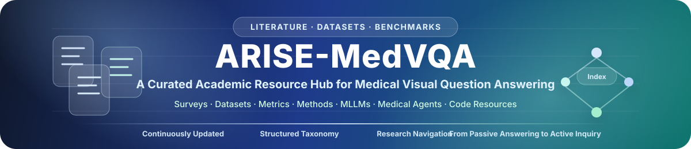

  

  
  
  
  
  

  <b>A curated academic resource hub for ARISE-MedVQA</b> 
  From Passive Answering to Active Inquiry · Evidence-Driven Reasoning · Medical Visual Question Answering

# Awesome ARISE-MedVQA

ARISE-MedVQA is a curated literature resource repository for Medical Visual Question Answering (Med-VQA), covering surveys, research directions, datasets, benchmarks, evaluation metrics, representative methods, and multimodal medical agent studies. The repository is not a single model implementation. Instead, it provides a structured and continuously updated entry point for researchers to understand the evolution, core resources, evaluation frameworks, and emerging trends of Med-VQA. Centered on the shift from passive answer prediction to active, evidence-seeking, risk-aware clinical inquiry, ARISE-MedVQA organizes key papers, datasets, benchmarks, evaluation protocols, and technical methods to support literature review, dataset selection, method comparison, experimental design, survey writing, and future research on interactive and clinically grounded medical AI.

## Intended Audience
This project is suitable for the following research and teaching scenarios:
- Researchers working on Medical Visual Question Answering, medical multimodal large models, and medical AI agents;
- Graduate students who need a quick and structured overview of Med-VQA datasets, methods, benchmarks, and research trends;
- Developers working on medical image question answering, report generation, interactive diagnostic support, or knowledge-enhanced medical reasoning;
- Authors preparing Med-VQA surveys, research proposals, grant applications, thesis topics, or benchmark studies;
- Teams interested in building medical multimodal datasets, evaluation frameworks, or active diagnostic interaction systems.

**We will continue to update and refine this repository to keep it aligned with the latest progress in Med-VQA and related medical multimodal AI research.**

# Survey
[1] **Task-Specific Models vs. Large Vision-Language Models in Medical Visual Question Answering: A Survey**  
Huahu Xu, Qishen Chen, Wenxuan He, Xingyuan Chen, [**Honghao Gao***](https://scholar.google.com/citations?user=PiiIpJIAAAAJ)   
*Expert Systems with Applications*, 2026, 132008.   [[DOI](https://doi.org/10.1016/j.eswa.2026.132008)] [[Publisher](https://www.sciencedirect.com/science/article/pii/S095741742600123X)]

[2] **From Visual Question Answering to Intelligent AI Agents in Ophthalmology**   Xiaolan Chen, Ruoyu Chen, Pusheng Xu, Xiaojie Wan, Weiyi Zhang, Bingjie Yan, Xianwen Shang, Mingguang He, Danli Shi  
*British Journal of Ophthalmology*, 2026.   [[DOI](https://doi.org/10.1136/bjo-2024-326097)] [[Publisher](https://bjo.bmj.com/content/110/1/1)]

[3] **Generative Models in Medical Visual Question Answering: A Survey**   Wenjie Dong, Shuhao Shen, Yuqiang Han, Tao Tan, Jian Wu, Hongxia Xu   *Applied Sciences*, **15**(6), 2983, 2025.   [[DOI](https://doi.org/10.3390/app15062983)] [[Publisher](https://www.mdpi.com/2076-3417/15/6/2983)]

[4] **Visual Question Answering in Robotic Surgery: A Comprehensive Review**  Di Ding, Tianliang Yao, Rong Luo, Xusen Sun   *IEEE Access*, **13**, 1–18, 2025.   [[DOI](https://doi.org/10.1109/ACCESS.2024.3525145)] [[Publisher](https://ieeexplore.ieee.org/document/10807961)]

[5] **Vision-Language Models for Medical Report Generation and Visual Question Answering: A Review**   Iryna Hartsock, Ghulam Rasool   *Frontiers in Artificial Intelligence*, **7**, 1430984, 2024.   [[DOI](https://doi.org/10.3389/frai.2024.1430984)] [[Publisher](https://www.frontiersin.org/journals/artificial-intelligence/articles/10.3389/frai.2024.1430984/full)] [[arXiv](https://arxiv.org/abs/2403.02469)]

[6] **Developing ChatGPT for Biology and Medicine: A Complete Review of Biomedical Question Answering**  
Qing Li, Lei Li, Yu Li   *Biophysics Reports*, **10**(3), 2024.   [[DOI](https://doi.org/10.52601/bpr.2024.240004)] [[Publisher](https://www.biophysics-reports.org/en/article/doi/10.52601/bpr.2024.240004)]

[7] **Survey of Multimodal Medical Question Answering**   Hilmi Demirhan, Wlodek W. Zadrozny   *BioMedInformatics*, **4**(1), 56–78, 2024.   [[DOI](https://doi.org/10.3390/biomedinformatics4010004)] [[Publisher](https://www.mdpi.com/2673-7426/4/1/4)]

[8] **Medical Visual Question Answering: A Survey**   Zhihong Lin, Donghao Zhang, Qingyi Tao, Danli Shi, Gholamreza Haffari, Qi Wu, Mingguang He, Zongyuan Ge   *Artificial Intelligence in Medicine*, **153**, 102611, 2024.   [[DOI](https://doi.org/10.1016/j.artmed.2023.102611)] [[Publisher](https://www.sciencedirect.com/science/article/pii/S0933365723002498)] [[arXiv](https://arxiv.org/abs/2111.10056)]

[9] **A Comprehensive Interpretation for Medical VQA: Datasets, Techniques, and Challenges**   Sheerin Sitara Noor Mohamed, Kavitha Srinivasan   *Journal of Intelligent & Fuzzy Systems*, **44**(6), 10527–10545, 2023.   [[DOI](https://doi.org/10.3233/JIFS-222569)] [[Publisher](https://content.iospress.com/articles/journal-of-intelligent-and-fuzzy-systems/ifs222569)]

[10] **A Critical Analysis of Benchmarks, Techniques, and Models in Medical Visual Question Answering**   Suheer Ali Al-Hadhrami, Mohamed El Bachir Menai, Saad Al-Ahmadi, Ahmad Alnafessah   *IEEE Access*, **11**, 136840–136858, 2023.   [[DOI](https://doi.org/10.1109/ACCESS.2023.3335216)] [[Publisher](https://ieeexplore.ieee.org/document/10323452)]

[11] **Visual Question Answering in the Medical Domain Based on Deep Learning Approaches: A Comprehensive Study**   Aisha Al-Sadi, Mahmoud Al-Ayyoub, Yaser Jararweh, Fumie Costen   *Pattern Recognition Letters*, **152**, 118–128, 2021.   [[DOI](https://doi.org/10.1016/j.patrec.2021.07.002)] [[Publisher](https://www.sciencedirect.com/science/article/pii/S0167865521002657)]

# Datasets (Open Access)

## 1.1 Early Medical Visual Question Answering Datasets

[1] **VQA-RAD**, A Dataset of Clinically Generated Visual Questions and Answers About Radiology Images  
Jason J. Lau, Soumya Gayen, Asma Ben Abacha, **[Dina Demner-Fushman\*](https://scholar.google.com/citations?user=ashaP54AAAAJ)**  
*Scientific Data*, **5**, 180251, **2018**.  
[[DOI](https://doi.org/10.1038/sdata.2018.251)] [[Publisher](https://www.nature.com/articles/sdata2018251)] [[PubMed](https://pubmed.ncbi.nlm.nih.gov/30457565/)] [[Dataset](https://doi.org/10.17605/OSF.IO/89KPS)] 

[2] **VQA-Med 2019**, VQA-Med: Overview of the Medical Visual Question Answering Task at ImageCLEF 2019 
Asma Ben Abacha, Sadid A. Hasan, Vivek V. Datla, Joey Liu, Dina Demner-Fushman, Henning Müller  
*Working Notes of CLEF 2019*, CEUR Workshop Proceedings 2380, **2019**.  
[[Publisher](https://ceur-ws.org/Vol-2380/)] [[PDF](https://ceur-ws.org/Vol-2380/paper_272.pdf)] [[Dataset](https://zenodo.org/records/10499039)] [[Code/Data](https://github.com/abachaa/VQA-Med-2019)]

[3] **VQA-Med 2020**, Overview of the VQA-Med Task at ImageCLEF 2020: Visual Question Answering and Generation in the Medical Domain  
Asma Ben Abacha, Vivek V. Datla, Sadid A. Hasan, Dina Demner-Fushman, Henning Müller  
*Working Notes of CLEF 2020*, CEUR Workshop Proceedings 2696, **2020**.  
[[Publisher](https://ceur-ws.org/Vol-2696/)] [[PDF](https://ceur-ws.org/Vol-2696/paper_106.pdf)] [[Code/Dataset](https://github.com/abachaa/VQA-Med-2020)]

[4] **SLAKE**: A Semantically-Labeled Knowledge-Enhanced Dataset for Medical Visual Question Answering  
Bo Liu, Li-Ming Zhan, Li Xu, Lin Ma, Yan Yang, **Xiao-Ming Wu\***  
*2021 IEEE 18th International Symposium on Biomedical Imaging (ISBI)*, 1650–1654, **2021**.  
[[DOI](https://doi.org/10.1109/ISBI48211.2021.9434010)] [[Publisher](https://ieeexplore.ieee.org/document/9434010)] [[arXiv](https://arxiv.org/abs/2102.09542)] [[Dataset](https://www.med-vqa.com/slake/)] 

[5] **PathVQA**, Towards Visual Question Answering on Pathology Images 
Xuehai He, Zhuo Cai, Wenlan Wei, Yichen Zhang, Luntian Mou, Eric Xing, **[Pengtao Xie\*](https://scholar.google.com/citations?user=cnncomYAAAAJ)**  
*Proceedings of the 59th Annual Meeting of the Association for Computational Linguistics and the 11th International Joint Conference on Natural Language Processing (ACL-IJCNLP), Volume 2: Short Papers*, 708–718, **2021**.  
[[DOI](https://doi.org/10.18653/v1/2021.acl-short.90)] [[Publisher](https://aclanthology.org/2021.acl-short.90/)] [[PDF](https://aclanthology.org/2021.acl-short.90.pdf)] [[Code/Dataset](https://github.com/UCSD-AI4H/PathVQA)]

[6] **OVQA**: A Clinically Generated Visual Question Answering Dataset  
Yefan Huang, Xiaoli Wang, Feiyan Liu, Guofeng Huang  
*Proceedings of the 45th International ACM SIGIR Conference on Research and Development in Information Retrieval (SIGIR)*, 2924–2938, **2022**.  
[[DOI](https://doi.org/10.1145/3477495.3531724)] [[Publisher](https://dl.acm.org/doi/10.1145/3477495.3531724)] [[arXiv](https://arxiv.org/abs/2211.06862)]

[7] **P-VQA**, Medical Knowledge-Based Network for Patient-Oriented Visual Question Answering 
Jian Huang, Yihao Chen, Yong Li, Zhenguo Yang, Xuehao Gong, Fu Lee Wang, Xiaohong Xu, Wenyin Liu  
*Information Processing & Management*, 60(2), 103241, **2023**.  
[[DOI](https://doi.org/10.1016/j.ipm.2022.103241)] [[Publisher](https://www.sciencedirect.com/science/article/pii/S0306457322003429)] [[Code/Dataset](https://github.com/cs-jerhuang/P-VQA)]

## 1.2 Large-Scale General Medical VQA Datasets

[8] **PMC-OA**, PMC-CLIP: Contrastive Language-Image Pre-training Using Biomedical Documents Weixiong Lin, Ziheng Zhao, Xiaoman Zhang, Chaoyi Wu, Ya Zhang, Yanfeng Wang, [**Weidi Xie\***](https://scholar.google.com/citations?user=Vtrqj4gAAAAJ)  *Medical Image Computing and Computer Assisted Intervention – MICCAI 2023*, LNCS 14227, 525–536, **2023**.  [[DOI](https://doi.org/10.1007/978-3-031-43993-3_51)] [[Publisher](https://link.springer.com/chapter/10.1007/978-3-031-43993-3_51)] [[arXiv](https://arxiv.org/abs/2303.07240?utm_source=chatgpt.com)] [[Code](https://github.com/WeixiongLin/PMC-CLIP)] [[Dataset](https://huggingface.co/datasets/axiong/pmc_oa?utm_source=chatgpt.com)]

[9] **PMC-VQA**, Development of a Large-Scale Medical Visual Question-Answering Dataset Xiaoman Zhang, Chaoyi Wu, Ziheng Zhao, Weixiong Lin, Ya Zhang, **Yanfeng Wang\***, [**Weidi Xie\***](https://scholar.google.com/citations?user=Vtrqj4gAAAAJ)  *Communications Medicine*, 4, 277, **2024**.  [[DOI](https://doi.org/10.1038/s43856-024-00709-2)] [[Publisher](https://www.nature.com/articles/s43856-024-00709-2?utm_source=chatgpt.com)] [[PubMed](https://pubmed.ncbi.nlm.nih.gov/39709495/?utm_source=chatgpt.com)] [[Code](https://github.com/xiaoman-zhang/PMC-VQA)] [[Dataset](https://huggingface.co/datasets/xmcmic/PMC-VQA)]

[10] **PubMedVision**, Towards Injecting Medical Visual Knowledge into Multimodal LLMs at Scale  Junying Chen, Chi Gui, Ruyi Ouyang, Anningzhe Gao, Shunian Chen, Guiming Hardy Chen, Xidong Wang, Zhenyang Cai, Ke Ji, Guangjun Yu, Xiang Wan, [**Benyou Wang\***](https://scholar.google.com/citations?user=Jk4vJU8AAAAJ)  *Proceedings of the 2024 Conference on Empirical Methods in Natural Language Processing (EMNLP)*, 7346–7370, **2024**.  [[DOI](https://doi.org/10.18653/v1/2024.emnlp-main.418)] [[Publisher](https://aclanthology.org/2024.emnlp-main.418/?utm_source=chatgpt.com)] [[PDF](https://aclanthology.org/2024.emnlp-main.418.pdf?utm_source=chatgpt.com)] [[Code](https://github.com/FreedomIntelligence/HuatuoGPT-Vision)] [[Dataset](https://huggingface.co/datasets/FreedomIntelligence/PubMedVision)]

[11] **OmniMedVQA**: A New Large-Scale Comprehensive Evaluation Benchmark for Medical LVLM Yutao Hu, Tianbin Li, Quanfeng Lu, [**Wenqi Shao\***](https://scholar.google.com/citations?user=Bs9mrwwAAAAJ), Junjun He, Yu Qiao, [**Ping Luo\***](https://scholar.google.com/citations?user=aXdjxb4AAAAJ)  *Proceedings of the IEEE/CVF Conference on Computer Vision and Pattern Recognition (CVPR)*, 22170–22183, **2024.**  [[DOI](https://doi.org/10.1109/CVPR52733.2024.02093)] [[Publisher](https://openaccess.thecvf.com/content/CVPR2024/html/Hu_OmniMedVQA_A_New_Large-Scale_Comprehensive_Evaluation_Benchmark_for_Medical_LVLM_CVPR_2024_paper.html?utm_source=chatgpt.com)] [[arXiv](https://arxiv.org/abs/2402.09181)] [[Code](https://github.com/OpenGVLab/Multi-Modality-Arena?utm_source=chatgpt.com)] [[Dataset](https://huggingface.co/datasets/foreverbeliever/OmniMedVQA?utm_source=chatgpt.com)]

[12]  **M3D-VQA**, M3D: Advancing 3D Medical Image Analysis with Multi-Modal Large Language Models  
Fan Bai, Yuxin Du, Tiejun Huang, Max Q.-H. Meng, Bo Zhao  
*arXiv preprint*, arXiv:2404.00578, **2024**.  
[[arXiv](https://arxiv.org/abs/2404.00578)] [[Code](https://github.com/BAAI-DCAI/M3D)] [[Dataset](https://huggingface.co/datasets/GoodBaiBai88/M3D-VQA)]

[13] **3D-RAD: A Comprehensive 3D Radiology Med-VQA Dataset with Multi-Temporal Analysis and Diverse Diagnostic Tasks**  
Xiaotang Gai, Jiaxiang Liu, Yichen Li, Zijie Meng, Jian Wu, [**Zuozhu Liu\***](https://scholar.google.com/citations?user=h602wLIAAAAJ&hl=en)  
*Advances in Neural Information Processing Systems (NeurIPS)*, 38, Datasets and Benchmarks Track, **2025**.  
[[DOI](https://doi.org/10.52202/085713-5656)] [[Publisher](https://proceedings.neurips.cc/paper_files/paper/2025/hash/f8250afec8305ed4a6b27ae405507442-Abstract-Datasets_and_Benchmarks_Track.html)] [[arXiv](https://arxiv.org/abs/2506.11147)] [[Code](https://github.com/Tang-xiaoxiao/3D-RAD)] [[Dataset](https://huggingface.co/datasets/Tang-xiaoxiao/3D-RAD)]

[14] **RadImageNet-VQA**: A Large-Scale CT and MRI Dataset for Radiologic Visual Question Answering  
Léo Butsanets, Charles Corbière, Julien Khlaut, Pierre Manceron, Corentin Dancette  
*Proceedings of the 9th International Conference on Medical Imaging with Deep Learning (MIDL)*, PMLR 315, 3036–3068, **2026**.  
[[Publisher](https://proceedings.mlr.press/v315/butsanets26a.html)] [[arXiv](https://arxiv.org/abs/2512.17396)] [[Dataset](https://huggingface.co/datasets/raidium/RadImageNet-VQA)]

[15] **MedMax:** Mixed-Modal Instruction Tuning for Training Biomedical Assistants  
Hritik Bansal, Daniel Israel, Siyan Zhao, Shufan Li, Tung Nguyen, Aditya Grover  
*Advances in Neural Information Processing Systems (NeurIPS)*, **38**, Datasets and Benchmarks Track, **2025**.  
[[DOI](https://doi.org/10.52202/085713-3588)] [[Publisher](https://proceedings.neurips.cc/paper_files/paper/2025/hash/9a6f7d845cf12385524f0f27ab26f57e-Abstract-Datasets_and_Benchmarks_Track.html)] [[arXiv](https://arxiv.org/abs/2412.12661)] [[Code](https://github.com/Hritikbansal/medmax)] [[Dataset](https://huggingface.co/datasets/mint-medmax/medmax_data)] [[Project](https://mint-medmax.github.io/)]

## 1.3 Chest X-ray VQA and Report-Driven Question Answering Datasets

[16] **EHRXQA / MIMIC-Ext-MIMIC-CXR-VQA**, EHRXQA: A Multi-Modal Question Answering Dataset for Electronic Health Records with Chest X-ray Images 
S. Bae, et al. 
NeurIPS [2023]

[17] **Medical-Diff-VQA**, Expert Knowledge-Aware Image Difference Graph Representation Learning for Difference-Aware Medical Visual Question Answering 
X. Hu, et al. 
KDD [2023]

[18] **Medical-CXR-VQA**, Interpretable medical image Visual Question Answering via multi-modal relationship graph learning 
X. Hu, et al. 
Medical Image Analysis [2024]

[19] Radialog: Large vision-language models for X-ray reporting and dialog-driven assistance 
C. Pellegrini, et al. 
MIDL [2025]

[21] **VinDr-CXR-VQA: A Visual Question Answering Dataset for Explainable Chest X-Ray Analysis with Multi-Task Learning**  
Hai-Dang Nguyen, Ha-Hieu Pham, Hao T. Nguyen, **[Huy-Hieu Pham\*](https://scholar.google.com/citations?user=mXcFcNkAAAAJ)**  
*arXiv preprint*, arXiv:2511.00504, 2025.  
[[arXiv](https://arxiv.org/abs/2511.00504)] [[Dataset](https://huggingface.co/datasets/Dangindev/VinDR-CXR-VQA)]

[21] **ReXVQA: A Large-scale Visual Question Answering Benchmark for Generalist Chest X-ray Understanding**  
Ankit Pal, Jung-Oh Lee, Xiaoman Zhang, Malaikannan Sankarasubbu, Seunghyeon Roh, Won Jung Kim, Meesun Lee, Pranav Rajpurkar  
*Pacific Symposium on Biocomputing*, **31**, 251–264, 2026.  
[[DOI](https://doi.org/10.1142/9789819824755_0018)] [[PubMed](https://pubmed.ncbi.nlm.nih.gov/41758146/)] [[arXiv](https://arxiv.org/abs/2506.04353)] [[Dataset](https://huggingface.co/datasets/rajpurkarlab/ReXVQA)]

[22] **GEMeX: A Large-Scale, Groundable, and Explainable Medical VQA Benchmark for Chest X-ray Diagnosis**  
Bo Liu, Ke Zou, Li-Ming Zhan, Zexin Lu, Xiaoyu Dong, Yidi Chen, Chengqiang Xie, Jiannong Cao, **Xiao-Ming Wu\***, **[Huazhu Fu\*](https://scholar.google.com/citations?user=jCvUBYMAAAAJ)**  
*Proceedings of the IEEE/CVF International Conference on Computer Vision (ICCV)*, 21310–21320, 2025.  
[[DOI](https://doi.org/10.1109/ICCV51701.2025.01979)] [[Publisher](https://openaccess.thecvf.com/content/ICCV2025/html/Liu_GEMeX_A_Large-Scale_Groundable_and_Explainable_Medical_VQA_Benchmark_for_ICCV_2025_paper.html)] [[arXiv](https://arxiv.org/abs/2411.16778)] [[Code](https://github.com/Awenbocc/GEMeX-Project)] [[Project](https://www.med-vqa.com/GEMeX/)]

[23] **GEMeX-RMCoT: An Enhanced Med-VQA Dataset for Region-Aware Multimodal Chain-of-Thought Reasoning**  
Bo Liu, Xiangyu Zhao, Along He, Yidi Chen, **[Huazhu Fu\*](https://scholar.google.com/citations?user=jCvUBYMAAAAJ)** , Xiao-Ming Wu  
*Proceedings of the 33rd ACM International Conference on Multimedia (ACM MM)*, 13213–13220, 2025.  
[[DOI](https://doi.org/10.1145/3746027.3758277)] [[Publisher](https://dl.acm.org/doi/10.1145/3746027.3758277)] [[arXiv](https://arxiv.org/abs/2506.17939)] [[Dataset](https://www.med-vqa.com/GEMeX/)]

[24] **MIMIC-Ext-CXR-QBA**, A Structured, Tagged, and Localized Visual Question Answering Dataset with Full Sentence Answers and Scene Graphs for Chest X-ray Images 
P. Müller, et al. 
ICLR [2026]

[25] **MIMIC-CXR-VQA**, MIMIC-CXR-VQA: A Medical Visual Question Answering Dataset Constructed with LLaMA-based Annotations 
M. Aas-Alas, et al. 
MIDL [2026]

[26] **DAMON-VQA, DAMON: Difference-Aware Medical Visual Question Answering via Multimodal Large Language Model**  
Zefan Zhang, Yanhui Li, Ruihong Zhao, [**Tian Bai***](https://ccst.jlu.edu.cn/info/1367/20115.htm)  
*IEEE Journal of Biomedical and Health Informatics*, **30**(8), 6336–6345, 2026.  
[[DOI](https://doi.org/10.1109/JBHI.2026.3663420)] [[PubMed](https://pubmed.ncbi.nlm.nih.gov/41666056/)] [[Code](https://github.com/zefanZhang-cn/DAMON)]

## 1.4 Specialty-Specific VQA Datasets

### 1.4.1 Ophthalmology VQA

[27] **DME-VQA**, Consistency-preserving visual question answering in medical imaging 
S. Tascon-Morales, P. Márquez-Neila, R. Sznitman 
MICCAI [2022]

[28] **OphthalVQA**, Unveiling the clinical incapabilities: a benchmarking study of GPT-4V(ision) for ophthalmic multimodal image analysis 
P. Xu, et al. 
British Journal of Ophthalmology [2024]

[29] **OphthalWeChat**, Benchmarking large multimodal models for ophthalmic visual question answering with OphthalWeChat 
P. Xu, et al. 
Advances in Ophthalmology Practice and Research [2026]

### 1.4.2 Pathology and Whole Slide Image VQA

[30] **WSI-VQA**, WSI-VQA: Interpreting Whole Slide Images by Generative Visual Question Answering 
P. Chen, et al. 
ECCV [2024]

[31] **QuiltVQA-RED / Quilt-VQA / Quilt-LLaVA-Instruct-107K**, Quilt-LLaVA: Visual Instruction Tuning by Extracting Localized Narratives from Open-Source Histopathology Videos 
M. S. Seyfioglu, et al. 
CVPR [2024]

### 1.4.3 Gastrointestinal Endoscopy and Digestive-Tract VQA

[32] **MEDVQA-GI**, Overview of ImageCLEFmedical 2023: Medical Visual Question Answering for Gastrointestinal Tract 
S. Hicks, et al. 
CLEF Working Notes [2023]

[33] **Kvasir-VQA**, Kvasir-VQA: A Text-Image Pair GI Tract Dataset 
S. Gautam, et al. 
International Workshop on Vision-Language Models for Biomedical Applications [2024]

[34] **Kvasir-VQA-x1**, Kvasir-VQA-x1: A Multimodal Dataset for Medical Reasoning and Robust MedVQA in Gastrointestinal Endoscopy 
S. Gautam, M. A. Riegler, P. Halvorsen 
MICCAI Workshop on Data Engineering in Medical Imaging [2025]

[35] **ColonINST**, Frontiers in Intelligent Colonoscopy 
G.-P. Ji, et al. 
Machine Intelligence Research [2026]

### 1.4.4 Surgical and Robotic Surgery VQA

[36] **Cholec80-VQA**, Surgical-VQA: Visual Question Answering in Surgical Scenes Using Transformer 
L. Seenivasan, et al. 
MICCAI [2022]

[37] **EndoVis-18-VQA**, Surgical-VQA: Visual Question Answering in Surgical Scenes Using Transformer 
L. Seenivasan, et al. 
MICCAI [2022]

[38] **PitVQA**, PitVQA: Image-Grounded Text Embedding LLM for Visual Question Answering in Pituitary Surgery 
R. He, et al. 
MICCAI [2024]

[38-1] **PitVQA++: Vector Matrix-Low-Rank Adaptation for Open-Ended Visual Question Answering in Pituitary Surgery**  
Runlong He, Danyal Z. Khan, Evangelos B. Mazomenos, Hani J. Marcus, Danail Stoyanov, Matthew J. Clarkson, [**Mobarak I. Hoque***](https://scholar.google.com/citations?user=QUwym50AAAAJ&hl=en)  
*IEEE Transactions on Medical Imaging*, **45**(7), 3626–3636, 2026.  
[[DOI](https://doi.org/10.1109/TMI.2026.3681175)] [[PubMed](https://pubmed.ncbi.nlm.nih.gov/41941823/)] [[arXiv](https://arxiv.org/abs/2502.14149)] [[Code](https://github.com/HRL-Mike/PitVQA-Plus)]

[39] **SSG-VQA**, Advancing surgical VQA with scene graph knowledge 
K. Yuan, et al. 
International Journal of Computer Assisted Radiology and Surgery [2024]

[40] **Surg-396K**, EndoChat: Grounded multimodal large language model for endoscopic surgery 
G. Wang, et al. 
Medical Image Analysis [2025]

[41] **EndoVis-17-VQLA / EndoVis-18-VQLA Extensions**, Surgical-VQLA++: Adversarial contrastive learning for calibrated robust visual question-localized answering in robotic surgery 
L. Bai, et al. 
Information Fusion [2025]

[42] **EndoBench**, EndoBench: A comprehensive evaluation of multi-modal large language models for endoscopy analysis 
S. Liu, et al. 
NeurIPS [2025]

### 1.4.5 Dermatology, Wound Care, and Mammography VQA

[43] **DermaVQA**, DermaVQA: A Multilingual Visual Question Answering Dataset for Dermatology 
W.-w. Yim, et al. 
MICCAI [2024]

[44] **WoundcareVQA**, WoundcareVQA: A multilingual visual question answering benchmark dataset for wound care 
W.-w. Yim, et al. 
Journal of Biomedical Informatics [2025]

[45] **MammoVQA**, A Benchmark for Breast Cancer Screening and Diagnosis in Mammogram Visual Question Answering 
J. Zhu, et al. 
Nature Communications [2025]

[46] **DermaVQA-DAS**, DermaVQA-DAS: Dermatology Assessment Schema (DAS) & Datasets for Closed-Ended Question Answering & Segmentation in Patient-Generated Dermatology Images 
W.-w. Yim, et al. 
arXiv preprint arXiv:2512.24340 [2025]

## 1.5 Localized, Explainable, and Reasoning-Enhanced VQA Datasets

[47] **RIS-VQA**, Localized questions in medical visual question answering 
S. Tascon-Morales, P. Márquez-Neila, R. Sznitman 
MICCAI [2023]

[48] **INSEGCAT-VQA**, Localized questions in medical visual question answering 
S. Tascon-Morales, P. Márquez-Neila, R. Sznitman 
MICCAI [2023]

[49] **EndoVis-17-VQLA / EndoVis-18-VQLA**, Surgical-VQLA: Transformer with Gated Vision-Language Embedding for Visual Question Localized-Answering in Robotic Surgery 
L. Bai, et al. 
ICRA [2023]

[50] **MedThink**, MedThink: A Rationale-Guided Framework for Explaining Medical Visual Question Answering 
X. Gai, et al. 
Findings of ACL: NAACL [2025]

[51] **Med-SER**, Med-SER: Enhancing Reasoning Interpretability in Medical Visual Question Answering via Structured Chain-of-Thought 
J. Qiao, et al. 
BIBM [2025]

[52] **MeCoVQA**, Towards a multimodal large language model with pixel-level insight for biomedicine 
X. Huang, et al. 
AAAI [2025]

[53] **C-SLAKE**, Consistency Conditioned Memory Augmented Dynamic Diagnosis Model for Medical Visual Question Answering 
T. Yu, et al. 
IEEE Journal of Biomedical and Health Informatics [2025]

## 1.6 Medical Education, Examination, Multi-Source Data, and Interactive Question Answering Resources

[54] **MMMD**, A Multilingual Multimodal Medical Examination Dataset for Visual Question Answering in Healthcare 
G. Riccio, et al. 
CBMS [2025]

[55] **MEDSQ**, MEDSQ: Towards personalized medical education via multi-form interaction guidance 
Y. Ouyang, et al. 
Expert Systems with Applications [2025]

[56] **MedFrameQA**, MedFrameQA: A Multi-Image Medical VQA Benchmark for Clinical Reasoning 
S. Yu, et al. 
arXiv preprint arXiv:2505.16964 [2025]

[57] **MedDQA**, Integration of Multi-Source Medical Data for Medical Diagnosis Question Answering 
Q. Peng, et al. 
IEEE Transactions on Medical Imaging [2025]

[58] **SilVar-Med**, SilVar-Med: A Speech-Driven Visual Language Model for Explainable Abnormality Detection in Medical Imaging 
T.-H. Pham, et al. 
CVPR [2025]
Information Processing & Management [2023]

# Methods (Selected)

## 1.1 Feature Fusion and Attention-based Medical VQA

[1] **MedFuseNet: An attention-based multimodal deep learning model for visual question answering in the medical domain** 
Sharma, D., S. Purushotham, C. K. Reddy 
Scientific Reports [2021]

[2] **Hierarchical deep multi-modal network for medical visual question answering** 
Gupta, D., S. Suman, A. Ekbal 
Expert Systems with Applications [2021]

[3] **Medical visual question answering via corresponding feature fusion combined with semantic attention** 
Zhu, H., et al. 
Mathematical Biosciences and Engineering [2022]

[4] **Type-Aware Medical Visual Question Answering** 
Zhang, A., et al. 
ICASSP [2022]

[5] **Medical visual question answering based on question-type reasoning and semantic space constraint** 
Wang, M., et al. 
Artificial Intelligence in Medicine [2022]

[6] **MHKD-MVQA: Multimodal Hierarchical Knowledge Distillation for Medical Visual Question Answering** 
Wang, J., et al. 
BIBM [2022]

[7] **M2FNet: Multi-granularity feature fusion network for medical visual question answering** 
Wang, H., et al. 
PRICAI [2022]

[8] **AMAM: An attention-based multimodal alignment model for medical visual question answering** 
Pan, H., et al. 
Knowledge-Based Systems [2022]

[9] **BPI-MVQA: a bi-branch model for medical visual question answering** 
Liu, S., et al. 
BMC Medical Imaging [2022]

[10] **A Transformer-based Medical Visual Question Answering Model** 
Liu, L., et al. 
ICPR [2022]

[11] **How Well Apply Multimodal Mixup and Simple MLPs Backbone to Medical Visual Question Answering?** 
Liu, L., X. Su 
BIBM [2022]

[12] **A Bi-level representation learning model for medical visual question answering** 
Li, Y., et al. 
Journal of Biomedical Informatics [2022]

[13] **Caption-aware medical VQA via semantic focusing and progressive cross-modality comprehension** 
Cong, F., et al. 
ACM Multimedia [2022]

[14] **Question-guided feature pyramid network for medical visual question answering** 
Yu, Y., et al. 
Expert Systems with Applications [2023]

[15] **FGCVQA: Fine-Grained Cross-Attention for Medical VQA** 
Wu, Z., et al. 
ICIP [2023]

[16] **Asymmetric cross-modal attention network with multimodal augmented mixup for medical visual question answering** 
Li, Y., et al. 
Artificial Intelligence in Medicine [2023]

[17] **Medical visual question answering with symmetric interaction attention and cross-modal gating** 
Chen, Z., et al. 
Biomedical Signal Processing and Control [2023]

[18] **Pre-trained multilevel fuse network based on vision-conditioned reasoning and bilinear attentions for medical image visual question answering** 
Cai, L., H. Fang, Z. Li 
Journal of Supercomputing [2023]

[19] **Visual Question Answer System for Skeletal Image Using Radiology Images in the Healthcare Domain Based on Visual and Textual Feature Extraction Techniques** 
Y. I, J. M., M. Shrimali, S. Gawade 
Annals of Data Science [2024]

[20] **Multimodal fusion: advancing medical visual question-answering** 
Mudgal, A., et al. 
Neural Computing and Applications [2024]

[21] **Deep Fuzzy Multiteacher Distillation Network for Medical Visual Question Answering** 
Liu, Y., et al. 
IEEE Transactions on Fuzzy Systems [2024]

[22] **Leveraging Convolutional Models as Backbone for Medical Visual Question Answering** 
Liu, L., X. Su, G. Gao 
BIBM [2024]

[23] **Optimizing Transformer and MLP with Hidden States Perturbation for Medical Visual Question Answering** 
Liu, L., X. Su, G. Gao 
BIBM [2024]

[24] **Multi-modal multi-head self-attention for medical VQA** 
Joshi, V., P. Mitra, S. Bose 
Multimedia Tools and Applications [2024]

[25] **A Dual-Attention Learning Network With Word and Sentence Embedding for Medical Visual Question Answering** 
Huang, X., H. Gong 
IEEE Transactions on Medical Imaging [2024]

[26] **Transforming Medical Imaging: A VQA Model for Microscopic Blood Cell Classification** 
Fatima, I., et al. 
IEEE Access [2024]

[27] **MMQL: Multi-Question Learning for Medical Visual Question Answering** 
Chen, Q., M. Bian, H. Xu 
MICCAI [2024]

[28] **Overcoming Data Limitations and Cross-Modal Interaction Challenges in Medical Visual Question Answering** 
Bi, Y., et al. 
IJCNN [2024]

[29] **Efficient Bilinear Attention-based Fusion for Medical Visual Question Answering** 
Zhang, Z., et al. 
IJCNN [2025]

[30] **Enhanced Medical Visual Question Answering Using Multi-Feature Fusion and Similarity-Based Answer Selection** 
Yu, F., et al. 
IJCNN [2025]

[31] **A medical visual question-answering model based on multi-scale feature fusion and question Feature enhancement** 
Xia, H., et al. 
Multimedia Systems [2025]

[32] **Visual question answering on blood smear images using convolutional block attention module powered object detection** 
Lubna, A., S. Kalady, A. Lijiya 
The Visual Computer [2025]

[33] **Meta-Learning with Attention Network for Medical Visual Question Answering** 
Liu, L., et al. 
BIBM [2025]

[34] **Answer Semantics-enhanced Medical Visual Question Answering** 
Liang, Y., et al. 
Machine Intelligence Research [2025]

[35] **Inference enhanced model with answer refinement for medical visual question answering** 
Li, Y., et al. 
Multimedia Systems [2025]

[36] **VG-CALF: a vision-guided cross-attention and late-fusion network for radiology images in Medical Visual Question Answering** 
Lameesa, A., C. Silpasuwanchai, M. S. B. Alam 
Neurocomputing [2025]

[37] **Answer Distillation Network With Bi-Text-Image Attention for Medical Visual Question Answering** 
Gong, H., L. Li 
IEEE Access [2025]

[38] **Contextual Feature-Based Medical Visual Question Answering Aided by Learnable Matrix** 
Gong, C., et al. 
Pattern Recognition and Computer Vision [2025]

[39] **A Language-Guided Progressive Fusion Network with semantic density alignment for Medical Visual Question Answering** 
Du, S., S. Liang, Y. Gu 
Journal of Biomedical Informatics [2025]

[40] **Body Part-Aware Cross-Modal Feature Interaction Learning for Medical Vision Question Answering** 
Dai, S., et al. 
ICIC [2025]

[41] **Visual question answering for medical diagnosis** 
Ben Chaabane, N., M. Bal-Ghaoui 
Intelligent Systems with Applications [2025]

[42] **CMID: Towards Medical Visual Question Answering via Contrastive Mutual Information Decoding**  
Zhihong Zhu, Yunyan Zhang, Fan Zhang, Bowen Xing, [**Xian Wu\***](https://scholar.google.com/citations?user=lslB5jkAAAAJ&hl=zh-CN)  
*Proceedings of the AAAI Conference on Artificial Intelligence*, **40**(41), 35275–35283, 2026.  
[[DOI](https://doi.org/10.1609/aaai.v40i41.40835)] [[Publisher](https://ojs.aaai.org/index.php/AAAI/article/view/40835)] [[PDF](https://ojs.aaai.org/index.php/AAAI/article/download/40835/44796)]

[42-1] **Dual-Level Confidence based Implicit Self-Refinement for Medical Visual Question Answering**  
Meihong Pan, [**Yefeng Zheng***](https://scholar.google.com/citations?user=vAIECxgAAAAJ&amp;hl=zh-CN)  
*Proceedings of the IEEE/CVF Conference on Computer Vision and Pattern Recognition (CVPR)*, 17215–17225, 2026.  
[[Publisher](https://openaccess.thecvf.com/content/CVPR2026/html/Pan_Dual-Level_Confidence_based_Implicit_Self-Refinement_for_Medical_Visual_Question_Answering_CVPR_2026_paper.html)] [[Code](https://github.com/pmhDL/DuCoR)]

## 1.2 Vision-Language Pre-training and Cross-modal Representation Alignment

[42] **Contrastive pre-training and representation distillation for medical visual question answering based on radiology images** 
Liu, B., L.-M. Zhan, X.-M. Wu 
MICCAI [2021]

[43] **MMBERT: Multimodal BERT pretraining for improved medical VQA** 
Khare, Y., et al. 
ISBI [2021]

[44] **Multi-modal Masked Autoencoders for Medical Vision-and-Language Pre-training** 
Chen, Z., et al. 
MICCAI [2022]

[45] **PLMVQA: Applying Pseudo Labels for Medical Visual Question Answering with Limited Data** 
Yu, Z., et al. 
MICCAI [2023]

[46] **PMC-CLIP: Contrastive language-image pre-training using biomedical documents** 
Lin, W., et al. 
MICCAI [2023]

[47] **Self-Supervised Vision-Language Pretraining for Medial Visual Question Answering** 
Li, P., et al. 
ISBI [2023]

[48] **Masked Vision and Language Pre-training with Unimodal and Multimodal Contrastive Losses for Medical Visual Question Answering** 
Li, P., et al. 
MICCAI [2023]

[49] **A Weak Supervision-based Robust Pretraining Method for Medical Visual Question Answering** 
He, S., et al. 
BIBM [2023]

[50] **PubMedCLIP: How Much Does CLIP Benefit Visual Question Answering in the Medical Domain?** 
Eslami, S., C. Meinel, G. de Melo 
Findings of EACL [2023]

[51] **Diffusion-based Visual Representation Learning for Medical Question Answering** 
Bian, D., X. Wang, M. Li 
ACML [2023]

[52] **Cross-Modal self-supervised vision language pre-training with multiple objectives for medical visual question answering** 
Liu, G., et al. 
Journal of Biomedical Informatics [2024]

[53] **Leveraging Coarse-to-Fine Grained Representations in Contrastive Learning for Differential Medical Visual Question Answering** 
Liang, X., et al. 
MICCAI [2024]

[54] **MISS: A Generative Pre-training and Fine-Tuning Approach for Med-VQA** 
Chen, J., et al. 
Artificial Neural Networks and Machine Learning [2024]

[55] **Alignment, Mining and Fusion: Representation Alignment with Hard Negative Mining and Selective Knowledge Fusion for Medical Visual Question Answering**  
Yuanhao Zou, **[Zhaozheng Yin\*](https://scholar.google.com/citations?user=x-y92ksAAAAJ)**  
*Proceedings of the IEEE/CVF Conference on Computer Vision and Pattern Recognition (CVPR)*, 29623–29633, 2025.  
[[DOI](https://doi.org/10.1109/CVPR52734.2025.02758)] [[Publisher](https://openaccess.thecvf.com/content/CVPR2025/html/Zou_Alignment_Mining_and_Fusion_Representation_Alignment_with_Hard_Negative_Mining_CVPR_2025_paper.html)] [[arXiv](https://arxiv.org/abs/2510.08791)] [[Code](https://github.com/AlexCo1d/AMiF)]

[56] **MVCM: Enhancing Multi-View and Cross-Modality Alignment for Medical Visual Question Answering and Medical Image-Text Retrieval** 
Zou, Y., Z. Yin 
CVPR [2025]

[57] **MLP-Based Vision Language Pre-Training for Medical Visual Question Answering** 
Zhang, Z., J. He, P. Li 
BIBM [2025]

[58] **UnICLAM: Contrastive Representation Learning with Adversarial Masking for Unified and Interpretable Medical Vision Question Answering**  
Chenlu Zhan, Peng Peng, [**Hongwei Wang\***](https://scholar.google.com/citations?user=lFbTT5AAAAAJ&hl=en), Gaoang Wang, Yu Lin, **Tao Chen\***, Hongsen Wang  
*Medical Image Analysis*, **101**, 103464, 2025.  
[[DOI](https://doi.org/10.1016/j.media.2025.103464)] [[Publisher](https://www.sciencedirect.com/science/article/pii/S136184152500012X)] [[PubMed](https://pubmed.ncbi.nlm.nih.gov/39847954/)] [[arXiv](https://arxiv.org/abs/2212.10729)]

[59] **BaMCo: Balanced Multimodal Contrastive Learning for Knowledge-Driven Medical VQA**  [**Ziya Ata Yazıcı***](https://scholar.google.com/citations?user=D_i4ga8AAAAJ&hl=en), Hazım Kemal Ekenel  
*Medical Image Computing and Computer Assisted Intervention – MICCAI 2025*, **LNCS 15966**, 77–87, 2025.  
[[DOI](https://doi.org/10.1007/978-3-032-04981-0_8)] [[Publisher](https://link.springer.com/chapter/10.1007/978-3-032-04981-0_8)] [[MICCAI](https://papers.miccai.org/miccai-2025/0088-Paper3305.html)] [[Code](https://github.com/yaziciz/BaMCo)]

[60] **Medical Vision-Language Pre-training with Multimodal Variational Masked Autoencoder for Robust Medical VQA**  
Dexuan Xu, Yanyuan Chen, [**Yu Huang\***](https://faculty.pku.edu.cn/hy/zh_CN/index.htm), Shihao E, Yiwei Lou, Yongzhi Cao, Hanpin Wang, Meikang Qiu  
*Proceedings of the 33rd ACM International Conference on Multimedia (ACM MM)*, 3991–4000, 2025.  
[[DOI](https://doi.org/10.1145/3746027.3755273)] [[Publisher](https://dl.acm.org/doi/10.1145/3746027.3755273)]

[61] **Unimodality-Supervised Contrastive Learning and Inference Enhancement Method for Medical Visual Question Answering** 
Tian, Y., et al. 
IJCNN [2025]

[62] **Beyond Static Knowledge: Dynamic Context-Aware Cross-Modal Contrastive Learning for Medical Visual Question Answering** Rui Yang, [**Lijun Liu***](https://scholar.google.com/citations?user=bi_u1-sAAAAJ), Xupeng Feng, Wei Peng, Xiaobing Yang *IEEE Transactions on Medical Imaging*, **45**(3), 1075–1087, 2026. [[DOI](https://doi.org/10.1109/TMI.2025.3617289)] [[Publisher](https://ieeexplore.ieee.org/document/11192609)] [[PubMed](https://pubmed.ncbi.nlm.nih.gov/41052164/)] [[Code](https://github.com/cloneiq/CKRA-MedVQA)]

[63] **Redefining Medical Visual Question Answering Using Conditional Generative Diffusion Models**  
Bing Liu, **[Lijun Liu\*](https://scholar.google.com/citations?user=bi_u1-sAAAAJ)**, Xiaobing Yang, Wei Peng, Li Liu  
*Biomedical Signal Processing and Control*, **111**, 108222, 2026.  
[[DOI](https://doi.org/10.1016/j.bspc.2025.108222)] [[Publisher](https://www.sciencedirect.com/science/article/pii/S1746809425007335)] [[Code](https://github.com/cloneiq/DiffuVQA)]

[63-1] **MedFG-VQA: Low-Frequency Memory and Graph Attention for Lightweight Medical VQA**  
Haowen Gu, Gensheng Pei, Zeren Sun, [**Mingwu Ren***](https://cs.njust.edu.cn/e4/01/c1730a189441/page.htm), Xiangbo Shu, Yazhou Yao, Fumin Shen  
*Proceedings of the IEEE/CVF Conference on Computer Vision and Pattern Recognition (CVPR)*, 42755–42764, 2026.  
[[Publisher](https://openaccess.thecvf.com/content/CVPR2026/html/Gu_MedFG-VQA_Low-Frequency_Memory_and_Graph_Attention_for_Lightweight_Medical_VQA_CVPR_2026_paper.html)] [[arXiv](https://arxiv.org/abs/2608.26848)] [[Code](https://github.com/NUST-Machine-Intelligence-Laboratory/MedFG)]

[63-2] **M3D-QAdapter: 3D Medical VQA with Lesion-Level Finding-Segmentation Alignment and Query-Driven Adaptive Token Reduction**  Hong Liu, Dong Wei, Hongze Zhu, Yinghao Zhang, Yefeng Zheng, [**Xian Wu\***](https://scholar.google.com/citations?user=lslB5jkAAAAJ), [**Liansheng Wang\*** ](https://xmu-lswang.github.io/) *Medical Image Computing and Computer Assisted Intervention – MICCAI 2026*, **LNCS 16879**, 360–370, 2026.  [[DOI](https://doi.org/10.1007/978-3-032-38062-3_34)] [[Publisher](https://link.springer.com/chapter/10.1007/978-3-032-38062-3_34?utm_source=chatgpt.com)] [[MICCAI](https://papers.miccai.org/miccai-2026/0604-Paper1643.html?utm_source=chatgpt.com)] [[Code](https://github.com/ccarliu/M3D-QAdapter)]

## 1.3 Knowledge-enhanced and Retrieval-augmented Medical VQA

[64] **RAMM: Retrieval-augmented Biomedical Visual Question Answering with Multi-modal Pre-training** 
Yuan, Z., et al. 
ACM Multimedia [2023]

[65] **Medical knowledge-based network for patient-oriented visual question answering** 
Huang, J., et al. 
Information Processing & Management [2023]

[66] **K-PathVQA: Knowledge-Aware Multimodal Representation for Pathology Visual Question Answering** 
Naseem, U., et al. 
IEEE Journal of Biomedical and Health Informatics [2024]

[67] **Candidate-Heuristic In-Context Learning: A new framework for enhancing medical visual question answering with LLMs** 
Liang, X., et al. 
Information Processing & Management [2024]

[68] **MKGF: A multi-modal knowledge graph based RAG framework to enhance LVLMs for Medical visual question answering** 
Wu, Y., et al. 
Neurocomputing [2025]

[69] **MedKI: Knowledge Dual Injections for Medical Visual Question Answering** 
Ren, H., et al. 
ICIP [2025]

[70] **Integration of Multi-Source Medical Data for Medical Diagnosis Question Answering** 
Peng, Q., et al. 
IEEE Transactions on Medical Imaging [2025]

[71] **Bridging the Semantic Gap in Medical Visual Question Answering With Prompt Learning**  
Zilin Lu, Qingjie Zeng, Mengkang Lu, Geng Chen, **[Yong Xia\*](https://scholar.google.com/citations?user=Usw1jeMAAAAJ)**  
*IEEE Transactions on Medical Imaging*, **44**(11), 4605–4616, 2025.  
[[DOI](https://doi.org/10.1109/TMI.2025.3580561)] [[Publisher](https://ieeexplore.ieee.org/document/11039185)] [[PubMed](https://pubmed.ncbi.nlm.nih.gov/40526558/)]

[72] **Fine-grained knowledge fusion for retrieval-augmented medical visual question answering** 
Liang, X., et al. 
Information Fusion [2025]

[73] **MAP-GR: medical aware prompt and graph-guided reasoning for enhanced medical visual question answering** 
Yu, Y., et al. 
Neurocomputing [2026]

[74] **Large-small model collaboration for medical visual question answering with task aware mixture of experts and relation knowledge distillation** 
Chen, Q., et al. 
Image and Vision Computing [2026]

[75] **KG-CMI: Knowledge Graph Enhanced Cross-Mamba Interaction for Medical Visual Question Answering**  
Xianyao Zheng, Hong Yu, Hui Cui, Changming Sun, Xiangyu Li, Ran Su, Leyi Wei, Jia Zhou, Junbo Wang, **[Qiangguo Jin\*](https://scholar.google.com/citations?user=USoKG48AAAAJ)**  
*IEEE Transactions on Industrial Informatics*, **22**(7), 6313–6324, 2026.  
[[DOI](https://doi.org/10.1109/TII.2026.3676874)] [[Publisher](https://ieeexplore.ieee.org/document/11478768)] [[arXiv](https://arxiv.org/abs/2604.00601)] [[Code](https://github.com/BioMedIA-repo/KG-CMI)]

[75-1] **MR-RAG: Multimodal Relevance-Aware Retrieval-Augmented Generation for Medical Visual Question Answering**  
Xuze Li, Haozhao Wang, Zhenyu Huang, Zhongxu Wang, Jinghua Zhang, [**Ruixuan Li***](https://scholar.google.com/citations?user=scAIu2MAAAAJ)  
*Proceedings of the IEEE/CVF Conference on Computer Vision and Pattern Recognition (CVPR)*, 15010–15019, 2026.  
[[Publisher](https://openaccess.thecvf.com/content/CVPR2026/html/Li_MR-RAG_Multimodal_Relevance-Aware_Retrieval-Augmented_Generation_for_Medical_Visual_Question_Answering_CVPR_2026_paper.html)]

[75-2] **MEC: Medical Evidence Capsules for Retrieval-Augmented Generation in Medical Multimodal Question Answering**  Zhenghua Xu, Xinwei Dai, [**Bo Wang\***](https://scholar.google.com/citations?user=Z7_ciAIAAAAJ&hl=en), Tian Tian *Medical Image Computing and Computer Assisted Intervention – MICCAI 2026*, **LNCS 16878**, 303–312, 2026.  [[DOI](https://doi.org/10.1007/978-3-032-38059-3_29)] [[Publisher](https://link.springer.com/chapter/10.1007/978-3-032-38059-3_29?utm_source=chatgpt.com)] [[MICCAI](https://papers.miccai.org/miccai-2026/0626-Paper2354.html?utm_source=chatgpt.com)] [[Code](https://github.com/fruitbitlab/MEC)]

## 1.4 Prompt Learning and Parameter-efficient Adaptation for Medical VQA

[75] **Prompt-Based Personalized Federated Learning for Medical Visual Question Answering** 
Zhu, H., et al. 
ICASSP [2024]

[76] **Targeted visual prompting for medical visual question answering** 
Tascon-Morales, S., P. Márquez-Neila, R. Sznitman 
International Workshop on Applications of Medical AI [2024]

[77] **Parameter-Efficient Transfer Learning for Medical Visual Question Answering** 
Liu, J., et al. 
IEEE Transactions on Emerging Topics in Computational Intelligence [2024]

[78] **LaPA: Latent Prompt Assist Model For Medical Visual Question Answering** 
Gu, T., et al. 
CVPR [2024]

[79] **UniDCP: Unifying Multiple Medical Vision-Language Tasks via Dynamic Cross-Modal Learnable Prompts** 
Zhan, C., et al. 
IEEE Transactions on Multimedia [2024]

[80] **Effective Medical Visual Question Answering Using Dynamic Prompting and Decoding Knowledge Editing** 
Zhou, Z., et al. 
Data Science and Engineering [2025]

[81] **Fine-grained Adaptive Visual Prompt for Generative Medical Visual Question Answering**  
Ting Yu, Zixuan Tong, Jun Yu, **[Ke Zhang\*](https://scholar.google.com/citations?user=RMLMbeMAAAAJ)**  
*Proceedings of the AAAI Conference on Artificial Intelligence*, **39**(9), 9662–9670, 2025.  
[[DOI](https://doi.org/10.1609/aaai.v39i9.33047)] [[Publisher](https://ojs.aaai.org/index.php/AAAI/article/view/33047)] [[PDF](https://ojs.aaai.org/index.php/AAAI/article/download/33047/35202)] [[Code](https://github.com/OpenMICG/FAVP)]

[82] **Multi-Scale Visual Prompting for Robust Visual Question Answering in Medical Imaging** 
Ma, Y., et al. 
BIBM [2025]

[83] **Caption-augmented reasoning model with Hierarchical rank LoRA finetuing for medical visual question Answering** 
Li, Y., et al. 
Journal of Biomedical Informatics [2025]

[84] **X-FLoRA: Cross-modal Federated Learning with Modality-expert LoRA for Medical VQA** 
Kim, M. H., C. Kim, S. B. Yoo 
EMNLP [2025]

[85] **Optimizing multimodal models for medical visual question answering: A comparative study of LoRA and AdaLoRA on VQA-RAD and SLAKE-VQA** 
Rezaei, Z., S. S. Samghabadi, Y. M. Banad 
Computers in Biology and Medicine [2026]

[85-1] **MOTOR: Multimodal Optimal Transport via Grounded Retrieval in Medical Visual Question Answering**  Mai A. Shaaban, Tausifa Jan Saleem, Vijay Ram Kumar Papineni, Mohammad Yaqub  *Medical Image Computing and Computer Assisted Intervention – MICCAI 2025*, **LNCS 15965**, 459–469, 2025.  [[DOI](https://doi.org/10.1007/978-3-032-04978-0_44)] [[Publisher](https://link.springer.com/chapter/10.1007/978-3-032-04978-0_44)] [[MICCAI](https://papers.miccai.org/miccai-2025/0586-Paper2665.html?utm_source=chatgpt.com)] [[arXiv](https://arxiv.org/abs/2506.22900?utm_source=chatgpt.com)] [[Code](https://github.com/BioMedIA-MBZUAI/MOTOR?utm_source=chatgpt.com)]

## 1.5 Explainable Reasoning and Chain-of-Thought Medical VQA

[86] **MedCoT: Medical Chain of Thought via Hierarchical Expert** 
Liu, J., et al. 
EMNLP [2024]

[87] **Tri-VQA: Triangular Reasoning Medical Visual Question Answering for Multi-Attribute Analysis** 
Fan, L., et al. 
BIBM [2024]

[88] **MedKCoT: A Knowledge-Guided Multi-Modal Chain-of-Thought Generation Framework for Medical Visual Question Answering** 
Wu, Y., et al. 
BIBM [2025]

[89] **Explainable medical visual question answering via chain of evidence** 
Qiu, C., et al. 
Knowledge-Based Systems [2025]

[90] **Med-SCoT: Structured chain-of-thought reasoning and evaluation for enhancing interpretability in medical visual question answering** 
Qiao, J., et al. 
Computerized Medical Imaging and Graphics [2025]

[91] **Med-SER: Enhancing Reasoning Interpretability in Medical Visual Question Answering via Structured Chain-of-Thought** 
Qiao, J., et al. 
BIBM [2025]

[92] **Reflect Then Reason: Iterative Reflection with Soft Reasoning Feature Enhancement for Medical Visual Question Answering** 
Chen, H. 
BIBM [2025]

## 1.6 Robust, Debiased, and Causally-grounded Medical VQA

[93] **Consistency-preserving visual question answering in medical imaging** 
Tascon-Morales, S., P. Márquez-Neila, R. Sznitman 
MICCAI [2022]

[94] **VQAMix: Conditional Triplet Mixup for Medical Visual Question Answering** 
Gong, H., et al. 
IEEE Transactions on Medical Imaging [2022]

[95] **Anomaly Matters: An anomaly-oriented model for medical visual question answering** 
Cong, F., et al. 
IEEE Transactions on Medical Imaging [2022]

[96] **Debiasing Medical Visual Question Answering via Counterfactual Training** 
Zhan, C., et al. 
MICCAI [2023]

[97] **Cross-Modal Noise Information Elimination Network for Medical Visual Question Answering** 
Yuan, W., C. Qiu 
NNICE [2024]

[98] **A Causal Approach to Mitigate Modality Preference Bias in Medical Visual Question Answering** 
Ye, S., et al. 
Workshop on Vision-Language Models for Biomedical Applications [2024]

[99] **Enhancing Generalization in Medical Visual Question Answering Tasks Via Gradient-Guided Model Perturbation** 
Liu, G., et al. 
ICASSP [2024]

[100] **Counterfactual Causal-Effect Intervention for Interpretable Medical Visual Question Answering** 
Cai, L., et al. 
IEEE Transactions on Medical Imaging [2024]

[101] **Constructing Negative Sample Pairs to Mitigate Language Priors in Medical Visual Question Answering** 
Cong, H., et al. 
ICIMH 2024 [2025]

[102] **Structure Causal Models and LLMs Integration in Medical Visual Question Answering**  
Zibo Xu, Qiang Li, **[Weizhi Nie\*](https://scholar.google.com/citations?user=aNwEZxkAAAAJ)**, Weijie Wang, Anan Liu  
*IEEE Transactions on Medical Imaging*, **44**(8), 3476–3489, 2025.  
[[DOI](https://doi.org/10.1109/TMI.2025.3564320)] [[PubMed](https://pubmed.ncbi.nlm.nih.gov/40299735/)] [[arXiv](https://arxiv.org/abs/2505.02703)]

[103] **Eliminating Language Bias for Medical Visual Question Answering with Counterfactual Contrastive Training**  Xingyu Wan, Qiaoying Teng, [**Jun Chen\***](https://scholar.google.com/citations?user=cDVzxXsAAAAJ&hl=zh-CN), Yonghan Lu, Deqi Yuan, **Zhe Liu\***  *Medical Image Computing and Computer Assisted Intervention – MICCAI 2025*, **LNCS 15965**, 194–204, 2025.  [[DOI](https://doi.org/10.1007/978-3-032-04978-0_19)] [[Publisher](https://link.springer.com/chapter/10.1007/978-3-032-04978-0_19)] [[MICCAI](https://papers.miccai.org/miccai-2025/0283-Paper2827.html?utm_source=chatgpt.com)] [[Code](https://github.com/YX542/DeCoCT)]

[104] **Mitigating Language Bias in Medical VQA via Causally-Inspired Intervention** 
Teng, Q., et al. 
BIBM [2025]

[105] **A Global Visual Information Intervention Model for Medical Visual Question Answering** 
Peng, P., et al. 
Computers in Biology and Medicine [2025]

[106] **Vision-amplified semantic entropy for hallucination detection in medical visual question answering** 
Liao, Z., et al. 
MICCAI [2025]

[107] **Knowing or Guessing? Robust Medical Visual Question Answering via Joint Consistency and Contrastive Learning**  Songtao Jiang, Yuxi Chen, Sibo Song, Yan Zhang, Yeying Jin, Yang Feng, Jian Wu, [**Zuozhu Liu\*** ](https://scholar.google.com/citations?user=h602wLIAAAAJ&hl=en) *Medical Image Computing and Computer Assisted Intervention – MICCAI 2025*, **LNCS 15970**, 325–335, 2025.  [[DOI](https://doi.org/10.1007/978-3-032-05141-7_32)] [[Publisher](https://link.springer.com/chapter/10.1007/978-3-032-05141-7_32)] [[MICCAI](https://papers.miccai.org/miccai-2025/0471-Paper3893.html?utm_source=chatgpt.com)] [[arXiv](https://arxiv.org/abs/2508.18687?utm_source=chatgpt.com)]

[108] **DiN: Diffusion Model for Robust Medical VQA with Semantic Noisy Labels** 
Guo, E., et al. 
CVPR [2025]

[109] **Cycle-VQA: A Cycle-Consistent Framework for Robust Medical Visual Question Answering** 
Fan, L., et al. 
Pattern Recognition [2025]

[110] **Med-BiasX: Robust Medical Visual Question Answering with Language Biases**  Huanjia Zhu, **Yishu Liu\***, Chengju Zhou, Guangming Lu, [**Bingzhi Chen\***](https://scholar.google.com/citations?user=dE0UAg0AAAAJ)  *Medical Image Computing and Computer Assisted Intervention – MICCAI 2025*, **LNCS 15973**, 369–378, 2025.  [[DOI](https://doi.org/10.1007/978-3-032-05185-1_36)] [[Publisher](https://link.springer.com/chapter/10.1007/978-3-032-05185-1_36)] [[MICCAI](https://papers.miccai.org/miccai-2025/0538-Paper5135.html?utm_source=chatgpt.com)]

[111] **Anomaly-aware mutual promotion network for medical visual question answering** 
Teng, J., et al. 
Knowledge-Based Systems [2026]

[112] **CIMB-MVQA: Causal Intervention on Modality-specific Biases for Medical Visual Question Answering**  
Bing Liu, [**Lijun Liu\***](https://scholar.google.com/citations?user=bi_u1-sAAAAJ), Jiaman Ding, Xiaobing Yang, Wei Peng, Li Liu  
*Medical Image Analysis*, **107**(Pt B), 103850, 2026.  
[[DOI](https://doi.org/10.1016/j.media.2025.103850)] [[Publisher](https://www.sciencedirect.com/science/article/pii/S1361841525003962)] [[PubMed](https://pubmed.ncbi.nlm.nih.gov/41172593/)] [[Code](https://github.com/cloneiq/CIMB-MVQA)]

[113] **Causal Gradient Intervention for Debiased and Evidence-Grounded Medical Visual Question Answering**  Bing Liu, Ziyuan Yang, [**Lijun Liu\***](https://scholar.google.com/citations?user=bi_u1-sAAAAJ), Jiaman Ding, Wei Peng  *Medical Image Analysis*, **114**, 104226, 2026.  [[DOI](https://doi.org/10.1016/j.media.2026.104226)] [[Publisher](https://www.sciencedirect.com/science/article/pii/S1361841526002951)] [[PubMed](https://pubmed.ncbi.nlm.nih.gov/42526079)] [[Code](https://github.com/cloneiq/DE-CaGI)]

[113-1] **Med-CAP: Counterfactual Evidence and Adaptive Prior Suppression for Robust Medical Visual Question Answering**  Zaiqiang Huang, Zhihong Zhu, Zixuan Huang, Yunyan Zhang, Hui Zhang, [**Xian Wu\*** ](https://scholar.google.com/citations?user=lslB5jkAAAAJ) *Medical Image Computing and Computer Assisted Intervention – MICCAI 2026*, **LNCS 16878**, 313–323, 2026.  [[DOI](https://doi.org/10.1007/978-3-032-38059-3_30)] [[Publisher](https://link.springer.com/chapter/10.1007/978-3-032-38059-3_30?utm_source=chatgpt.com)] [[MICCAI](https://papers.miccai.org/miccai-2026/0628-Paper3867.html?utm_source=chatgpt.com)] [[Code](https://github.com/ZaiqiangHuang/Med-CAP)]

## 1.7 Difference-aware and Dynamic Diagnosis-oriented Medical VQA

[113] **Expert Knowledge-Aware Image Difference Graph Representation Learning for Difference-Aware Medical Visual Question Answering** 
Hu, X., et al. 
KDD [2023]

[114] **Spot the Difference: Difference Visual Question Answering with Residual Alignment** 
Lu, Z., et al. 
MICCAI [2024]

[115] **Anatomy-Aware Adaptation of Pre-Trained Models for Medical Difference Visual Question Answering** 
Zhou, Q., et al. 
BIBM [2025]

[116] **Consistency Conditioned Memory Augmented Dynamic Diagnosis Model for Medical Visual Question Answering** 
Yu, T., et al. 
IEEE Journal of Biomedical and Health Informatics [2025]

[117] **Medical Knowledge-Based Differential Image Visual Question Answering** 
Lu, F., et al. 
IEEE Access [2025]

[118] **Cross-modal Knowledge Diffusion-based Generation for Difference-aware Medical VQA** 
Lin, Q., et al. 
IEEE Transactions on Image Processing [2025]

[119] **DAMON: Difference-Aware Medical Visual Question Answering via Multimodal Large Language Model**  
Zefan Zhang, Yanhui Li, Ruihong Zhao, [**Tian Bai***](https://ccst.jlu.edu.cn/info/1367/20115.htm)  
*IEEE Journal of Biomedical and Health Informatics*, **30**(8), 6336–6345, 2026.  
[[DOI](https://doi.org/10.1109/JBHI.2026.3663420)] [[PubMed](https://pubmed.ncbi.nlm.nih.gov/41666056/)] [[Code](https://github.com/zefanZhang-cn/DAMON)]

## 1.8 Visual Question Localized-Answering in Surgical and Endoscopic Scenarios

[120] **Surgical-VQA: Visual Question Answering in Surgical Scenes Using Transformer** 
Seenivasan, L., et al. 
MICCAI [2022]

[121] **Surgical-VQLA: Transformer with Gated Vision-Language Embedding for Visual Question Localized-Answering in Robotic Surgery** 
Bai, L., et al. 
ICRA [2023]

[122] **CAT-ViL: Co-attention Gated Vision-Language Embedding for Visual Question Localized-Answering in Robotic Surgery** 
Bai, L., M. Islam, H. Ren 
MICCAI [2023]

[123] **Revisiting Distillation for Continual Learning on Visual Question Localized-Answering in Robotic Surgery** 
Bai, L., M. Islam, H. Ren 
MICCAI [2023]

[124] **Alignment before Awareness: Towards Visual Question Localized-Answering in Robotic Surgery via Optimal Transport and Answer Semantics** 
Zhu, Z., et al. 
LREC-COLING [2024]

[125] **Dual modality prompt learning for visual question-grounded answering in robotic surgery** 
Zhang, Y., et al. 
Visual Computing for Industry, Biomedicine, and Art [2024]

[126] **Advancing surgical VQA with scene graph knowledge** 
Yuan, K., et al. 
International Journal of Computer Assisted Radiology and Surgery [2024]

[127] **PitVQA: Image-Grounded Text Embedding LLM for Visual Question Answering in Pituitary Surgery** 
He, R., et al. 
MICCAI [2024]

[128] **Parallel Multi-Attention and Gated Fusion for Visual Question Localized Answering in Surgical Scenes** 
Wang, Z., et al. 
IEEE Journal of Biomedical and Health Informatics [2025]

[129] **EndoChat: Grounded multimodal large language model for endoscopic surgery** 
Wang, G., et al. 
Medical Image Analysis [2025]

[130] **EndoBench: A comprehensive evaluation of multi-modal large language models for endoscopy analysis** 
Liu, S., et al. 
NeurIPS [2025]

[131] **Enhancing Visual Reasoning With LLM-Powered Knowledge Graphs for Visual Question Localized-Answering in Robotic Surgery** 
Hao, P., et al. 
IEEE Journal of Biomedical and Health Informatics [2025]

[132] **LMT++: Adaptively Collaborating LLMs With Multi-Specialized Teachers for Continual VQA in Robotic Surgical Videos** 
Du, Y., et al. 
IEEE Transactions on Medical Imaging [2025]

[133] **R-LLaVA: Improving Med-VQA Understanding through Visual Region of Interest** 
Chen, X., et al. 
IJCNN [2025]

[134] **Surgical-VQLA++: Adversarial contrastive learning for calibrated robust visual question-localized answering in robotic surgery** 
Bai, L., et al. 
Information Fusion [2025]

[135] **Frontiers in Intelligent Colonoscopy** 
Ji, G.-P., et al. 
Machine Intelligence Research [2026]

[136] **Segmentation-enhanced Medical Visual Question Answering with mask-prompt alignment using contrastive learning and multitask object grounding** 
Chen, Q., et al. 
Engineering Applications of Artificial Intelligence [2026]

PitVQA++: Vector Matrix-Low-Rank Adaptation for Open-Ended Visual Question Answering in Pituitary Surgery 

2026 TMI

## 1.9 MLLM-based and Agentic Medical VQA

[137] **ChatCAD+: Toward a Universal and Reliable Interactive CAD Using LLMs** 
Zhao, Z., et al. 
IEEE Transactions on Medical Imaging [2024]

[138] **Unveiling the clinical incapabilities: a benchmarking study of GPT-4V(ision) for ophthalmic multimodal image analysis** 
Xu, P., et al. 
British Journal of Ophthalmology [2024]

[139] **Quilt-LLaVA: Visual Instruction Tuning by Extracting Localized Narratives from Open-Source Histopathology Videos** 
Seyfioglu, M. S., et al. 
CVPR [2024]

[140] **WSI-VQA: Interpreting Whole Slide Images by Generative Visual Question Answering** 
Chen, P., et al. 
ECCV [2024]

[141] **Towards Injecting Medical Visual Knowledge into Multimodal LLMs at Scale** 
Chen, J., et al. 
EMNLP [2024]

[142] **M3d: Advancing 3d medical image analysis with multi-modal large language models** 
Bai, F., et al. 
arXiv preprint [2024]

[143] **Language Models Meet Anomaly Detection for Better Interpretability and Generalizability** 
Li, J., et al. 
MICCAI 2024 Workshops [2025]

[144] **A Benchmark for Breast Cancer Screening and Diagnosis in Mammogram Visual Question Answering** 
Zhu, J., et al. 
Nature Communications [2025]

[145] **A Dynamic Agent Framework for Large Language Model Reasoning for Medical and Visual Question Answering** 
Xiao, Z., et al. 
ICCV [2025]

[146] **SilVar-Med: A Speech-Driven Visual Language Model for Explainable Abnormality Detection in Medical Imaging** 
Pham, T.-H., et al. 
CVPR [2025]

[147] **OmniDoctor: Towards LLM-centric Lifelong Learning for New Emerging Medical VQA Tasks** 
Jiang, N., et al. 
ACM Multimedia [2025]

[148] **Towards a multimodal large language model with pixel-level insight for biomedicine** 
Huang, X., et al. 
AAAI [2025]

[149] **MedBLIP: A Multimodal Method of Medical Question-Answering Based on Fine-Tuning Large Language Model** 
Gong, L., et al. 
Computerized Medical Imaging and Graphics [2025]

[150] **MiniMedGPT: Efficient Large Vision-Language Model for medical Visual Question Answering** 
Alsabbagh, A. R., et al. 
Pattern Recognition Letters [2025]

[151] **SMR-agents: Synergistic medical reasoning agents for zero-shot medical visual question answering with MLLMs** 
Wang, D., et al. 
Information Processing & Management [2026]

Overall, research on Med-VQA methods has evolved from early feature fusion and attention-based modeling toward vision-language pre-training, cross-modal alignment, knowledge enhancement, retrieval augmentation, prompt learning, parameter-efficient fine-tuning, causal debiasing, explainable reasoning, difference-aware question answering, localized answering, and MLLM/Agent-driven open-ended medical question answering. This evolution indicates that the central challenge of Med-VQA is shifting from “how to predict the correct answer” to “how to perform reliable, explainable, verifiable, and interactive clinical reasoning grounded in medical evidence.”
