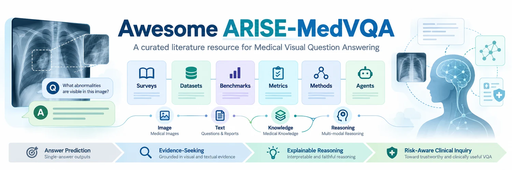

  

  <b>A curated academic resource hub for ARISE-MedVQA</b> 
  From Passive Answering to Active Inquiry · Evidence-Driven Reasoning · Medical Visual Question Answering

ARISE-MedVQA is a curated literature resource repository for Medical Visual Question Answering (Med-VQA), covering surveys, research directions, datasets, benchmarks, evaluation metrics, representative methods, and multimodal medical agent studies. The repository is not a single model implementation. Instead, it provides a structured and continuously updated entry point for researchers to understand the evolution, core resources, evaluation frameworks, and emerging trends of Med-VQA. Centered on the shift from passive answer prediction to active, evidence-seeking, risk-aware clinical inquiry, ARISE-MedVQA organizes key papers, datasets, benchmarks, evaluation protocols, and technical methods to support literature review, dataset selection, method comparison, experimental design, survey writing, and future research on interactive and clinically grounded medical AI. 

This project is suitable for the following research and teaching scenarios:

- Researchers working on Medical Visual Question Answering, medical multimodal large models, and medical AI agents;
- Graduate students who need a quick and structured overview of Med-VQA datasets, methods, benchmarks, and research trends;
- Developers working on medical image question answering, report generation, interactive diagnostic support, or knowledge-enhanced medical reasoning;
- Authors preparing Med-VQA surveys, research proposals, grant applications, thesis topics, or benchmark studies;
- Teams interested in building medical multimodal datasets, evaluation frameworks, or active diagnostic interaction systems.

# [Browse the Literature by Category](catalog/README.md)

Each paper has one primary collection, determined by its main contribution. Cross-cutting themes connect related work across collections.

| Collection                                                   | Papers | What you will find                                           |
| :----------------------------------------------------------- | -----: | :----------------------------------------------------------- |
| [**Reviews & Surveys**](catalog/Survey/README.md)            |     23 | Research syntheses, taxonomies, evidence gaps, and future directions |
| [**Datasets & Data Resource**](catalog/Dataset/README.md)    |     27 | Data resources, task construction, annotation, and quality control |
| [**Benchmarks & Evaluation**](catalog/Benchmark/README.md)   |     37 | Evaluation tasks, protocols, metrics, and capability assessment |
| [**Methods & Algorithms**](catalog/Method/README.md)         |    203 | Task-specific architectures, learning mechanisms, and original algorithms |
| [**Foundation Models & Backbones**](catalog/Foundation/README.md) |     64 | Pretraining, transferable representations, and reusable model components |

# [Browse the Literature by Year](years/README.md)

| [2027](years/2027.md) | [2026](years/2026.md) | [2025](years/2025.md)  | [2024](#years/2024.md) |
| --------------------- | --------------------- | ---------------------- | ---------------------- |
| [2023](years/2023.md) | [2022](years/2022.md) | [2021](#years/2021.md) | [2020](years/2020.md)  |
| [2019](years/2019.md) | [2018](years/2018.md) |                        |                        |

# Table of Contents

- [1. Surveys & Reviews](#section-1)
- [2. Datasets & Data Resources](#section-2)
  - [2.1. General Medical VQA Datasets](#section-2.1)
  - [2.2. Image–Text Pretraining & Instruction Data](#section-2.2)
  - [2.3. Radiology & Volumetric Imaging](#section-2.3)
  - [2.4. Pathology & Whole-Slide Imaging](#section-2.4)
  - [2.5. Endoscopy, Surgery & Medical Video](#section-2.5)
  - [2.6. Other Specialties, Education & Dialogue](#section-2.6)
- [3. Benchmarks & Evaluation](#section-3)
  - [3.1. Benchmark Resources & Shared Tasks](#section-3.1)
  - [3.2. Capability & Comparative Studies](#section-3.2)
  - [3.3. Reliability & Evaluation Protocols](#section-3.3)
- [4. Foundation Models & Reusable Backbones](#section-4)
  - [4.1. Reusable Visual & Vision-Language Encoders](#section-4.1)
  - [4.2. Generalist Biomedical Vision-Language Models](#section-4.2)
  - [4.3. Specialty & Grounded Vision-Language Models](#section-4.3)
- [5. Methods & Algorithms](#section-5)
  - [5.1. Architectures & Multimodal Fusion](#section-5.1)
  - [5.2. Representation Learning & Cross-modal Alignment](#section-5.2)
  - [5.3. Knowledge-enhanced & Retrieval-augmented Methods](#section-5.3)
  - [5.4. Prompt Learning & Efficient Adaptation](#section-5.4)
  - [5.5. Reasoning & Answer Generation](#section-5.5)
  - [5.6. Reliability, Generalization & Debiasing](#section-5.6)
  - [5.7. Agentic & Tool-augmented Systems](#section-5.7)

# [1. Surveys & Reviews](catalog/Survey/README.md)

[2026-07] Task-specific models vs. large vision-language models in medical visual question answering: A survey. [DOI](https://doi.org/10.1016/j.eswa.2026.132008)

[2026-05] Foundation Model for Medical Imaging: A Comprehensive Review. [DOI](https://doi.org/10.1016/j.eswa.2026.132008)

[2026-03] Vision–language foundation model driven agentic AI systems for healthcare. [DOI](https://doi.org/10.1007/s00371-026-04437-7)

| Date    | Title                                                        | DOI                                                      |
| ------- | ------------------------------------------------------------ | -------------------------------------------------------- |
| 2026-07 | Task-specific models vs. large vision-language models in medical visual question answering: A survey | [DOI](https://doi.org/10.1016/j.eswa.2026.132008)        |
| 2026-05 | Foundation Model for Medical Imaging: A Comprehensive Review | [DOI](https://doi.org/10.1109/tai.2025.3618796)          |
| 2026-03 | Vision–language foundation model driven agentic AI systems for healthcare | [DOI](https://doi.org/10.1007/s00371-026-04437-7)        |
| 2026-02 | From task-specific to foundation models: A paradigm shift in medical vision-language analysis | [DOI](https://doi.org/10.1016/j.cosrev.2025.100831)      |
| 2026-01 | Frontiers in Intelligent Colonoscopy | [DOI](https://doi.org/10.1007/s11633-025-1597-6)         |
| 2026-01 | Knowledge distillation and teacher–student learning in medical imaging: Comprehensive overview, pivotal role, and future directions | [DOI](https://doi.org/10.1016/j.media.2025.103819)       |
| 2026-01 | Knowledge fusion in deep learning-based medical vision-language models: A review | [DOI](https://doi.org/10.1016/j.inffus.2025.103455)      |
| 2025-08 | Visual-language foundation models in medical imaging: A systematic review and meta-analysis of diagnostic and analytical applications | [DOI](https://doi.org/10.1016/j.cmpb.2025.108870)        |
| 2025-08 | From visual question answering to intelligent AI agents in ophthalmology | [DOI](https://doi.org/10.1136/bjo-2024-326097)           |
| 2025-07 | Can We Trust AI Doctors? A Survey of Medical Hallucination in Large Language and Large Vision-Language Models | [DOI](https://doi.org/10.18653/v1/2025.findings-acl.350) |
| 2025-05 | A comprehensive survey of large language models and multimodal large language models in medicine | [DOI](https://doi.org/10.1016/j.inffus.2024.102888)      |
| 2025-05 | CLIP in medical imaging: A survey | [DOI](https://doi.org/10.1016/j.media.2025.103551)       |
| 2025-04 | Large Language Model for Medical Images: A Survey of Taxonomy, Systematic Review, and Future Trends | [DOI](https://doi.org/10.26599/bdma.2024.9020090)        |
| 2025-03 | Generative Models in Medical Visual Question Answering: A Survey | [DOI](https://doi.org/10.3390/app15062983)               |
| 2025-02 | Integrating language into medical visual recognition and reasoning: A survey | [DOI](https://doi.org/10.1016/j.media.2025.103514)       |
| 2025    | Visual Question Answering in Robotic Surgery: A Comprehensive Review | [DOI](https://doi.org/10.1109/access.2024.3525145)       |
| 2024-10 | Vision-language models for medical report generation and visual question answering: a review | [DOI](https://doi.org/10.3389/frai.2024.1430984)         |
| 2024-03 | Developing ChatGPT for biology and medicine: a complete review of biomedical question answering | [DOI](https://doi.org/10.52601/bpr.2024.240004)          |
| 2023-12 | Survey of Multimodal Medical Question Answering | [DOI](https://doi.org/10.3390/biomedinformatics4010004)  |
| 2023-10 | A scoping review on multimodal deep learning in biomedical images and texts | [DOI](https://doi.org/10.1016/j.jbi.2023.104482)         |
| 2023-09 | Medical visual question answering: A survey | [DOI](https://doi.org/10.1016/j.artmed.2023.102611)      |
| 2023-04 | A comprehensive interpretation for medical VQA: Datasets, techniques, and challenges | [DOI](https://doi.org/10.3233/jifs-222569)               |
| 2023    | A Critical Analysis of Benchmarks, Techniques, and Models in Medical Visual Question Answering | [DOI](https://doi.org/10.1109/access.2023.3335216)       |

# [2. Datasets & Data Resources](catalog/Dataset/README.md)

## 2.1. General Medical VQA Datasets

| Date    | Title                                                        | DOI                                                   |
| ------- | ------------------------------------------------------------ | ----------------------------------------------------- |
| 2024-12 | Development of a large-scale medical visual question-answering dataset | [DOI](https://doi.org/10.1038/s43856-024-00709-2)     |
| 2022-07 | OVQA A Clinically Generated Visual Question Answering Dataset | [DOI](https://doi.org/10.1145/3477495.3531724)        |
| 2021-04 | Slake: A Semantically-Labeled Knowledge-Enhanced Dataset For Medical Visual Question Answering | [DOI](https://doi.org/10.1109/isbi48211.2021.9434010) |

## 2.2. Image–Text Pretraining & Instruction Data

| Date    | Title                                                        | DOI                                                    |
| ------- | ------------------------------------------------------------ | ------------------------------------------------------ |
| 2026-04 | MedMax: Mixed-Modal Instruction Tuning for Training Biomedical Assistants | [DOI](https://doi.org/10.52202/085713-3588)            |
| 2025-06 | BIOMEDICA: An Open Biomedical Image-Caption Archive, Dataset, and Vision-Language Models Derived from Scientific Literature | [DOI](https://doi.org/10.1109/cvpr52734.2025.01837)    |
| 2024-11 | Towards Injecting Medical Visual Knowledge into Multimodal LLMs at Scale | [DOI](https://doi.org/10.18653/v1/2024.emnlp-main.418) |

## 2.3. Radiology & Volumetric Imaging

| Date    | Title                                                        | DOI                                                          |
| ------- | ------------------------------------------------------------ | ------------------------------------------------------------ |
| 2026-09 | SpineXR-VQA: A Clinically-Validated Visual Question Answering Dataset for Spine X-Rays | [DOI](https://doi.org/10.1145/3820903)                       |
| 2026-06 | GIV-CXR: Densely Grounded, Visually Interpretable Chest X-ray Question Answering Dataset | [CVPR](https://openaccess.thecvf.com/content/CVPR2026W/Med-Reasoner/html/Bavana_GIV-CXR_Densely_Grounded_Visually_Interpretable_Chest_X-ray_Question_Answering_Dataset_CVPRW_2026_paper.html) |
| 2026-06 | MIMIC-CXR-VQA: A Large-Scale LLM-Annotated Dataset and Comparative Benchmark for Medical Visual Question Answering | [CVPR](https://openaccess.thecvf.com/content/CVPR2026W/CV4Clinic2026/html/Aas-Alas_MIMIC-CXR-VQA_A_Large-Scale_LLM-Annotated_Dataset_and_Comparative_Benchmark_for_Medical_CVPRW_2026_paper.html) |
| 2026-05 | RadImageNet-VQA: A Large-Scale CT and MRI Dataset for Radiologic Visual Question Answering | [DOI](https://proceedings.mlr.press/v315/butsanets26a.html)  |
| 2026    | A Structured, Tagged, and Localized Visual Question Answering Dataset with Full Sentence Answers and Scene Graphs for Chest X-ray Images | [DOI](https://proceedings.iclr.cc/paper_files/paper/2026/hash/6de71272e0be559af3f76b884e94794b-Abstract-Conference.html) |
| 2025-11 | VinDr-CXR-VQA: A Visual Question Answering Dataset for Explainable Chest X-Ray Analysis with Multi-Task Learning | [DOI](https://doi.org/10.48550/arXiv.2511.00504)             |
| 2025-10 | GEMeX-RMCoT: An Enhanced Med-VQA Dataset for Region-Aware Multimodal Chain-of-Thought Reasoning | [DOI](https://doi.org/10.1145/3746027.3758277)               |
| 2025-10 | Development of a large-scale grounded vision language dataset for chest CT analysis | [DOI](https://doi.org/10.1038/s41597-025-05922-9)            |
| 2023-10 | Localized Questions in Medical Visual Question Answering | [DOI](https://doi.org/10.1007/978-3-031-43895-0_34)          |
| 2018-11 | A dataset of clinically generated visual questions and answers about radiology images | [DOI](https://doi.org/10.1038/sdata.2018.251)                |

## 2.4. Pathology & Whole-Slide Imaging

| Date    | Title                                                        | DOI接                                                 |
| ------- | ------------------------------------------------------------ | ----------------------------------------------------- |
| 2024-07 | TM-PATHVQA: 90000+ Textless Multilingual Questions for Medical Visual Question Answering | [DOI](https://doi.org/10.21437/Interspeech.2024-1036) |
| 2021-08 | Towards Visual Question Answering on Pathology Images | [DOI](https://doi.org/10.18653/v1/2021.acl-short.90)  |

## 2.5. Endoscopy, Surgery & Medical Video

| Date    | Title                                                        | DOI                                                |
| ------- | ------------------------------------------------------------ | -------------------------------------------------- |
| 2025-10 | Kvasir-VQA-x1:A Multimodal Dataset for Medical Reasoning and Robust MedVQA in Gastrointestinal Endoscopy | [DOI](https://doi.org/10.1007/978-3-032-08009-7_6) |
| 2024-10 | Kvasir-VQA: A Text-Image Pair GI Tract Dataset | [DOI](https://doi.org/10.1145/3689096.3689458)     |
| 2023-03 | A dataset for medical instructional video classification and question answering | [DOI](https://doi.org/10.1038/s41597-023-02036-y)  |

## 2.6. Other Specialties, Education & Dialogue

| Date    | Title                                                        | DOI                                                 |
| ------- | ------------------------------------------------------------ | --------------------------------------------------- |
| 2026    | MaxVQA: A Large-Scale Multi-Source Dataset for Explanatory Visual Question Answering in Mammography | [DOI](https://doi.org/10.1109/jbhi.2026.3736729)    |
| 2025-12 | DermaVQA-DAS: Dermatology Assessment Schema (DAS) & Datasets for Closed-Ended Question Answering & Segmentation in Patient-Generated Dermatology Images | [DOI](https://doi.org/10.48550/arXiv.2512.24340)    |
| 2025-08 | WoundcareVQA: A multilingual visual question answering benchmark dataset for wound care | [DOI](https://doi.org/10.1016/j.jbi.2025.104888)    |
| 2025-06 | A Multilingual Multimodal Medical Examination Dataset for Visual Question Answering in Healthcare | [DOI](https://doi.org/10.1109/cbms65348.2025.00093) |
| 2024-10 | DermaVQA: A Multilingual Visual Question Answering Dataset for Dermatology | [DOI](https://doi.org/10.1007/978-3-031-72086-4_20) |
| 2020-07 | Towards Visual Dialog for Radiology | [DOI](https://doi.org/10.18653/v1/2020.bionlp-1.6)  |

# [3. Benchmarks & Evaluation](catalog/Benchmark/README.md)

## 3.1. Benchmark Resources & Shared Tasks

| Date    | Title                                                        | DOI                                                          |
| ------- | ------------------------------------------------------------ | ------------------------------------------------------------ |
| 2026-09 | Lost in Volume: The CT-SpatialVQA Benchmark for Evaluating Semantic-Spatial Understanding of 3D Medical Vision–Language Models | [DOI](https://doi.org/10.1007/978-3-032-38470-6_16)          |
| 2026-09 | RoboSurg-VQA: A Multimodal Visual Question Answering Benchmark Derived from Surgical Segmentation Data | [DOI](https://doi.org/10.3390/make8100300)                   |
| 2026-07 | OmniPathoVQA: Benchmarking pathology vision–language models with Encyclopedia-scale knowledge | [DOI](https://doi.org/10.1016/j.media.2026.104196)           |
| 2026-06 | Med-CMR: A Fine-Grained Benchmark Integrating Visual Evidence and Clinical Logic for Medical Complex Multimodal Reasoning | [CVPR](https://openaccess.thecvf.com/content/CVPR2026/html/Gong_Med-CMR_A_Fine-Grained_Benchmark_Integrating_Visual_Evidence_and_Clinical_Logic_CVPR_2026_paper.html) |
| 2026-04 | 3D-RAD: A Comprehensive 3D Radiology Med-VQA Dataset with Multi-Temporal Analysis and Diverse Diagnostic Tasks | [DOI](https://doi.org/10.52202/085713-5656)                  |
| 2026-03 | MultiMedBench: A Scenario-Aware Benchmark for Evaluating Knowledge Editing in Medical VQA | [DOI](https://doi.org/10.1609/aaai.v40i40.40679)             |
| 2026-03 | SurgPub-Video: A Comprehensive Surgical Video Framework for Enhanced Surgical Intelligence in Vision-Language Model | [DOI](https://doi.org/10.1609/aaai.v40i8.37593)              |
| 2025-12 | ReXVQA: A Large-scale Visual Question Answering Benchmark for Generalist Chest X-ray Understanding | [DOI](https://doi.org/10.1142/9789819824755_0018)            |
| 2025-11 | A Benchmark for Breast Cancer Screening and Diagnosis in Mammogram Visual Question Answering | [DOI](https://doi.org/10.1038/s41467-025-66507-z)            |
| 2025-10 | GEMeX: A Large-Scale, Groundable, and Explainable Medical VQA Benchmark for Chest X-Ray Diagnosis | [DOI](https://doi.org/10.1109/iccv51701.2025.01979)          |
| 2025-09 | FunBench: Benchmarking Fundus Reading Skills of MLLMs | [DOI](https://doi.org/10.1007/978-3-032-04978-0_27)          |
| 2025-09 | Localizing Before Answering: A Benchmark for Grounded Medical Visual Question Answering | [DOI](https://doi.org/10.24963/ijcai.2025/853)               |
| 2025-07 | MMXU: A Multi-Modal and Multi-X-ray Understanding Dataset for Disease Progression | [DOI](https://doi.org/10.18653/v1/2025.findings-acl.508)     |
| 2025-05 | MedFrameQA: A Multi-Image Medical VQA Benchmark for Clinical Reasoning | [DOI](https://doi.org/10.18653/2026.emnlp-main.2482)         |
| 2025    | EndoBench: A Comprehensive Evaluation of Multi-Modal Large Language Models for Endoscopy Analysis | [DOI](https://doi.org/10.52202/085713-0076)                  |
| 2024-12 | CARES: A Comprehensive Benchmark of Trustworthiness in Medical Vision Language Models | [DOI](https://doi.org/10.52202/079017-4455)                  |
| 2024-12 | GMAI-MMBench: A Comprehensive Multimodal Evaluation Benchmark Towards General Medical AI | [DOI](https://doi.org/10.52202/079017-2992)                  |
| 2024-06 | OmniMedVQA: A New Large-Scale Comprehensive Evaluation Benchmark for Medical LVLM | [DOI](https://doi.org/10.1109/cvpr52733.2024.02093)          |
| 2024-03 | M3D: Advancing 3D Medical Image Analysis with Multi-Modal Large Language Models | [DOI](https://doi.org/10.48550/arXiv.2404.00578)             |
| 2024    | FEDMEKI: A Benchmark for Scaling Medical Foundation Models via Federated Knowledge Injection | [DOI](https://doi.org/10.52202/079017-0033)                  |
| 2023-12 | EHRXQA: A Multi-Modal Question Answering Dataset for Electronic Health Records with Chest X-ray Images | [DOI](https://doi.org/10.52202/075280-0170)                  |
| 2023-10 | Overview of ImageCLEFmedical 2023 – Medical Visual Question Answering for Gastrointestinal Tract | [DOI](https://ceur-ws.org/Vol-3497/paper-107.pdf)            |
| 2021-08 | Overview of the VQA-Med Task at ImageCLEF 2021: Visual Question Answering and Generation in the Medical Domain | [DOI](https://ceur-ws.org/Vol-2936/paper-87.pdf)             |
| 2020-10 | Overview of the VQA-Med Task at ImageCLEF 2020: Visual Question Answering and Generation in the Medical Domain | [DOI](https://ceur-ws.org/Vol-2696/paper_106.pdf)            |
| 2019-07 | VQA-Med: Overview of the Medical Visual Question Answering Task at ImageCLEF 2019 | [DOI](https://ceur-ws.org/Vol-2380/paper_272.pdf)            |
| 2018-07 | Overview of ImageCLEF 2018 Medical Domain Visual Question Answering Task | [DOI](https://ceur-ws.org/Vol-2125/paper_212.pdf)            |

## 3.2. Capability & Comparative Studies

| Date    | Title                                                        | DOI                                                      |
| ------- | ------------------------------------------------------------ | -------------------------------------------------------- |
| 2026-08 | When does retrieval help medical question answering? A question-type sensitivity analysis and failure taxonomy for text-based (image-free) medical RAG, with an interpretable clinical filter (CAF-RAG) | [DOI](https://doi.org/10.1016/j.imu.2026.101810)         |
| 2026-02 | Benchmarking large multimodal models for ophthalmic visual question answering with OphthalWeChat | [DOI](https://doi.org/10.1016/j.aopr.2025.10.006)        |
| 2025-12 | Optimizing multimodal models for medical visual question answering: A comparative study of LoRA and AdaLoRA on VQA-RAD and SLAKE-VQA | [DOI](https://doi.org/10.1016/j.compbiomed.2025.111397)  |
| 2025-12 | Advancing Reliable Medical VQA: Evaluation and Enhancement of Model Robustness | [DOI](https://doi.org/10.1109/bibm66473.2025.11356296)   |
| 2025-07 | Worse than Random? An Embarrassingly Simple Probing Evaluation of Large Multimodal Models in Medical VQA | [DOI](https://doi.org/10.18653/v1/2025.findings-acl.981) |
| 2024-05 | Unveiling the clinical incapabilities: a benchmarking study of GPT-4V(ision) for ophthalmic multimodal image analysis | [DOI](https://doi.org/10.1136/bjo-2023-325054)           |

## 3.3. Reliability & Evaluation Protocols

| Date    | Title                                                        | DOI                                                          |
| ------- | ------------------------------------------------------------ | ------------------------------------------------------------ |
| 2026-06 | Schema Affects Evaluation Conclusions: Metadata Context in Medical VLM Benchmarks | [DOI](https://openaccess.thecvf.com/content/CVPR2026W/DataCV/html/Jarquin_Schema_Affects_Evaluation_Conclusions_Metadata_Context_in_Medical_VLM_Benchmarks_CVPRW_2026_paper.html) |
| 2025-09 | Confidence Calibration for Multimodal LLMs: An Empirical Study Through Medical VQA | [DOI](https://doi.org/10.1007/978-3-032-04978-0_9)           |
| 2025-05 | MediConfusion: Can you trust your AI radiologist? Probing the reliability of multimodal medical foundation models. | [DOI](https://proceedings.iclr.cc/paper_files/paper/2025/hash/b37c2e26b75ee02fcabd65a2a0367136-Abstract-Conference.html) |
| 2024-08 | BESTMVQA: A Benchmark Evaluation System for Medical Visual Question Answering | [DOI](https://doi.org/10.1007/978-3-031-70378-2_27)          |
| 2023-07 | A reinforcement learning approach for VQA validation: An application to diabetic macular edema grading | [DOI](https://doi.org/10.1016/j.media.2023.102822)           |

# [4. Foundation Models & Reusable Backbones](catalog/Foundation/README.md)

## 4.1. Reusable Visual & Vision-Language Encoders

| Date    | Title                                                        | DOI                                                      |
| ------- | ------------------------------------------------------------ | -------------------------------------------------------- |
| 2026-01 | Convolutional masked encoder and contrastive learning for small-scale medical language-image pre-training | [DOI](https://doi.org/10.1016/j.bspc.2025.108308)        |
| 2025-12 | Med-GLIP: Advancing Medical Language-Image Pre-Training with Large-Scale Grounded Dataset | [DOI](https://doi.org/10.1109/bibm66473.2025.11357141)   |
| 2025-12 | MLP-Based Vision Language Pre-Training for Medical Visual Question Answering | [DOI](https://doi.org/10.1109/bibm66473.2025.11356107)   |
| 2025-10 | Medical Vision-Language Pre-training with Multimodal Variational Masked Autoencoder for Robust Medical VQA | [DOI](https://doi.org/10.1145/3746027.3755273)           |
| 2025-09 | A generalizable pathology foundation model using a unified knowledge distillation pretraining framework | [DOI](https://doi.org/10.1038/s41551-025-01488-4)        |
| 2025-09 | MedKI: Knowledge Dual Injections for Medical Visual Question Answering | [DOI](https://doi.org/10.1109/icip55913.2025.11084480)   |
| 2025-06 | Alignment, Mining and Fusion: Representation Alignment with Hard Negative Mining and Selective Knowledge Fusion for Medical Visual Question Answering | [DOI](https://doi.org/10.1109/cvpr52734.2025.02758)      |
| 2025-06 | MVCM: Enhancing Multi-View and Cross-Modality Alignment for Medical Visual Question Answering and Medical Image-Text Retrieval | [DOI](https://doi.org/10.1109/cvprw67362.2025.00023)     |
| 2025-06 | Unimodality-Supervised Contrastive Learning and Inference Enhancement Method for Medical Visual Question Answering | [DOI](https://doi.org/10.1109/ijcnn64981.2025.11228617)  |
| 2025-02 | Leveraging a Vision-Language Model with Natural Text Supervision for MRI Retrieval, Captioning, Classification, and Visual Question Answering | [DOI](https://doi.org/10.1101/2025.02.15.638446)         |
| 2025-01 | UnICLAM: Contrastive representation learning with adversarial masking for unified and interpretable Medical Vision Question Answering | [DOI](https://doi.org/10.1016/j.media.2025.103464)       |
| 2025-01 | A Multimodal Biomedical Foundation Model Trained from Fifteen Million Image–Text Pairs | [DOI](https://doi.org/10.1056/aioa2400640)               |
| 2025-01 | A vision–language foundation model for precision oncology | [DOI](https://doi.org/10.1038/s41586-024-08378-w)        |
| 2024-11 | Cross-Modal self-supervised vision language pre-training with multiple objectives for medical visual question answering | [DOI](https://doi.org/10.1016/j.jbi.2024.104748)         |
| 2024-10 | Deep Fuzzy Multiteacher Distillation Network for Medical Visual Question Answering | [DOI](https://doi.org/10.1109/tfuzz.2024.3402086)        |
| 2024-04 | Medical Vision-Language Representation Learning with Cross-Modal Multi-Teacher Contrastive Distillation | [DOI](https://doi.org/10.1109/icassp48485.2024.10447344) |
| 2024-03 | MITER: Medical Image–TExt joint adaptive pretRaining with multi-level contrastive learning | [DOI](https://doi.org/10.1016/j.eswa.2023.121526)        |
| 2024-02 | Diffusion-based Visual Representation Learning for Medical Question Answering | [DOI](https://proceedings.mlr.press/v222/bian24a.html)   |
| 2024-01 | Mapping medical image-text to a joint space via masked modeling | [DOI](https://doi.org/10.1016/j.media.2023.103018)       |
| 2024    | UniDCP: Unifying Multiple Medical Vision-Language Tasks via Dynamic Cross-Modal Learnable Prompts | [DOI](https://doi.org/10.1109/tmm.2024.3397191)          |
| 2023-12 | A Weak Supervision-based Robust Pretraining Method for Medical Visual Question Answering | [DOI](https://doi.org/10.1109/bibm58861.2023.10385332)   |
| 2023-10 | PMC-CLIP: Contrastive Language-Image Pre-training Using Biomedical Documents | [DOI](https://doi.org/10.1007/978-3-031-43993-3_51)      |
| 2023-10 | Masked Vision and Language Pre-training with Unimodal and Multimodal Contrastive Losses for Medical Visual Question Answering | [DOI](https://doi.org/10.1007/978-3-031-43907-0_36)      |
| 2023-05 | PubMedCLIP: How Much Does CLIP Benefit Visual Question Answering in the Medical Domain? | [DOI](https://doi.org/10.18653/v1/2023.findings-eacl.88) |
| 2023-05 | Contrastive training of a multimodal encoder for medical visual question answering | [DOI](https://doi.org/10.1016/j.iswa.2023.200221)        |
| 2023-04 | Self-Supervised Vision-Language Pretraining for Medial Visual Question Answering | [DOI](https://doi.org/10.1109/isbi53787.2023.10230743)   |
| 2022-12 | MedCLIP: Contrastive Learning from Unpaired Medical Images and Text | [DOI](https://doi.org/10.18653/v1/2022.emnlp-main.256)   |
| 2022-10 | Align, Reason and Learn: Enhancing Medical Vision-and-Language Pre-training with Knowledge | [DOI](https://doi.org/10.1145/3503161.3547948)           |
| 2022-09 | Multi-modal Masked Autoencoders for Medical Vision-and-Language Pre-training | [DOI](https://doi.org/10.1007/978-3-031-16443-9_65)      |
| 2021-09 | Contrastive Pre-training and Representation Distillation for Medical Visual Question Answering Based on Radiology Images | [DOI](https://doi.org/10.1007/978-3-030-87196-3_20)      |
| 2021-04 | MMBERT: Multimodal BERT Pretraining for Improved Medical VQA | [DOI](https://doi.org/10.1109/isbi48211.2021.9434063)    |

## 4.2. Generalist Biomedical Vision-Language Models

| Date    | Title                                                        | DOI                                                        |
| ------- | ------------------------------------------------------------ | ---------------------------------------------------------- |
| 2026-06 | Med-R1: Reinforcement Learning for Generalizable Medical Reasoning in Vision-Language Models | [DOI](https://doi.org/10.1109/tmi.2026.3661001)            |
| 2026-05 | LLaMA32-Med: Parameter-Efficient Adaptation of Multimodal LLMs for Medical Visual Question Answering | [DOI](https://proceedings.mlr.press/v315/dong26a.html)     |
| 2025-12 | Multi-Scale Visual Prompting for Robust Visual Question Answering in Medical Imaging | [DOI](https://doi.org/10.1109/bibm66473.2025.11356041)     |
| 2025-10 | HealthGPT: A Medical Large Vision-Language Model for Unifying Comprehension and Generation via Heterogeneous Knowledge Adaptation | [DOI](https://proceedings.mlr.press/v267/lin25n.html)      |
| 2025-09 | Medical Large Vision Language Models with Multi-image Visual Ability | [DOI](https://doi.org/10.1007/978-3-032-04971-1_38)        |
| 2025-08 | Cliva-Med: A Lightweight Vision-Language Model for Medical Visual Question Answering | [DOI](https://doi.org/10.1109/prai67447.2025.11412636)     |
| 2025-07 | SigPhi-Med: A lightweight vision-language assistant for biomedicine | [DOI](https://doi.org/10.1016/j.jbi.2025.104849)           |
| 2025-06 | VILA-M3: Enhancing Vision-Language Models with Medical Expert Knowledge | [DOI](https://doi.org/10.1109/cvpr52734.2025.01378)        |
| 2025-06 | Effective Medical Visual Question Answering Using Dynamic Prompting and Decoding Knowledge Editing | [DOI](https://doi.org/10.1007/s41019-025-00291-0)          |
| 2024-11 | Med-MoE: Mixture of Domain-Specific Experts for Lightweight Medical Vision-Language Models | [DOI](https://doi.org/10.18653/v1/2024.findings-emnlp.221) |
| 2024-09 | MISS: A Generative Pre-training and Fine-Tuning Approach for Med-VQA | [DOI](https://doi.org/10.1007/978-3-031-72353-7_22)        |
| 2024-08 | A generalist vision–language foundation model for diverse biomedical tasks | [DOI](https://doi.org/10.1038/s41591-024-03185-2)          |
| 2024-08 | MLeVLM: Improve Multi-level Progressive Capabilities based on Multimodal Large Language Model for Medical Visual Question Answering | [DOI](https://doi.org/10.18653/v1/2024.findings-acl.296)   |
| 2024-08 | Multi-modal Concept Alignment Pre-training for Generative Medical Visual Question Answering | [DOI](https://doi.org/10.18653/v1/2024.findings-acl.319)   |
| 2024-06 | Fusion of Domain-Adapted Vision and Language Models for Medical Visual Question Answering | [DOI](https://doi.org/10.18653/v1/2024.clinicalnlp-1.21)   |
| 2024-02 | Towards Generalist Biomedical AI | [DOI](https://doi.org/10.1056/aioa2300138)                 |
| 2023-12 | Med-Flamingo: a Multimodal Medical Few-shot Learner | [DOI](https://proceedings.mlr.press/v225/moor23a.html)     |
| 2023-10 | Towards Unifying Medical Vision-and-Language Pre-training via Soft Prompts | [DOI](https://doi.org/10.1109/iccv51070.2023.02139)        |
| 2023    | LLaVA-Med: Training a Large Language-and-Vision Assistant for Biomedicine in One Day | [DOI](https://doi.org/10.52202/075280-1240)                |

## 4.3. Specialty & Grounded Vision-Language Models

| Date    | Title                                                        | DOI                                                          |
| ------- | ------------------------------------------------------------ | ------------------------------------------------------------ |
| 2026-05 | RaDialog: Large Vision-Language Models for X-Ray Reporting and Dialog-Driven Assistance | [DOI](https://proceedings.mlr.press/v301/pellegrini26a.html) |
| 2026-02 | Grounded knowledge-enhanced medical vision–language pre-training for chest X-ray | [DOI](https://doi.org/10.1016/j.bspc.2025.108416)            |
| 2025-10 | M4CXR: Exploring Multitask Potentials of Multimodal Large Language Models for Chest X-Ray Interpretation | [DOI](https://doi.org/10.1109/tnnls.2025.3587687)            |
| 2025-08 | EndoChat: Grounded multimodal large language model for endoscopic surgery | [DOI](https://doi.org/10.1016/j.media.2025.103789)           |
| 2025-06 | SilVar-Med: A Speech-Driven Visual Language Model for Explainable Abnormality Detection in Medical Imaging | [DOI](https://doi.org/10.1109/cvprw67362.2025.00281)         |
| 2025-06 | MIMO: A medical vision language model with visual referring multimodal input and pixel grounding multimodal output | [DOI](https://doi.org/10.1109/cvpr52734.2025.02303)          |
| 2025-06 | SlideChat: A Large Vision-Language Assistant for Whole-Slide Pathology Image Understanding | [DOI](https://doi.org/10.1109/cvpr52734.2025.00484)          |
| 2025-04 | VividMed: Vision Language Model with Versatile Visual Grounding for Medicine | [DOI](https://doi.org/10.18653/v1/2025.naacl-long.89)        |
| 2025-04 | Towards a Multimodal Large Language Model with Pixel-Level Insight for Biomedicine | [DOI](https://doi.org/10.1609/aaai.v39i4.32394)              |
| 2025-04 | Medxchat: A Unified Multimodal Large Language Model Framework Towards CXRS Understanding and Generation | [DOI](https://doi.org/10.1109/isbi60581.2025.10981215)       |
| 2024-10 | Design as Desired: Utilizing Visual Question Answering for Multimodal Pre-training | [DOI](https://doi.org/10.1007/978-3-031-72083-3_56)          |
| 2024-07 | ChatFFA: An ophthalmic chat system for unified vision-language understanding and question answering for fundus fluorescein angiography | [DOI](https://doi.org/10.1016/j.isci.2024.110021)            |
| 2024-06 | Quilt-LLaVA: Visual Instruction Tuning by Extracting Localized Narratives from Open-Source Histopathology Videos | [DOI](https://doi.org/10.1109/cvpr52733.2024.01252)          |
| 2024-06 | A multimodal generative AI copilot for human pathology | [DOI](https://doi.org/10.1038/s41586-024-07618-3)            |

# [5. Methods & Systems](catalog/Method/README.md)

## 5.1. Architectures & Multimodal Fusion

| Date    | Title                                                        | DOI                                                          |
| ------- | ------------------------------------------------------------ | ------------------------------------------------------------ |
| 2026-09 | Proto-CAP: Prototype Memory Fusion and Curriculum-Adaptive Loss for Pediatric Myopia Visual Question Answering | [DOI](https://doi.org/10.1007/978-3-032-38059-3_43)          |
| 2026-07 | Parallel Multi-Attention and Gated Fusion for Visual Question Localized Answering in Surgical Scenes | [DOI](https://doi.org/10.1109/jbhi.2025.3648589)             |
| 2026-06 | Attention Consistent Longitudinal Medical Visual Question Answering Guided by Vision Foundation Models | [DOI](https://openaccess.thecvf.com/content/CVPR2026W/PHAROS-AIF-MIH/html/Wu_Attention_Consistent_Longitudinal_Medical_Visual_Question_Answering_Guided_by_Vision_CVPRW_2026_paper.html) |
| 2026-06 | MedFG-VQA: Low-Frequency Memory and Graph Attention for Lightweight Medical VQA | [DOI](https://openaccess.thecvf.com/content/CVPR2026/html/Gu_MedFG-VQA_Low-Frequency_Memory_and_Graph_Attention_for_Lightweight_Medical_VQA_CVPR_2026_paper.html) |
| 2026    | MedFuseT: A Transformer-Based Model for Advancing Medical Visual Question Answering | [DOI](https://doi.org/10.1109/access.2026.3661875)           |
| 2025-09 | Visual question answering for medical diagnosis | [DOI](https://doi.org/10.1016/j.iswa.2025.200545)            |
| 2025-07 | Body Part-Aware Cross-Modal Feature Interaction Learning for Medical Vision Question Answering | [DOI](https://doi.org/10.1007/978-981-96-9794-6_2)           |
| 2025-06 | Efficient Bilinear Attention-based Fusion for Medical Visual Question Answering | [DOI](https://doi.org/10.1109/ijcnn64981.2025.11228425)      |
| 2025-06 | Enhanced Medical Visual Question Answering Using Multi-Feature Fusion and Similarity-Based Answer Selection | [DOI](https://doi.org/10.1109/ijcnn64981.2025.11228331)      |
| 2025-05 | A medical visual question-answering model based on multi-scale feature fusion and question Feature enhancement | [DOI](https://doi.org/10.1007/s00530-025-01848-9)            |
| 2025-04 | DSAF: A Dual-Stage Attention Based Multimodal Fusion Framework for Medical Visual Question Answering | [DOI](https://doi.org/10.1007/s42979-025-03868-8)            |
| 2025-03 | A Language-Guided Progressive Fusion Network with semantic density alignment for Medical Visual Question Answering | [DOI](https://doi.org/10.1016/j.jbi.2025.104811)             |
| 2025-01 | VG-CALF: A vision-guided cross-attention and late-fusion network for radiology images in Medical Visual Question Answering | [DOI](https://doi.org/10.1016/j.neucom.2024.128730)          |
| 2024-12 | Cross-Guided Attention and Combined Loss for Optimizing Gastrointestinal Visual Question Answering | [DOI](https://doi.org/10.1109/bibm62325.2024.10821854)       |
| 2024-12 | Leveraging Convolutional Models as Backbone for Medical Visual Question Answering | [DOI](https://doi.org/10.1109/bibm62325.2024.10821918)       |
| 2024-11 | Contextual Feature-Based Medical Visual Question Answering Aided by Learnable Matrix | [DOI](https://doi.org/10.1007/978-981-97-8505-6_1)           |
| 2024-08 | Multimodal fusion: advancing medical visual question-answering | [DOI](https://doi.org/10.1007/s00521-024-10318-8)            |
| 2024-07 | Interpretable medical image Visual Question Answering via multi-modal relationship graph learning | [DOI](https://doi.org/10.1016/j.media.2024.103279)           |
| 2024-06 | Visual Question Answer System for Skeletal Image Using Radiology Images in the Healthcare Domain Based on Visual and Textual Feature Extraction Techniques | [DOI](https://doi.org/10.1007/s40745-024-00553-0)            |
| 2024-04 | Visual question answering on blood smear images using convolutional block attention module powered object detection | [DOI](https://doi.org/10.1007/s00371-024-03359-6)            |
| 2024-02 | A Dual-Attention Learning Network With Word and Sentence Embedding for Medical Visual Question Answering | [DOI](https://doi.org/10.1109/tmi.2023.3322868)              |
| 2024    | Transforming Medical Imaging: A VQA Model for Microscopic Blood Cell Classification | [DOI](https://doi.org/10.1109/access.2024.3496655)           |
| 2023-10 | CAT-ViL: Co-attention Gated Vision-Language Embedding for Visual Question Localized-Answering in Robotic Surgery | [DOI](https://doi.org/10.1007/978-3-031-43996-4_38)          |
| 2023-10 | FGCVQA: Fine-Grained Cross-Attention for Medical VQA | [DOI](https://doi.org/10.1109/icip49359.2023.10222540)       |
| 2023-10 | Multi-modal multi-head self-attention for medical VQA | [DOI](https://doi.org/10.1007/s11042-023-17162-3)            |
| 2023-09 | Asymmetric cross-modal attention network with multimodal augmented mixup for medical visual question answering | [DOI](https://doi.org/10.1016/j.artmed.2023.102667)          |
| 2023-08 | Medical visual question answering with symmetric interaction attention and cross-modal gating | [DOI](https://doi.org/10.1016/j.bspc.2023.105049)            |
| 2023-05 | Surgical-VQLA:Transformer with Gated Vision-Language Embedding for Visual Question Localized-Answering in Robotic Surgery | [DOI](https://doi.org/10.1109/icra48891.2023.10160403)       |
| 2023-04 | Vision-Language Transformer for Interpretable Pathology Visual Question Answering | [DOI](https://doi.org/10.1109/jbhi.2022.3163751)             |
| 2023-04 | MF2-MVQA: A Multi-Stage Feature Fusion Method for Medical Visual Question Answering | [DOI](https://doi.org/10.1109/isbi53787.2023.10230530)       |
| 2023-03 | Question-guided feature pyramid network for medical visual question answering | [DOI](https://doi.org/10.1016/j.eswa.2022.119148)            |
| 2023-03 | Parallel multi-head attention and term-weighted question embedding for medical visual question answering | [DOI](https://doi.org/10.1007/s11042-023-14981-2)            |
| 2023-03 | Vision–Language Model for Visual Question Answering in Medical Imagery | [DOI](https://doi.org/10.3390/bioengineering10030380)        |
| 2023-03 | Pre-trained multilevel fuse network based on vision-conditioned reasoning and bilinear attentions for medical image visual question answering | [DOI](https://doi.org/10.1007/s11227-023-05195-2)            |
| 2022-12 | How Well Apply Multimodal Mixup and Simple MLPs Backbone to Medical Visual Question Answering? | [DOI](https://doi.org/10.1109/bibm55620.2022.9995347)        |
| 2022-11 | AMAM: An Attention-based Multimodal Alignment Model for Medical Visual Question Answering | [DOI](https://doi.org/10.1016/j.knosys.2022.109763)          |
| 2022-11 | M2FNet: Multi-granularity Feature Fusion Network for Medical Visual Question Answering | [DOI](https://doi.org/10.1007/978-3-031-20865-2_11)          |
| 2022-10 | Caption-Aware Medical VQA via Semantic Focusing and Progressive Cross-Modality Comprehension | [DOI](https://doi.org/10.1145/3503161.3548122)               |
| 2022-09 | Surgical-VQA: Visual Question Answering in Surgical Scenes Using Transformer | [DOI](https://doi.org/10.1007/978-3-031-16449-1_4)           |
| 2022-08 | A Transformer-based Medical Visual Question Answering Model | [DOI](https://doi.org/10.1109/icpr56361.2022.9956469)        |
| 2022-07 | Medical visual question answering via corresponding feature fusion combined with semantic attention | [DOI](https://doi.org/10.3934/mbe.2022478)                   |
| 2022-06 | Medical visual question answering based on question-type reasoning and semantic space constraint | [DOI](https://doi.org/10.1016/j.artmed.2022.102346)          |
| 2022-05 | Type-Aware Medical Visual Question Answering | [DOI](https://doi.org/10.1109/icassp43922.2022.9747087)      |
| 2022-04 | BPI-MVQA: a bi-branch model for medical visual question answering | [DOI](https://doi.org/10.1186/s12880-022-00800-x)            |
| 2021-10 | Visual question answering in the medical domain based on deep learning approaches: A comprehensive study | [DOI](https://doi.org/10.1016/j.patrec.2021.07.002)          |
| 2021-10 | MedFuseNet: An attention-based multimodal deep learning model for visual question answering in the medical domain | [DOI](https://doi.org/10.1038/s41598-021-98390-1)            |
| 2021-10 | MVQAS A Medical Visual Question Answering System | [DOI](https://doi.org/10.1145/3459637.3481971)               |
| 2021-02 | Hierarchical deep multi-modal network for medical visual question answering | [DOI](https://doi.org/10.1016/j.eswa.2020.113993)            |
| 2020-03 | A Question-Centric Model for Visual Question Answering in Medical Imaging | [DOI](https://doi.org/10.1109/tmi.2020.2978284)              |

## 5.2. Representation Learning & Cross-modal Alignment

| Date    | Title                                                        | DOI                                                      |
| ------- | ------------------------------------------------------------ | -------------------------------------------------------- |
| 2026-07 | Beyond Surface Features: Advancing Medical Vision-Language Alignment via Dynamic Evidence-Guided Preference Optimization | [DOI](https://doi.org/10.18653/v1/2026.acl-long.1200)    |
| 2026-05 | Dual-Guided Multi-Granularity Implicit Alignment Network for Medical Visual Question Answering | [DOI](https://doi.org/10.1109/icassp55912.2026.11461438) |
| 2026-03 | Beyond Static Knowledge: Dynamic Context-Aware Cross-Modal Contrastive Learning for Medical Visual Question Answering | [DOI](https://doi.org/10.1109/tmi.2025.3617289)          |
| 2026-01 | Large-small model collaboration for medical visual question answering with task aware mixture of experts and relation knowledge distillation | [DOI](https://doi.org/10.1016/j.imavis.2025.105820)      |
| 2026-01 | Segmentation-enhanced Medical Visual Question Answering with mask-prompt alignment using contrastive learning and multitask object grounding | [DOI](https://doi.org/10.1016/j.engappai.2025.112866)    |
| 2025-09 | BaMCo: Balanced Multimodal Contrastive Learning for Knowledge-Driven Medical VQA | [DOI](https://doi.org/10.1007/978-3-032-04981-0_8)       |
| 2025-09 | BioD2C: A Dual-Level Semantic Consistency Constraint Framework for Biomedical VQA | [DOI](https://doi.org/10.1007/978-3-032-05127-1_9)       |
| 2025    | Answer Distillation Network With Bi-Text-Image Attention for Medical Visual Question Answering | [DOI](https://doi.org/10.1109/access.2025.3532308)       |
| 2024-09 | Leveraging Coarse-to-Fine Grained Representations in Contrastive Learning for Differential Medical Visual Question Answering | [DOI](https://doi.org/10.1007/978-3-031-72086-4_39)      |
| 2024-09 | MMQL: Multi-Question Learning for Medical Visual Question Answering | [DOI](https://doi.org/10.1007/978-3-031-72086-4_45)      |
| 2024-09 | Spot the Difference: Difference Visual Question Answering with Residual Alignment | [DOI](https://doi.org/10.1007/978-3-031-72086-4_61)      |
| 2024-06 | Overcoming Data Limitations and Cross-Modal Interaction Challenges in Medical Visual Question Answering | [DOI](https://doi.org/10.1109/ijcnn60899.2024.10651345)  |
| 2024-05 | Alignment before Awareness: Towards Visual Question Localized-Answering in Robotic Surgery via Optimal Transport and Answer Semantics | [DOI](https://doi.org/10.63317/4jh5knz54ake)             |
| 2024-02 | PLMVQA: Applying Pseudo Labels for Medical Visual Question Answering with Limited Data | [DOI](https://doi.org/10.1007/978-3-031-47425-5_32)      |
| 2023-05 | Medical Visual Question Answering via Conditional Reasoning and Contrastive Learning | [DOI](https://doi.org/10.1109/tmi.2022.3232411)          |
| 2022-12 | MHKD-MVQA: Multimodal Hierarchical Knowledge Distillation for Medical Visual Question Answering | [DOI](https://doi.org/10.1109/bibm55620.2022.9995473)    |
| 2022-08 | A Bi-level representation learning model for medical visual question answering | [DOI](https://doi.org/10.1016/j.jbi.2022.104183)         |
| 2021-09 | Cross-Modal Self-Attention with Multi-Task Pre-Training for Medical Visual Question Answering | [DOI](https://doi.org/10.1145/3460426.3463584)           |

## 5.3. Knowledge-enhanced & Retrieval-augmented Methods

| Date    | Title                                                        | DOI                                                          |
| ------- | ------------------------------------------------------------ | ------------------------------------------------------------ |
| 2026-09 | MEC: Medical Evidence Capsules for Retrieval-Augmented Generation in Medical Multimodal Question Answering | [DOI](https://doi.org/10.1007/978-3-032-38059-3_29)          |
| 2026-07 | MedKInstruct: A Multimodal Knowledge Graph Based Framework for Multi-Hop and Hard-Negative Instruction Data Synthesis in MedVQA | [DOI](https://doi.org/10.18653/v1/2026.findings-acl.1391)    |
| 2026-07 | KG-CMI: Knowledge Graph Enhanced Cross-Mamba Interaction for Medical Visual Question Answering | [DOI](https://doi.org/10.1109/tii.2026.3676874)              |
| 2026-07 | DoKE: Domain knowledge–enhanced multimodal large language model–based framework for chest X–ray follow–up medical visual question answering | [DOI](https://doi.org/10.1016/j.bspc.2026.109908)            |
| 2026-07 | A knowledge enhanced framework for interpretable medical visual question and answering via large foundation model | [DOI](https://doi.org/10.1007/s00530-026-02470-z)            |
| 2026-06 | MR-RAG: Multimodal Relevance-Aware Retrieval-Augmented Generation for Medical Visual Question Answering | [DOI](https://openaccess.thecvf.com/content/CVPR2026/html/Li_MR-RAG_Multimodal_Relevance-Aware_Retrieval-Augmented_Generation_for_Medical_Visual_Question_Answering_CVPR_2026_paper.html) |
| 2026-06 | EC-RAG: Evidence-Centric Retrieval-Augmented Generation for Medical Visual Question Answering | [DOI](https://doi.org/10.1145/3805622.3810670)               |
| 2026-05 | Making Medical Vision-Language Models Think Causally Across Modalities with Retrieval-Augmented Cross-Modal Reasoning | [DOI](https://doi.org/10.1109/icassp55912.2026.11462104)     |
| 2026-04 | MAP-GR: medical aware prompt and graph-guided reasoning for enhanced medical visual question answering | [DOI](https://doi.org/10.1016/j.neucom.2026.132645)          |
| 2026-03 | KGLMQA: enhancing medical visual question answering with knowledge graphs and LLMs | [DOI](https://doi.org/10.7717/peerj-cs.3679)                 |
| 2025-12 | Enhancing Visual Reasoning With LLM-Powered Knowledge Graphs for Visual Question Localized-Answering in Robotic Surgery | [DOI](https://doi.org/10.1109/jbhi.2025.3538324)             |
| 2025-09 | MOTOR: Multimodal Optimal Transport via Grounded Retrieval in Medical Visual Question Answering | [DOI](https://doi.org/10.1007/978-3-032-04978-0_44)          |
| 2025-08 | Fine-grained knowledge fusion for retrieval-augmented medical visual question answering | [DOI](https://doi.org/10.1016/j.inffus.2025.103059)          |
| 2025-06 | MKGF: A multi-modal knowledge graph based RAG framework to enhance LVLMs for Medical visual question answering | [DOI](https://doi.org/10.1016/j.neucom.2025.129999)          |
| 2025-04 | Cross-Modal Knowledge Diffusion-Based Generation for Difference-Aware Medical VQA | [DOI](https://doi.org/10.1109/tip.2025.3558446)              |
| 2025-03 | Integration of Multi-Source Medical Data for Medical Diagnosis Question Answering | [DOI](https://doi.org/10.1109/tmi.2024.3496862)              |
| 2025-02 | Path-RAG: Knowledge-Guided Key Region Retrieval for Open-ended Pathology Visual Question Answering | [DOI](https://proceedings.mlr.press/v259/naeem25a.html)      |
| 2025    | Medical Knowledge-Based Differential Image Visual Question Answering | [DOI](https://doi.org/10.1109/access.2025.3565695)           |
| 2024-09 | Region-Specific Retrieval Augmentation for Longitudinal Visual Question Answering: A Mix-and-Match Paradigm | [DOI](https://doi.org/10.1007/978-3-031-72086-4_55)          |
| 2024-05 | Advancing surgical VQA with scene graph knowledge | [DOI](https://doi.org/10.1007/s11548-024-03141-y)            |
| 2023-10 | RAMM: Retrieval-augmented Biomedical Visual Question Answering with Multi-modal Pre-training | [DOI](https://doi.org/10.1145/3581783.3611830)               |
| 2023-08 | Expert Knowledge-Aware Image Difference Graph Representation Learning for Difference-Aware Medical Visual Question Answering | [DOI](https://doi.org/10.1145/3580305.3599819)               |
| 2023-07 | Retrieving Multimodal Prompts for Generative Visual Question Answering | [DOI](https://doi.org/10.18653/v1/2023.findings-acl.158)     |
| 2023-07 | K-PathVQA: Knowledge-Aware Multimodal Representation for Pathology Visual Question Answering | [DOI](https://doi.org/10.1109/jbhi.2023.3294249)             |
| 2023-03 | Medical knowledge-based network for Patient-oriented Visual Question Answering | [DOI](https://doi.org/10.1016/j.ipm.2022.103241)             |

## 5.4. Prompt Learning & Efficient Adaptation

| Date    | Title                                                        | DOI                                                      |
| ------- | ------------------------------------------------------------ | -------------------------------------------------------- |
| 2026-09 | M3D-QAdapter: 3D Medical VQA with Lesion-Level Finding-Segmentation Alignment and Query-Driven Adaptive Token Reduction | [DOI](https://doi.org/10.1007/978-3-032-38062-3_34)      |
| 2026-07 | PitVQA++: Vector Matrix-Low-Rank Adaptation for Open-Ended Visual Question Answering in Pituitary Surgery | [DOI](https://doi.org/10.1109/tmi.2026.3681175)          |
| 2026-04 | D2MNet: Difference-Aware Decoupling and Multi-Prompt Learning for Medical Difference Visual Question Answering | [DOI](https://doi.org/10.3390/jimaging12040162)          |
| 2025-12 | Anatomy-Aware Adaptation of Pre-Trained Models for Medical Difference Visual Question Answering | [DOI](https://doi.org/10.1109/bibm66473.2025.11356508)   |
| 2025-12 | Meta-Learning with Attention Network for Medical Visual Question Answering | [DOI](https://doi.org/10.1109/bibm66473.2025.11356912)   |
| 2025-11 | X-FLoRA: Cross-modal Federated Learning with Modality-expert LoRA for Medical VQA | [DOI](https://doi.org/10.18653/v1/2025.emnlp-main.422)   |
| 2025-11 | Bridging the Semantic Gap in Medical Visual Question Answering With Prompt Learning | [DOI](https://doi.org/10.1109/tmi.2025.3580561)          |
| 2025-11 | Caption-augmented reasoning model with Hierarchical rank LoRA finetuing for medical visual question Answering | [DOI](https://doi.org/10.1016/j.jbi.2025.104964)         |
| 2025-09 | Localization Lens for Improving Medical Vision-Language Models | [DOI](https://doi.org/10.1007/978-3-032-05114-1_33)      |
| 2025-06 | R-LLaVA: Improving Med-VQA Understanding through Visual Region of Interest | [DOI](https://doi.org/10.1109/ijcnn64981.2025.11227685)  |
| 2025-05 | MedBLIP: A multimodal method of medical question-answering based on fine-tuning large language model | [DOI](https://doi.org/10.1016/j.compmedimag.2025.102581) |
| 2025-04 | MedPromptX: Grounded Multimodal Prompting for Chest X-Ray Diagnosis | [DOI](https://doi.org/10.1007/978-3-031-84525-3_18)      |
| 2025-04 | Fine-grained Adaptive Visual Prompt for Generative Medical Visual Question Answering | [DOI](https://doi.org/10.1609/aaai.v39i9.33047)          |
| 2025-03 | MiniMedGPT: Efficient Large Vision–Language Model for medical Visual Question Answering | [DOI](https://doi.org/10.1016/j.patrec.2025.01.001)      |
| 2025-02 | Targeted Visual Prompting for Medical Visual Question Answering | [DOI](https://doi.org/10.1007/978-3-031-82007-6_7)       |
| 2024-11 | Self-Training Large Language and Vision Assistant for Medical Question Answering | [DOI](https://doi.org/10.18653/v1/2024.emnlp-main.1119)  |
| 2024-10 | Efficiency in Focus: LayerNorm as a Catalyst for Fine-tuning Medical Visual Language Models | [DOI](https://doi.org/10.1145/3664647.3680834)           |
| 2024-09 | Candidate-Heuristic In-Context Learning: A new framework for enhancing medical visual question answering with LLMs | [DOI](https://doi.org/10.1016/j.ipm.2024.103805)         |
| 2024-08 | Parameter-Efficient Transfer Learning for Medical Visual Question Answering | [DOI](https://doi.org/10.1109/tetci.2023.3311333)        |
| 2024-06 | LaPA: Latent Prompt Assist Model for Medical Visual Question Answering | [DOI](https://doi.org/10.1109/cvprw63382.2024.00502)     |
| 2024-04 | Prompt-Based Personalized Federated Learning for Medical Visual Question Answering | [DOI](https://doi.org/10.1109/icassp48485.2024.10445933) |
| 2024-04 | Dual modality prompt learning for visual question-grounded answering in robotic surgery | [DOI](https://doi.org/10.1186/s42492-024-00160-z)        |
| 2023-10 | Open-Ended Medical Visual Question Answering Through Prefix Tuning of Language Models | [DOI](https://doi.org/10.1007/978-3-031-43904-9_70)      |
| 2021-09 | Multiple Meta-model Quantifying for Medical Visual Question Answering | [DOI](https://doi.org/10.1007/978-3-030-87240-3_7)       |
| 2020-11 | Learning from the Guidance: Knowledge Embedded Meta-learning for Medical Visual Question Answering | [DOI](https://doi.org/10.1007/978-3-030-63820-7_22)      |
| 2019-10 | Overcoming Data Limitation in Medical Visual Question Answering | [DOI](https://doi.org/10.1007/978-3-030-32251-9_57)      |

## 5.5. Reasoning & Answer Generation

| Date    | Title                                                        | DOI                                                          |
| ------- | ------------------------------------------------------------ | ------------------------------------------------------------ |
| 2026-09 | EchoVQA: Enabling Conversational Assistance for Point-of-Care Cardiac Ultrasound | [DOI](https://doi.org/10.1007/978-3-032-38059-3_14)          |
| 2026-09 | IRIS: An Intelligent Vision-Language System for Ocular Surface Diseases via Topic Tree and Scene-Driven VQA Generation | [DOI](https://doi.org/10.1007/978-3-032-38059-3_22)          |
| 2026-09 | Reformulating Chest X-Ray Report Generation as Fine-Grained Visual Question Answering with Structured Clinical Report Templates | [DOI](https://doi.org/10.1007/978-3-032-38059-3_48)          |
| 2026-08 | DAMON: Difference-Aware Medical Visual Question Answering via Multimodal Large Language Model | [DOI](https://doi.org/10.1109/jbhi.2026.3663420)             |
| 2026-07 | Act as you think: Reinforcing Consistent Reasoning in Medical Visual Question Answering | [DOI](https://doi.org/10.18653/v1/2026.acl-long.81)          |
| 2026-07 | Evo-PI: Aligning Medical Reasoning via Evolving Principle-Guided Supervision | [DOI](https://doi.org/10.18653/v1/2026.acl-long.1469)        |
| 2026-03 | MedEyes: Learning Dynamic Visual Focus for Medical Progressive Diagnosis | [DOI](https://doi.org/10.1609/aaai.v40i16.38401)             |
| 2026-03 | CMID: Towards Medical Visual Question Answering via Contrastive Mutual Information Decoding | [DOI](https://doi.org/10.1609/aaai.v40i41.40835)             |
| 2026-01 | Redefining medical visual question answering using conditional generative diffusion models | [DOI](https://doi.org/10.1016/j.bspc.2025.108222)            |
| 2025-12 | Med-SER: Enhancing Reasoning Interpretability in Medical Visual Question Answering via Structured Chain-of-Thought | [DOI](https://doi.org/10.1109/bibm66473.2025.11356359)       |
| 2025-12 | MedKCoT: A Knowledge-Guided Multi-Modal Chain-of-Thought Generation Framework for Medical Visual Question Answering | [DOI](https://doi.org/10.1109/bibm66473.2025.11356053)       |
| 2025-12 | Reflect Then Reason: Iterative Reflection with Soft Reasoning Feature Enhancement for Medical Visual Question Answering | [DOI](https://doi.org/10.1109/bibm66473.2025.11356577)       |
| 2025-11 | Answer Semantics-enhanced Medical Visual Question Answering | [DOI](https://doi.org/10.1007/s11633-025-1564-2)             |
| 2025-11 | Med-SCoT: Structured chain-of-thought reasoning and evaluation for enhancing interpretability in medical visual question answering | [DOI](https://doi.org/10.1016/j.compmedimag.2025.102659)     |
| 2025-10 | Visual and Domain Knowledge for Professional-Level Graph-of-Thought Medical Reasoning | [DOI](https://proceedings.mlr.press/v267/bao25b.html)        |
| 2025-10 | Inference enhanced model with answer refinement for medical visual question answering | [DOI](https://doi.org/10.1007/s00530-025-01997-x)            |
| 2025-10 | SurGen-Net: A Generative Approach for Surgical VQA with Structured Text Generation | [DOI](https://doi.org/10.1109/iccvw69036.2025.00139)         |
| 2025-08 | Explainable medical visual question answering via chain of evidence | [DOI](https://doi.org/10.1016/j.knosys.2025.113672)          |
| 2025-04 | MedThink: A Rationale-Guided Framework for Explaining Medical Visual Question Answering | [DOI](https://doi.org/10.18653/v1/2025.findings-naacl.415)   |
| 2025-04 | MEDSQ: Towards personalized medical education via multi-form interaction guidance | [DOI](https://doi.org/10.1016/j.eswa.2024.126138)            |
| 2025-02 | Consistency Conditioned Memory Augmented Dynamic Diagnosis Model for Medical Visual Question Answering | [DOI](https://doi.org/10.1109/jbhi.2024.3492141)             |
| 2025    | MultI-MVQA: A multitask framework for interpretable medical visual question answering | [DOI](https://doi.org/10.1016/j.procs.2025.09.307)           |
| 2024-12 | Tri-VQA: Triangular Reasoning Medical Visual Question Answering for Multi-Attribute Analysis | [DOI](https://doi.org/10.1109/bibm62325.2024.10822825)       |
| 2024-11 | MedCoT: Medical Chain of Thought via Hierarchical Expert | [DOI](https://doi.org/10.18653/v1/2024.emnlp-main.962)       |
| 2024-10 | PitVQA: Image-Grounded Text Embedding LLM for Visual Question Answering in Pituitary Surgery | [DOI](https://doi.org/10.1007/978-3-031-72089-5_46)          |
| 2024-10 | WSI-VQA: Interpreting Whole Slide Images by Generative Visual Question Answering | [DOI](https://doi.org/10.1007/978-3-031-72764-1_23)          |
| 2024-07 | Detecting Any Instruction-to-Answer Interaction Relationship: Universal Instruction-to-Answer Navigator for Med-VQA | [DOI](https://proceedings.mlr.press/v235/wu24ac.html)        |
| 2023-12 | Multi-level Relational Reasoning and Attention Network for Medical Visual Question Answering | [DOI](https://doi.org/10.1109/hpcc-dss-smartcity-dependsys60770.2023.00094) |
| 2023-10 | SurgicalGPT: End-to-End Language-Vision GPT for Visual Question Answering in Surgery | [DOI](https://doi.org/10.1007/978-3-031-43996-4_27)          |
| 2023-06 | Q2ATransformer: Improving Medical VQA via an Answer Querying Decoder | [DOI](https://doi.org/10.1007/978-3-031-34048-2_34)          |
| 2022-09 | Consistency-Preserving Visual Question Answering in Medical Imaging | [DOI](https://doi.org/10.1007/978-3-031-16452-1_37)          |
| 2022-09 | RepsNet: Combining Vision with Language for Automated Medical Reports | [DOI](https://doi.org/10.1007/978-3-031-16443-9_68)          |
| 2020-10 | Medical Visual Question Answering via Conditional Reasoning | [DOI](https://doi.org/10.1145/3394171.3413761)               |
| 2020    | CGMVQA: A New Classification and Generative Model for Medical Visual Question Answering | [DOI](https://doi.org/10.1109/access.2020.2980024)           |

## 5.6. Reliability, Generalization & Debiasing

| Date    | Title                                                        | DOI                                                          |
| ------- | ------------------------------------------------------------ | ------------------------------------------------------------ |
| 2026-09 | Deterministic Hallucination Detection in Medical VQA via Confidence-Evidence Bayesian Gain | [DOI](https://doi.org/10.1007/978-3-032-38059-3_13)          |
| 2026-09 | Learning to Trim: End-to-End Causal Graph Pruning with Dynamic Anatomical Feature Banks for Medical VQA | [DOI](https://doi.org/10.1007/978-3-032-38059-3_25)          |
| 2026-09 | VIHD: Visual Intervention-Based Hallucination Detection for Medical Visual Question Answering | [DOI](https://doi.org/10.1007/978-3-032-38059-3_61)          |
| 2026-09 | CARE: Confidence-Aware Reasoning for Reliable Medical VQA | [DOI](https://doi.org/10.1007/978-3-032-38059-3_7)           |
| 2026-09 | Med-CAP: Counterfactual Evidence and Adaptive Prior Suppression for Robust Medical Visual Question Answering | [DOI](https://doi.org/10.1007/978-3-032-38059-3_30)          |
| 2026-07 | Causal gradient intervention for debiased and evidence-grounded medical visual question answering | [DOI](https://doi.org/10.1016/j.media.2026.104226)           |
| 2026-06 | Dual-Level Confidence based Implicit Self-Refinement for Medical Visual Question Answering | [DOI](https://openaccess.thecvf.com/content/CVPR2026/html/Pan_Dual-Level_Confidence_based_Implicit_Self-Refinement_for_Medical_Visual_Question_Answering_CVPR_2026_paper.html) |
| 2026-05 | Anomaly-aware mutual promotion network for medical visual question answering | [DOI](https://doi.org/10.1016/j.knosys.2026.115688)          |
| 2026-05 | Entropy-Aware Multimodal Preference Optimization for Factuality Alignment in Medical Visual Question Answering | [DOI](https://doi.org/10.1109/icassp55912.2026.11460518)     |
| 2026-05 | Scene graph-guided uncertainty decomposition improves confidence calibration in surgical visual question answering | [DOI](https://doi.org/10.3389/fmed.2026.1849346)             |
| 2026-01 | Augmenting medical visual question answering with mixup, label smoothing, and layer-wise relevance propagation eXplainable Artificial Intelligence | [DOI](https://doi.org/10.7717/peerj-cs.3407)                 |
| 2025-12 | Mitigating Language Bias in Medical VQA via Causally-Inspired Intervention | [DOI](https://doi.org/10.1109/bibm66473.2025.11356787)       |
| 2025-11 | LMT++: Adaptively Collaborating LLMs With Multi-Specialized Teachers for Continual VQA in Robotic Surgical Videos | [DOI](https://doi.org/10.1109/tmi.2025.3581108)              |
| 2025-10 | ECSA: Mitigating Catastrophic Forgetting and Few-Shot Generalization in Medical Visual Question Answering | [DOI](https://doi.org/10.3390/tomography11100115)            |
| 2025-10 | CIMB-MVQA: Causal intervention on modality-specific biases for medical visual question answering | [DOI](https://doi.org/10.1016/j.media.2025.103850)           |
| 2025-10 | OmniDoctor: Towards LLM-centric Lifelong Learning for New Emerging Medical VQA Tasks | [DOI](https://doi.org/10.1145/3746027.3755745)               |
| 2025-09 | Vision-Amplified Semantic Entropy for Hallucination Detection in Medical Visual Question Answering | [DOI](https://doi.org/10.1007/978-3-032-04971-1_63)          |
| 2025-09 | Cause-Effect Driven Optimization for Robust Medical Visual Question Answering with Language Biases | [DOI](https://doi.org/10.24963/ijcai.2025/280)               |
| 2025-09 | Knowing or Guessing? Robust Medical Visual Question Answering via Joint Consistency and Contrastive Learning | [DOI](https://doi.org/10.1007/978-3-032-05141-7_32)          |
| 2025-09 | Cycle-VQA: A Cycle-Consistent Framework for Robust Medical Visual Question Answering | [DOI](https://doi.org/10.1016/j.patcog.2025.111609)          |
| 2025-09 | Eliminating Language Bias for Medical Visual Question Answering with Counterfactual Contrastive Training | [DOI](https://doi.org/10.1007/978-3-032-04978-0_19)          |
| 2025-09 | Med-BiasX: Robust Medical Visual Question Answering with Language Biases | [DOI](https://doi.org/10.1007/978-3-032-05185-1_36)          |
| 2025-08 | Structure Causal Models and LLMs Integration in Medical Visual Question Answering | [DOI](https://doi.org/10.1109/tmi.2025.3564320)              |
| 2025-06 | DiN: Diffusion Model for Robust Medical VQA with Semantic Noisy Labels | [DOI](https://doi.org/10.1109/cvpr52734.2025.01337)          |
| 2025-04 | Language Models Meet Anomaly Detection for Better Interpretability and Generalizability | [DOI](https://doi.org/10.1007/978-3-031-84525-3_10)          |
| 2025-04 | Constructing Negative Sample Pairs to Mitigate Language Priors in Medical Visual Question Answering | [DOI](https://doi.org/10.1145/3715931.3715951)               |
| 2025-04 | A Global Visual Information Intervention Model for Medical Visual Question Answering | [DOI](https://doi.org/10.1016/j.compbiomed.2025.110195)      |
| 2025-01 | Surgical-VQLA++: Adversarial contrastive learning for calibrated robust visual question-localized answering in robotic surgery | [DOI](https://doi.org/10.1016/j.inffus.2024.102602)          |
| 2024-12 | Counterfactual Causal-Effect Intervention for Interpretable Medical Visual Question Answering | [DOI](https://doi.org/10.1109/tmi.2024.3425533)              |
| 2024-12 | Optimizing Transformer and MLP with Hidden States Perturbation for Medical Visual Question Answering | [DOI](https://doi.org/10.1109/bibm62325.2024.10821987)       |
| 2024-10 | A Causal Approach to Mitigate Modality Preference Bias in Medical Visual Question Answering | [DOI](https://doi.org/10.1145/3689096.3689459)               |
| 2024-05 | LLM-Assisted Multi-Teacher Continual Learning for Visual Question Answering in Robotic Surgery | [DOI](https://doi.org/10.1109/icra57147.2024.10610603)       |
| 2024-04 | Enhancing Generalization in Medical Visual Question Answering Tasks Via Gradient-Guided Model Perturbation | [DOI](https://doi.org/10.1109/icassp48485.2024.10446378)     |
| 2024-01 | Cross-Modal Noise Information Elimination Network for Medical Visual Question Answering | [DOI](https://doi.org/10.1109/nnice61279.2024.10498179)      |
| 2023-12 | Causal Reasoning through Two Cognition Layers for Improving Generalization in Visual Question Answering | [DOI](https://doi.org/10.18653/v1/2023.emnlp-main.573)       |
| 2023-10 | Revisiting Distillation for Continual Learning on Visual Question Localized-Answering in Robotic Surgery | [DOI](https://doi.org/10.1007/978-3-031-43996-4_7)           |
| 2023-10 | Debiasing Medical Visual Question Answering via Counterfactual Training | [DOI](https://doi.org/10.1007/978-3-031-43895-0_36)          |
| 2022-10 | Anomaly Matters: An Anomaly-Oriented Model for Medical Visual Question Answering | [DOI](https://doi.org/10.1109/tmi.2022.3185113)              |
| 2022-10 | VQAMix: Conditional Triplet Mixup for Medical Visual Question Answering | [DOI](https://doi.org/10.1109/tmi.2022.3185008)              |

## 5.7. Agentic & Tool-augmented Systems

| Date    | Title                                                        | DOI                                                         |
| ------- | ------------------------------------------------------------ | ----------------------------------------------------------- |
| 2026-08 | NCRAgent: A Neuro-Inspired Multiagent Framework for Transparent and Explainable Medical VQA | [DOI](https://doi.org/10.1109/tai.2026.3668173)             |
| 2026-05 | Multi-Agent Diagnostic Collaboration and Segmentation-Aware Residual Decoding for Hallucination-Resistant Medical VQA | [DOI](https://doi.org/10.1109/icassp55912.2026.11464397)    |
| 2026-01 | SMR-agents: Synergistic medical reasoning agents for zero-shot medical visual question answering with MLLMs | [DOI](https://doi.org/10.1016/j.ipm.2025.104297)            |
| 2025-12 | A Multi-Agent System for Complex Reasoning in Radiology Visual Question Answering | [DOI](https://doi.org/10.1109/jcdl67857.2025.00025)         |
| 2025-11 | AMANDA: Agentic Medical Knowledge Augmentation for Data-Efficient Medical Visual Question Answering | [DOI](https://doi.org/10.18653/v1/2025.findings-emnlp.1350) |
| 2025-11 | Med-VRAgent: A Framework for Medical Visual Reasoning-Enhanced Agents | [DOI](https://doi.org/10.18653/v1/2025.emnlp-main.939)      |
| 2025-10 | A Dynamic Agent Framework for Large Language Model Reasoning for Medical and Visual Question Answering | [DOI](https://doi.org/10.1109/iccvw69036.2025.00124)        |
| 2025-10 | PathFinder: A Multi-Modal Multi-Agent System for Medical Diagnostic Decision-Making Applied to Histopathology | [DOI](https://doi.org/10.1109/iccv51701.2025.02175)         |
| 2025-04 | Towards conversational diagnostic artificial intelligence | [DOI](https://doi.org/10.1038/s41586-025-08866-7)           |
| 2024-11 | ChatCAD+: Toward a Universal and Reliable Interactive CAD Using LLMs | [DOI](https://doi.org/10.1109/tmi.2024.3398350)             |
| 2024-11 | MMedAgent: Learning to Use Medical Tools with Multi-modal Agent | [DOI](https://doi.org/10.18653/v1/2024.findings-emnlp.510)  |
| 2024    | MDAgents: An Adaptive Collaboration of LLMs for Medical Decision-Making | [DOI](https://doi.org/10.52202/079017-2522)                 |

Overall, research on Med-VQA methods has evolved from early feature fusion and attention-based modeling toward vision-language pre-training, cross-modal alignment, knowledge enhancement, retrieval augmentation, prompt learning, parameter-efficient fine-tuning, causal debiasing, explainable reasoning, difference-aware question answering, localized answering, and MLLM/Agent-driven open-ended medical question answering. This evolution indicates that the central challenge of Med-VQA is shifting from “how to predict the correct answer” to “how to perform reliable, explainable, verifiable, and interactive clinical reasoning grounded in medical evidence.”

# AI Use Statement

This literature collection was prepared with the assistance of artificial intelligence (AI) tools for literature organization, categorization, summarization, and language editing. AI was used to support information processing rather than to independently validate the included research. Classifications, summaries, and descriptions may contain omissions or inaccuracies. Readers are encouraged to consult the original publications for authoritative details, experimental results, and scientific conclusions.

